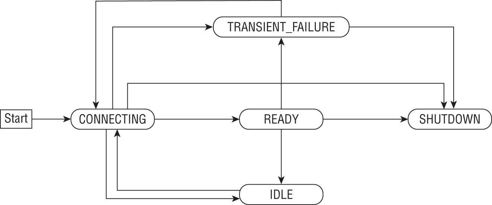

# 生产就绪的 gRPC 应用程序
在本章中，你将首先学习如何实现支持 TLS 的安全 gRPC 应用程序。然后，你将学习在服务器应用程序中实施健康检查、处理运行时错误和取消处理的技术。之后，你将了解提高客户端应用程序健壮性的技术，例如为各种操作配置超时和处理瞬时故障。在最后一节中，你将了解 gRPC 库如何在内部管理客户端和服务器之间的连接。让我们潜入吧！

## 使用 TLS 保护通信
到目前为止，我们编写的客户端和服务器应用程序通过不安全的通道进行通信——这是我们一直在客户端中使用的 setupGrpcCommunication ( ) 函数来设置与服务器的通信：

```go
func setupGrpcConnection(addr string) (*grpc.ClientConn, error) {
    return grpc.DialContext(
        context.Background(),
        addr,
        grpc.WithInsecure(),
        grpc.WithBlock(),
    )
}
```

grpc.WithInsecure() DialOption 明确指出客户端必须通过不安全的通道与服务器通信。当然，这只是因为我们的服务器应用程序没有配置为通过一个进行通信。你会记得我们在第 7 章“生产就绪的 HTTP 服务器”中使用传输层安全性 (TLS) 来保护 HTTP 客户端和服务器应用程序之间的通信。我们可以使用相同的技术在 gRPC 应用程序之间建立安全的通信通道。

首先，让我们配置一个仅允许通过 TLS 进行通信的 gRPC 服务器（忽略错误处理）：

```go
tlsCertFile := os.Getenv("TLS_CERT_FILE_PATH")
tlsKeyFile := os.Getenv("TLS_KEY_FILE_PATH")
creds, err := credentials.NewServerTLSFromFile(
    tlsCertFile,
    tlsKeyFile,
)
credsOption := grpc.Creds(creds)
s := grpc.NewServer(credsOption)
```

首先，我们从 google.golang.org/grpc/credentials 包中调用 credentials.NewServerTLSFromFile() 函数，将其路径传递给 TLS 证书和相应的私钥。此函数返回一个对象，creds，类型为credentials.TransportCredentials 和一个错误值。然后我们使用 creds 作为参数调用 grpc.Creds() 函数。此函数返回一个值 credsOption，类型为 grpc.ServerOption。最后，我们用这个值调用 grpc.NewServer() 函数。而已。

与基于 TLS 的 HTTP 服务器不同，对于启用 TLS 的服务器通常使用不同的端口号，我们也将使用相同的端口号 50051，用于启用 TLS 的 gRPC 服务器。

接下来，你需要配置客户端应用程序以通过 TLS 与服务器通信：

```go
func setupGrpcConn(
    addr string,
    tlsCertFile string,
) (*grpc.ClientConn, error) {
    creds, err := credentials.NewClientTLSFromFile(tlsCertFile, "")
    if err != nil {
        return nil, err
    }
    credsOption := grpc.WithTransportCredentials(creds)
    return grpc.DialContext(
        context.Background(),
        addr,
        credsOption,
        grpc.WithBlock(),
    )
}
```

我们更新了 setupGrpcConn() 以返回一个 *grpc.ClientConn 对象，该对象被配置为通过 TLS 与服务器通信。它现在需要一个额外的参数，tlsCertFile，一个包含客户端应该信任的 TLS 证书路径的字符串。我们使用 TLS 证书的路径调用由 google.golang.org/grpc/credentials 包定义的 NewClientTLSFromFile() 函数。第二个参数，如果非空，将覆盖在证书中找到的主机名，并且该主机名将被信任。我们将为 localhost 主机名生成 TLS 证书，这是我们希望客户端信任的主机名。因此，我们指定一个空字符串。该函数返回一个值creds，类型为credentials.TransportCredentials 和一个错误值。然后，我们通过调用 grpc.WithTransportCredentials() 函数，将凭据作为参数传递，创建与凭据对应的 ClientOption 值 credsOption。最后，我们调用 DialContext()，将 credsOption 作为 ClientOption 传递。 tlsCertFile 中证书的路径必须指向与服务器使用的证书相同的证书。

最后一步是生成自签名 TLS 证书。和第 7 章一样，我们将使用 openssl 命令以稍微不同的参数集来执行此操作，以符合底层 Go 库的客户端 TLS 验证要求：

```sh
$ openssl req -x509 -newkey rsa:4096 -keyout server.key -out server.crt \
    -days 365 \
    -subj "/C=AU/ST=NSW/L=Sydney/O=Echorand/OU=Org/CN=localhost" \
    -extensions san \
    -config <(echo '[req]'; echo 'distinguished_name=req';
            echo '[san]'; echo 'subjectAltName=DNS:localhost') \
    -nodes
```

这将创建两个文件 server.key 和 server.crt，分别对应于 TLS 密钥和证书。你现在可以将这些文件指向服务器并将证书指向客户端。

你可以在本书代码库的 chap10/user-service-tls 目录中找到服务器和客户端应用程序的代码。服务器实现了我们在第 8 章“使用 gRPC 构建 RPC 应用程序”中首次实现的用户服务，现在与客户端的通信通过 TLS 加密通道进行。你还会发现服务器和客户端测试已更新为通过 TLS 进行通信。

让我们看一下我们将如何运行应用程序的快速演示。一、服务器：

```sh
$ cd chap10/user-service-tls/server
$ go build
$ TLS_KEY_FILE_PATH=../tls/server.key \
  TLS_CERT_FILE_PATH=../tls/server.crt \
  ./server
```

在一个单独的终端中，我们将运行客户端：

```go
$ cd chap10/user-service-tls/client
$ go build
$ TLS_CERT_FILE_PATH=../tls/server.crt \
  ./client localhost:50051
User: jane doe.com
```

正如我们在第 7 章中讨论的那样，手动生成和分发证书是不可扩展的。如果你的服务是内部服务，请使用 cfssl (https://github.com/cloudflare/cfssl) 等工具实现内部可信 CA，然后拥有生成证书和信任 CA 的机制。

对于面向公众的服务，你可能会发现 autocert (https://pkg.go.dev/golang.org/x/crypto/acme/autocert) 可用于从 Let's Encrypt（一个免费开放的证书颁发机构）获取证书。

接下来，你将学习使你的服务器应用程序健壮的各种技术。

## 服务器的稳健性

在以下部分中，你将首先了解如何在你的服务器应用程序中实施健康检查。然后，你将学习如何使你的应用程序免受未处理的运行时错误的影响。之后，你将学习如何使用拦截器中止请求处理以防止资源耗尽。

### 实施健康检查

服务器启动时，可能需要几秒钟的时间来创建网络侦听器、注册 gRPC 服务并建立与数据存储或其他服务的连接。因此，它可能不会立即准备好处理客户端请求。最重要的是，服务器在其操作期间可能会因请求而过载，以至于它不应该真正接受任何新的请求。在这两种情况下，建议在你的服务中添加一个 RPC 方法，可用于探测服务器是否健康。通常，此探测将由另一个应用程序执行，例如负载均衡器或代理服务，它们根据健康探测是否成功将请求转发到你的服务器。

gRPC 健康检查协议定义了专用 Health gRPC 服务的规范。它定义了这样的服务必须遵循的 protobuf 规范：

```protobuf
syntax = "proto3";
package grpc.health.v1;
 
message HealthCheckRequest {
  string service = 1;
}
 
message HealthCheckResponse {
  enum ServingStatus {
    UNKNOWN = 0;
    SERVING = 1;
    NOT_SERVING = 2;
    SERVICE_UNKNOWN = 3;  // Used only by the Watch method.
  }
  ServingStatus status = 1;
}
 
service Health {
  rpc Check(HealthCheckRequest) returns (HealthCheckResponse);
  rpc Watch(HealthCheckRequest) returns (stream HealthCheckResponse);
}
```

HealthCheckRequest 消息由另一个应用程序（例如负载平衡器）用于请求服务器的运行状况。它包含一个字符串字段 service，指示客户端正在查询其健康状况的服务名称。正如你将看到的，你可以配置单个服务的运行状况。

HealthCheckResponse 消息用于发送健康检查请求的结果。它包含一个字段，状态，类型为 ServingStatus，一个枚举。 status 的值将是以下四个值之一：

- UNKNOWN
- SERVING
- NOT_SERVING
- SERVICE_UNKNOWN

google.golang.org/grpc/health/grpc_health_v1 包包含基于上述 protobuf 规范为 Health 服务生成的 Go 代码。 google.golang.org/grpc/health / 包包含 Health 服务的实现。因此，要向 gRPC 服务器注册 Health 服务，我们将更新注册其他服务的代码，如下所示：

```go
import (
    healthsvc "google.golang.org/grpc/health"
    healthz "google.golang.org/grpc/health/grpc_health_v1"
)

func registerServices(s *grpc.Server, h *healthz.Server) {
    svc.RegisterUsersServer(s, &userService{})
    healthsvc.RegisterHealthServer(s, h)
}
```

registerServices() 函数接受一个额外的参数——health.Server 类型的值，它在 google.golang.org/grpc/health 包中定义，指向 Health 服务实现。要注册 Health 服务，我们调用 grpc_health_v1 包中定义的 RegisterHealthServer() 函数。

我们将调用 registerServices() 函数如下：

```go
s := grpc.NewServer()
h := healthz.NewServer()
registerServices(s, h)
```

我们调用 grpc_health_v1 包中定义的 NewServer() 函数，它初始化健康服务的内部数据结构。这将返回一个 *healthz.Server 类型的对象——Health 服务的实现。然后我们使用 *grpc.Server 和 *healthz.Server 值调用 registerServices() 函数。除了用户服务之外，gRPC 服务器现在还配置为处理对 Health 服务的请求。

接下来，我们将为各个服务配置健康状态。 healthz.Server 对象的 SetServingStatus() 方法用于设置服务的状态。它接受两个参数——一个包含服务名称的字符串 service 和一个 ServiceStatus 类型的值（定义为 HealthCheckResponse 消息的一部分的枚举）。我们将定义一个辅助函数来包装这个逻辑，如下所示：

```go
func updateServiceHealth(
    h *healthz.Server,
    service string,
    status healthsvc.HealthCheckResponse_ServingStatus,
) {
    h.SetServingStatus(
        service,
        status,
    )
}
```

在服务端，调用registerServices()函数后，我们将Users服务的健康状态设置如下：

```go
s := grpc.NewServer()
h := healthz.NewServer()
registerServices(s, h)
updateServiceHealth(
    h,
    svc.Users_ServiceDesc.ServiceName,
    healthsvc.HealthCheckResponse_SERVING,
)
```

我们使用 Users_ServiceDesc.ServiceName 属性获取用户服务的服务名称，然后通过调用 SetServingStatus() 方法将服务的健康状态设置为 HealthCheckResponse_SERVING。你可以在本书代码存储库的 chap10/server-healthcheck/server 目录中找到 gRPC 服务器的代码，该服务器注册用户服务，如第 9 章“高级 gRPC 应用程序”所述，以及 Health 服务。

现在让我们编写一些测试来验证 Health 服务的行为。在所有测试中，我们首先需要创建一个客户端来与 Health 服务进行通信。我们将通过定义以下函数来实现：

```go
package main
 
import (
    // Other imports
    healthsvc "google.golang.org/grpc/health/grpc_health_v1"
)

func getHealthSvcClient(
    l *bufconn.Listener,
) (healthsvc.HealthClient, error) {

    bufconnDialer := func(
        ctx context.Context, addr string,
    ) (net.Conn, error) {
        return l.Dial()
    }

    client, err := grpc.DialContext(
        context.Background(),
        "", grpc.WithInsecure(),
        grpc.WithContextDialer(bufconnDialer),
    )
    if err != nil {
        return nil, err
    }
    return healthsvc.NewHealthClient(client), nil
}
```

使用 bufconn.Listener 类型的对象 l 调用 getHealthSvcClient()，并返回 healthsvc.HealthClient 类型的值和错误。在函数内部，我们创建了一个拨号器 bufconnDialer，然后用它来创建一个 *grpc.ClientConn 对象 client。然后，我们调用 grpc_health_v1 包中定义的 NewHealthClient() 函数来创建 healthsvc.HealthClient 对象。

我们将编写的第一个测试函数将使用空 HealthCheckRequest 对象调用 Health 服务的 Check() 方法：

```go
func TestHealthService(t *testing.T) {
    l := startTestGrpcServer()
    healthClient, err := getHealthSvcClient(l)
    if err != nil {
        t.Fatal(err)
    }

    resp, err := healthClient.Check(
        context.Background(),
        &healthsvc.HealthCheckRequest{},
    )
    if err != nil {
        t.Fatal(err)
    }
    serviceHealthStatus := resp.Status.String()
    if serviceHealthStatus != "SERVING" {
        t.Fatalf(
            "Expected health: SERVING, Got: %s",
            serviceHealthStatus,
        )
    }
}
```

我们使用 startTestGrpcServer() 函数（如我们在第 8 章和第 9 章中定义的）创建一个测试服务器。然后将返回的 *bufconn.Listener 对象作为参数传递给之前定义的 getHealthSvcClient() 函数，以获取配置为与 Health 服务通信的客户端。

然后，我们使用空的 HealthCheckRequest 值调用 Check() 方法。然后检查 HealthCheckResponse 类型的返回值以确保 Status 字段的值与我们期望的值匹配。当未指定服务名称，并且服务器能够成功回复请求时，响应状态设置为 1（或 SERVING ）。由于status字段是一个枚举，我们调用定义的String()方法来获取对应的字符串值，不管你是否设置了注册服务的健康状态，是否健康。

要检查用户服务的健康状态，我们将调用 Check() 方法，如下所示：

```go
resp, err := healthClient.Check(
    context.Background(),
    &healthsvc.HealthCheckRequest{
        Service: "Users",
    },
 )
```

如果我们指定了一个没有设置健康状态的服务，我们将得到一个非 nil 错误响应，并且 response 的值 resp 将为 nil。错误响应代码将设置为 codes.NotFound，如 google.golang.org/grpc/codes 包中所定义。以下测试将验证该行为：

```go
func TestHealthServiceUnknown(t *testing.T) {
    l := startTestGrpcServer()
    healthClient, err := getHealthSvcClient(l)
    if err != nil {
        t.Fatal(err)
    }

    _, err = healthClient.Check(
        context.Background(),
        &healthsvc.HealthCheckRequest{
            Service: "Repo",
        },
    )
    if err == nil {
        t.Fatalf("Expected non-nil error, Got nil error")
    }
    expectedError := status.Errorf(
        codes.NotFound, "unknown service",
    )
    if !errors.Is(err, expectedError) {
        t.Fatalf(
            "Expected error %v, Got; %v",
            err,
            expectedError,
        )
    }
}
```

上面突出显示了关键语句。我们使用 google.golang.org/grpc/status 包的 Errorf() 函数构造一个错误值，然后我们使用错误包中的 errors.Is() 函数来检查返回的和预期的错误是否匹配。

接下来，让我们看看 Watch()，Health 服务中定义的第二种方法。这是一种服务器端流式 RPC 方法，当健康检查客户端希望收到服务中任何健康状态变化的通知时，它很有用。让我们看看它是如何工作的。

我们使用两个参数调用该方法——一个 context.Context 对象和一个 HealthCheckRequest 对象，指定我们要查看用户服务的健康状态：

```go
client, err := healthClient.Watch(
    context.Background(),
    &healthsvc.HealthCheckRequest{
        Service: "Users",
    },
)
```

Watch() 方法返回两个值：类型为 Health_WatchClient 的客户端和一个错误值。 Health_WatchClient 是 grpc_health_v1 包中定义的一个接口，如下：

```go
type Health_WatchClient interface {
    Recv() (*HealthCheckResponse, error)
    grpc.ClientStream
}
```

Recv() 方法将返回 HealthCheckResponse 类型的对象和错误值。然后我们编写一个无条件的 for 循环，在那里我们将调用 Recv() 方法以在服务器可用时获取响应：

```go
for {
    resp, err := client.Recv()
    if err == io.EOF {
        break
    }
    if err != nil {
        log.Printf("Error in Watch: %#v\n", err)

    }
    log.Printf("Health Status: %#v", resp)
    if resp.Status != healthsvc.HealthCheckResponse_SERVING {
        log.Printf("Unhealthy: %#v", resp)
    }
}
```

当我们第一次调用 Recv() 时，我们将收到一个包含用户服务健康状态的响应。之后，只有当服务的健康状态发生变化时，我们才会得到响应。

以下测试函数验证行为：

```go
func TestHealthServiceWatch(t *testing.T) {

    // TODO setup and obtain healthClient

    client, err := healthClient.Watch(
        context.Background(),
        &healthsvc.HealthCheckRequest{
            Service: "Users",
        },
    )
    if err != nil {
        t.Fatal(err)
    }

    resp, err := client.Recv()
    if err != nil {
        t.Fatalf("Error in Watch: %#v\n", err)
    }
    if resp.Status != healthsvc.HealthCheckResponse_SERVING {
        t.Errorf(
            "Expected SERVING, Got: %#v",
            resp.Status.String(),
        )
    }

    updateServiceHealth(
        h,
        "Users",
        healthsvc.HealthCheckResponse_NOT_SERVING,
    )

    resp, err = client.Recv()
    if err != nil {
        t.Fatalf("Error in Watch: %#v\n", err)
    }
    if resp.Status != healthsvc.HealthCheckResponse_NOT_SERVING {
        t.Errorf(
            "Expected NOT_SERVING, Got: %#v",
            resp.Status.String(),
        )
    }
}
```

我们调用 Watch() 方法，然后调用 Recv() 方法——一次。我们验证健康状态报告为 SERVING。然后，我们调用 updateServiceHealth() 将服务的健康状态更改为 NOT_SERVING。我们再次调用 Recv() 方法。这一次，我们验证响应的状态字段值是否为 NOT_SERVING。因此，尽管客户端必须定期调用 Check() 方法以了解服务器中的任何健康状态变化，但 Watch() 方法会通知客户端，然后客户端可以做出适当的反应。

你可以在本书代码库的 chap10/server-healthcheck/server 目录下的 health_test.go 文件中找到所有测试函数的源代码。

在下一节中，你将学习如何实现拦截器来设置恢复机制，以在出现运行时错误时阻止服务器终止。不过，在此之前，你将在本章的第一个练习练习 10.1 中为 Health 服务实现一个客户端。

> 练习 10.1：健康检查客户端 实现健康服务的命令行客户端。客户端应该同时支持 Check 和 Watch 方法。如果健康状态不成功，客户端应以非零退出代码退出。

你的应用程序应允许客户端与服务器建立不安全或 TLS 加密的通信通道。你的应用程序还应该支持接受一个特定的服务名称，它应该检查其健康状况。

### 处理运行时错误
当客户端应用程序向 gRPC 服务器发出请求时，该请求将在单独的 goroutine 中处理——就像你了解的 HTTP 服务器一样。但是，与 HTTP 服务器不同的是，如果在请求处理期间发生未处理的运行时错误（例如由调用 panic() 函数引起的错误），它将终止整个服务器进程，这也将终止当前正在处理的任何其他请求.这是否可取将主要取决于你的特定应用程序行为。假设我们认为这并不理想，并且我们希望在服务器应用程序中实现一种机制，以便继续处理现有请求和新请求，即使在处理另一个请求时出现未处理的错误。实现这种机制的传统方法是定义一个服务器端拦截器。在这个拦截器中，我们将设置对另一个函数的延迟调用，在那里我们调用recover() 函数并记录错误（如果有）。当发生运行时错误时，将调用此延迟函数而不是终止应用程序。

首先，让我们看看一元拦截器：

```go
func panicUnaryInterceptor(
    ctx context.Context,
    req interface{},
    info *grpc.UnaryServerInfo,
    handler grpc.UnaryHandler,
) (resp interface{}, err error) {
    defer func() {
        if r := recover(); r != nil {
            log.Printf("Panic recovered: %v", r)
            err = status.Error(
                codes.Internal,
                "Unexpected error happened",
            )
        }
    }()
    resp, err = handler(ctx, req)
    return
}
```

我们已经定义了拦截器来使用命名的返回值：resp 和 err。这允许我们设置出现运行时错误时返回的值。当发生运行时错误时，recover() 函数返回一个非 nil 值。我们记录此值并将 err 分配给使用 status.Error() 函数创建的新错误值。我们将响应代码设置为 code.Internal 并将错误配置为具有自定义错误消息。这样，我们将在服务器端记录实际错误，但只向客户端发送简短的错误消息。根据你的应用程序，这是在出现意外运行时错误时运行任何其他操作的机会。 resp 的默认值（即 nil）将作为 RPC 请求的响应返回。

服务器端流拦截器的配置类似。流拦截器的一个有趣方面是，无论运行时错误是在初始流设置期间还是在随后的消息交换之一期间引起的，它都能正常工作。

本书代码库的目录 chap10/svc-panic-handling 包含第 9 章 - 链式拦截器 ( chap9/interceptor-chain ) 中 gRPC 应用程序的修改版本。服务器已更新以注册恐慌处理拦截器，使其成为一元和流式 RPC 方法调用的最内层拦截器：

```go
s := grpc.NewServer(
    grpc.ChainUnaryInterceptor(
        metricUnaryInterceptor,
        loggingUnaryInterceptor,
        panicUnaryInterceptor,
    ),
    grpc.ChainStreamInterceptor(
        metricStreamInterceptor,
        loggingStreamInterceptor,
        panicStreamInterceptor,
    ),
)
```

将恐慌处理拦截器注册为最内部的拦截器意味着服务处理程序中的运行时错误不会妨碍其他拦截器的运行。当然，这假设在任何外部拦截器中都没有运行时错误，这可能成立，也可能不成立。当然，我们可以将恐慌处理拦截器附加到最外层和最内层拦截器的两倍，以包围所有其他拦截器。

为了说明拦截器的工作，服务器和客户端应用程序已按如下所述进行了修改。

如果用户的电子邮件地址格式为 panic@example.com，则用户服务的 GetUser() 方法被修改为调用 panic() 函数：

```go
components := strings.Split(in.Email, "@")
if len(components) != 2 {
    return nil, errors.New("invalid email address")
}
if components[0] == "panic" {
    panic("I was asked to panic")
}
```

客户端应用程序被修改为接受对应于用户电子邮件地址的第三个参数，然后在对 GetUser() 方法的请求中指定该参数。

如果传入的请求消息是 panic ，则 GetHelp() 方法被修改为调用 panic() ：

```go
fmt.Printf("Request receieved: %s\n", request.Request)
if request.Request == "panic" {
    panic("I was asked to panic")
}
```

现在让我们从终端会话构建并运行服务器：

```sh
$ cd chap10/svc-panic-handling/server
$ go build
$ ./server
```

在单独的终端会话中，构建并运行客户端：

```sh
$ cd chap10/svc-panic-handling/client
$ go build
```

然后，让我们调用 GetUser() 方法：

```sh
$ ./client localhost:50051 GetUser panic@example.com
2021/07/05 21:02:25 Method:/Users/GetUser, Duration:1.494875ms,
Error:rpc error: code = Internal desc = Unexpected error happened
2021/07/05 21:02:25 rpc error: code = Internal desc = Unexpected
error happened
```

你可以看到客户端没有得到成功的响应，而是从服务器得到一个错误。 code 和 desc 字段的值是我们在紧急处理拦截器中设置的值。

在服务器端，你将看到以下日志消息：

```sh
2021/07/05 21:02:25 Received request for user with Email: panic@example.com 
Id:
2021/07/05 21:02:25 Panic recovered: I was asked to panic
2021/07/05 21:02:25 Method:/Users/GetUser, Error:rpc error:
code = Internal desc = Unexpected error happened, 
Request-Id:[request-123]
2021/07/05 21:02:25 Method:/Users/GetUser, Duration:160.291μs
```

接下来，调用 GetHelp() 方法：

```sh
$ ./client localhost:50051 GetHelp
Request: panic
2021/07/05 21:07:37 Send msg called: *users.UserHelpRequest
2021/07/05 21:07:37 Recv msg called: *users.UserHelpReply
2021/07/05 21:07:37 rpc error: code = Internal desc = Unexpected 
error happened
```

在服务器端，你将看到以下日志：

```sh
Request receieved: panic
2021/07/05 21:07:37 Panic recovered: I was asked to panic
2021/07/05 21:07:37 Method:/Users/GetHelp, Error:rpc error: code = 
Internal desc = Unexpected error happened, Request-Id:[request-123]
2021/07/05 21:07:37 Method:/Users/GetHelp, Duration:1.302932917s
```

编写一个拦截器来恢复运行时错误，让你的服务器在继续处理其他请求的同时保持运行。它还允许你记录错误原因、发布指标以便你可以监控错误或运行任何自定义清理和回滚过程。

接下来，你将了解在操作花费的时间超过配置的时间间隔或客户端断开连接时中止请求处理的技术。

### 中止请求处理
假设你想对 RPC 方法的执行时间施加上限。根据你的服务的历史行为，你知道对于某些恶意用户请求，RPC 方法可能需要超过 300 毫秒的时间。在这种情况下，你只想中止请求。使用服务器端拦截器，你可以跨所有服务处理程序实现此类逻辑。

以下函数实现了一元 RPC 超时拦截器：

```go
func timeoutUnaryInterceptor(
    ctx context.Context,
    req interface{},
    info *grpc.UnaryServerInfo,
    handler grpc.UnaryHandler,
) (interface{}, error) {
    var resp interface{}
    var err error

    ctxWithTimeout, cancel := context.WithTimeout(
        ctx, 
        300*time.Millisecond,
    )
    defer cancel()

    ch := make(chan error)

    go func() {
        resp, err = handler(ctxWithTimeout, req)
        ch <- err
    }()

    select {
        case <-ctxWithTimeout.Done():
        cancel()
        err = status.Error(
            codes.DeadlineExceeded,
            fmt.Sprintf(
                "%s: Deadline exceeded", 
                info.FullMethod,
            ),
        )
        return resp, err
        case <-ch:

        }
    return resp, err
}
```

上面的拦截器创建了一个新的 context.Context 对象 ctxWithTimeout，使用 context.WithTimeout() 函数调用并使用传入的上下文 ctx 作为父上下文。超时设置为 300 毫秒，这是我们配置的服务处理程序完成执行的最大持续时间。我们在 goroutine 中执行处理程序方法。然后我们使用 select 语句等待接收通道 err 上的值或函数调用 ctxWithTimeout.Done()。当处理程序方法完成执行时，一个值将准备好从 err 中读取。

另一方面，ctxWithTimeout.Done() 函数将在 300 毫秒过去后返回。如果后者先发生，我们取消上下文，创建一个新的错误值，并将代码设置为 codes.DeadLineExceeded，并将其与 resp 的 nil 值一起返回。

使用上述拦截器配置你的服务器的结果是，任何耗时超过 300 毫秒的 RPC 方法都将被中止。如果我们以拦截器的上下文取消用于取消正在进行的处理的方式编写服务方法（正如你在第 7 章中学到的那样），服务器资源也会及时释放以用于处理其他请求。我们将通过编写测试函数来完成，而不是通过运行 gRPC 服务器来验证拦截器的工作。这还将演示如何为服务器端一元 RPC 拦截器编写单元测试。

我们将使用预期的参数直接调用 timeoutUnaryInterceptor() 函数，如下所示：

```go
func TestUnaryTimeOutInterceptor(t *testing.T) {
    req := svc.UserGetRequest{}
    unaryInfo := &grpc.UnaryServerInfo{
        FullMethod: "Users.GetUser",
    }
    testUnaryHandler := func(
        ctx context.Context, 
        req interface{},
    ) (interface{}, error) {
        time.Sleep(500 * time.Millisecond)
        return svc.UserGetReply{}, nil
    }

    _, err := timeoutUnaryInterceptor(
        context.Background(),
        req,
        unaryInfo,
        testUnaryHandler,
    )
    if err == nil {
        t.Fatal(err)
    }
    expectedErr := status.Errorf(
        codes.DeadlineExceeded,
        "Users.GetUser: Deadline exceeded",
    )
    if !errors.Is(err, expectedErr) {
        t.Errorf(
            "Expected error: %v Got: %v\n",
            expectedErr,
            err,
        )
    }
}
```

timeoutUnaryInterceptor() 函数以四个对象作为参数被调用。我们在上面的测试函数中创建了这些对象，如下所示：

- context：context.Context 类型的对象。上下文对象是通过调用 context.Background() 函数创建的。
- req：包含空接口类型的请求 RPC 消息的对象。{}我们创建一个空的 svc.UserGetRequest{} 对象并将其分配给 req 。
- info：grpc.UnaryServerInfo 类型的对象。我们创建一个类型为 grpc.UnaryServerInfo 的对象，将 FullMethod 字段（一个字符串）设置为“Users.GetUser”。
- handler：grpc.UnaryHandler 类型的函数。我们创建一个 testUnaryHandler() 函数作为我们的测试函数的服务处理程序。在其中，我们休眠 500 毫秒，以便我们可以验证拦截器的行为，然后返回一个空的 UserGetReply 对象作为响应。

现在假设我们要为流式 RPC 方法实现此行为。我们知道，在流式 RPC 方法的情况下，流式连接很可能是长期存在的。请求和响应将包含一个消息流，在流上的连续消息之间具有潜在的延迟。如果我们还想对流式 RPC 方法强制超时怎么办？例如，假设在客户端流方法或双向流 RPC 方法中，如果我们在过去 60 秒内没有收到来自客户端的消息，我们将中止连接。为了实现这一点，我们将实现一个等效于 timeoutUnaryInterceptor() 的流媒体服务器端拦截器。当服务器等待接收消息时，我们将施加最大超时策略，并且计时器将根据消息重置。我们定义了一个新类型，wrappedServerStream，用于包装底层的ServerStream对象，并在RecvMsg()方法的实现中实现超时逻辑：

```go
type wrappedServerStream struct {
    RecvMsgTimeout time.Duration
    grpc.ServerStream
}

func (s wrappedServerStream) SendMsg(m interface{}) error {
    return s.ServerStream.SendMsg(m)
}

func (s wrappedServerStream) RecvMsg(m interface{}) error {
    ch := make(chan error)
    t := time.NewTimer(s.RecvMsgTimeout)
    go func() {
        log.Printf("Waiting to receive a message: %T", m)
        ch <- s.ServerStream.RecvMsg(m)
    }()

    select {
        case <-t.C:
        return status.Error(
            codes.DeadlineExceeded,
            "Deadline exceeded",
        )
        case err := <-ch:
        return err
    }
}
```

我们用两个字段定义了wrappedServerStream 结构：类型为time.Duration 的RecvMsgTimeout 并嵌入了一个grpc.ServerStream 对象。我们实现的 SendMsg() 方法调用嵌入流的 SendMsg() 方法。在 RecvMsg() 方法内部，我们创建了一个 time.Timer 对象，将 RecvMsgTimeout 的值作为参数传递给 time.NewTimer() 函数。返回的对象 t 包含一个字段 C，一个类型为 chan Time 的通道。然后我们在 goroutine 中调用底层流的 RecvMsg() 方法。

使用 select 语句，我们等待在两个通道之一上接收一个值： – t.C 和 ch。当 RecvMsgTimeout 中指定的持续时间过去时，第一个通道接收一个值。当对底层流的 RecvMsg() 的调用返回时，第二个通道接收一个值。根据 select 的行为，如果第一个通道首先接收到一个值，我们将一个错误设置，即错误代码，返回到codes.DeadlineExceeded。当服务处理程序收到错误时，它可以中止 RPC 方法的执行。

现在已经在 RecvMsg() 方法中定义了超时逻辑，我们将定义拦截器如下：

```go
func timeoutStreamInterceptor(
    srv interface{},
    stream grpc.ServerStream,
    info *grpc.StreamServerInfo,
    handler grpc.StreamHandler,
) error {
    serverStream := wrappedServerStream{
        RecvMsgTimeout: 500 * time.Millisecond,
        ServerStream:   stream,
    }
    err := handler(srv, serverStream)
    return err
}
```

拦截器将 500 毫秒的持续时间定义为 RecvMsgTimeout。接下来我们将通过编写单元测试来验证拦截器的工作。必须使用以下参数调用 timeoutStreamingInterceptor() 函数：

- srv：这是 interface{} 类型，因此可以是任何类型的对象。这里我们将使用一个字符串“test”。
- stream：这是一个实现 grpc.ServerStream 接口的类型的对象。在我们的测试中，我们将定义一个新类型 testStream 来实现此接口。在 RecvMsg() 方法中，我们将通过休眠 700 毫秒来模拟我们的无响应客户端行为，这超过了拦截器配置的超时时间。
- info：这是一个 *grpc.ServerInfo 类型的对象，我们按如下方式创建它：

```go
streamInfo := &grpc.StreamServerInfo{
    FullMethod:     "Users.GetUser",
    IsClientStream: true,
    IsServerStream: true,
}
```

- 处理程序：这是一个双向（或服务器端）流式 RPC 方法处理程序。在我们的测试中，我们实现了以下测试处理函数：

```go
testHandler := func(
    srv interface{},
    stream grpc.ServerStream,
) (err error) {
    for {
        m := svc.UserHelpRequest{}
        err := stream.RecvMsg(&m)
        if err == io.EOF {
            break
        }
        if err != nil {
            return err

        }
        r := svc.UserHelpReply{}
        err = stream.SendMsg(&r)
        if err == io.EOF {
            break
        }
        if err != nil {
            return err

        }
    }
    return nil
}
```

现在创建了所有不同的对象，我们可以定义测试函数：

```go
type testStream struct {
    grpc.ServerStream
}

func (s testStream) SendMsg(m interface{}) error {
    log.Println("Test Stream - SendMsg")
    return nil
}

func (s testStream) RecvMsg(m interface{}) error {
    log.Println("Test Stream - RecvMsg - Going to sleep")
    time.Sleep(700 * time.Millisecond)
    return nil
}

func TestStreamingTimeOutInterceptor(t *testing.T) {

    streamInfo := &grpc.StreamServerInfo{
        FullMethod:     "Users.GetUser",
        IsClientStream: true,
        IsServerStream: true,
    }

    testStream := testStream{}

    // TODO – Define testHandler  as above

    err := timeoutStreamInterceptor(
        "test",
        testStream,
        streamInfo,
        testHandler,
    )
    expectedErr := status.Errorf(
        codes.DeadlineExceeded,
        "Deadline exceeded",
    )
    if !errors.Is(err, expectedErr) {
        t.Errorf(
            "Expected error: %v Got: %v\n",
            expectedErr,
            err,
        )
    }
}
```

你可以在本书源代码库的 chap10/svc-timeout 目录中找到带有超时拦截器实现和单元测试的示例 gRPC 服务器应用程序。

我们希望在我们的服务器应用程序中拥有的另一个能力是能够对客户端发起的请求终止事件做出反应，例如上下文取消或网络故障。在这种情况下，服务器也应该尽快中止请求处理。在拦截器中为一元 RPC 方法实现这一点看起来与超时拦截器非常相似：

```go
func clientDisconnectUnaryInterceptor(
    ctx context.Context,
    req interface{},
    info *grpc.UnaryServerInfo,
    handler grpc.UnaryHandler,
) (interface{}, error) {
    var resp interface{}
    var err error

    ch := make(chan error)

    go func() {
        resp, err = handler(ctx, req)
        ch <- err
    }()

    select {
        case <-ctx.Done():
        err = status.Error(
            codes.Canceled,
            fmt.Sprintf(
                "%s: Request canceled",
                info.FullMethod,
            ),
        )
        return resp, err
        case <-ch:

        }
    return resp, err
}
```

上面突出显示了关键语句。我们在 goroutine 中调用 RPC 方法处理程序。然后，使用 select 语句，我们等待接收 ctx.Done() 方法返回的通道上的值，该值指示客户端连接已关闭，或者处理程序执行的结果。如果第一个事件先发生，我们会创建一个错误值，指示请求已被取消并返回错误。

流拦截器的实现看起来与一元拦截器非常相似：

```go
func clientDisconnectStreamInterceptor(
    srv interface{},
    stream grpc.ServerStream,
    info *grpc.StreamServerInfo,
    handler grpc.StreamHandler,
) (err error) {

    ch := make(chan error)

    go func() {
        err = handler(srv, stream)
        ch <- err
    }()

    select {
        case <-stream.Context().Done():
        err = status.Error(
            codes.Canceled,
            fmt.Sprintf(
                "%s: Request canceled", 
                info.FullMethod,
            ),
        )
        return
        case <-ch:

        }
    return
}
```

再一次，我们在 goroutine 中调用 RPC 方法处理程序。然后，使用 select 语句，我们等待 stream.Context.Done() 方法返回的通道关闭，这表明客户端连接已关闭，或者处理程序执行的结果。如果第一个事件先发生，我们会创建一个错误值，指示请求已被取消并返回错误。你可以在本书源代码库的 chap10/svc-client-dxn 目录中找到带有拦截器实现（包括单元测试）的示例服务器应用程序。

在我们继续下一部分之前，我们专注于提高客户端应用程序的弹性，你需要尝试一个练习，练习 10.2。

>练习 10.2：实现优雅关闭 带超时 要优雅地停止 gRPC 服务器，你将调用 grpc.Server 对象的 GracefulStop() 方法。但是，它不允许调用者配置最长持续时间，直到它尝试等待现有请求处理完成为止。你在本练习中的目标是实现服务器的限时正常关闭。时间到期后，代码应调用 Stop() 方法，导致硬关闭。

在调用 GracefulStop() 方法之前，将所有服务的健康状态更新为 NOT_SERVING。这意味着在你等待方法返回时，任何健康检查请求都将获得有关服务健康状况的适当更新。

## 客户端的稳健性
在本章的这一部分，你将学习提高客户端应用程序健壮性的技术。我们将首先了解我们可以配置的各种超时值。然后，我们将了解传输 RPC 方法调用的底层连接的行为，并最终检查提高单个方法调用弹性的技术。

在这些部分中，我们将使用注册了用户服务的 gRPC 服务器。该服务定义了两个 RPC 方法：GetUser() 和 GetHelp()。我们的示例客户端可以根据指定的命令行参数调用这些方法中的任何一个来调用它。你可以在本书源代码库的 chap10/client-resiliency 目录中找到该应用程序的代码。

### 改进连接设置
在进行任何 RPC 方法调用之前，我们在客户端中执行的第一步是与服务器建立通道。为了刷新你的记忆，我们一直使用以下代码来创建频道：

```go
func setupGrpcConn(addr string) (*grpc.ClientConn, error) {
    return grpc.DialContext(
        context.Background(),
        addr,
        grpc.WithBlock(),
    )
    return conn, err
}
```

grpc.WithBlock() 将导致上述对 DialContext() 函数的调用在成功建立连接之前不会返回。事实上，如果你没有指定该选项，则连接建立过程不会立即开始。它会在将来的某个时间点发生，在你进行第一个 RPC 方法调用时或之前。

使用 grpc.WithBlock() 选项可以在出现临时故障的情况下帮助我们，例如服务器需要几百毫秒才能准备好或临时网络故障导致超时。但是，这也可能导致客户端继续尝试建立连接而不退出，即使存在需要检查的永久性故障。此类失败的示例是指定格式错误的服务器地址或不存在的主机名。

为了获得使用 grpc.WithBlock() 选项的好处并且不尝试“永远”建立连接，我们将指定另一个 DialOption，通过调用 grpc.FailOnNonTempDialError(true) 函数创建。 true 参数指定如果发生非临时错误，则不会再尝试重新建立连接。 DialContext() 函数将返回遇到的错误。

此外，即使对于临时错误，配置尝试建立连接的时间上限也是实用的。 grpc.DialContext() 函数接受一个 context.Context 对象作为第一个参数。因此，我们创建一个带有超时值的上下文并使用该上下文调用函数。

更新的 setupGrpcConn() 如下：

```go
func setupGrpcConn(
    addr string,
) (*grpc.ClientConn, context.CancelFunc, error) {
    log.Printf("Connecting to server on %s\n", addr)
    ctx, cancel := context.WithTimeout(
        context.Background(),
        10*time.Second,
    )
    conn, err := grpc.DialContext(
        ctx,
        addr,
        grpc.WithBlock(),
        grpc.FailOnNonTempDialError(true),
        grpc.WithReturnConnectionError()
    )
    return conn, cancel, err
}
```

请注意，我们添加了第三个 DialOption，grpc.WithReturnConnectionError()。使用此选项，当出现临时错误并且上下文在 DialContext() 函数成功之前到期时，返回的错误还将包含阻止连接建立发生的原始错误。

值得一提的是，指定 grpc.WithReturnConnectionError() DialOption 也会隐式设置 grpc.WithBlock() 选项。通过上述更改，DialContext() 函数现在将表现出以下行为：

- 遇到非临时性错误时会立即返回。返回的错误值将包含所遇到错误的详细信息。
- 如果出现非临时错误，它只会尝试建立连接 10 秒。该函数将返回包含非临时错误详细信息的错误值。

在 chap10/client-resiliency 目录下构建客户端应用程序，并按如下方式运行（本地不运行任何 gRPC 服务器）：

```go
$ cd chap10/client-resiliency/client
$ go build
$/client localhost:50051 GetUser jane@joe.com
2021/07/22 19:02:31 Connecting to server on localhost:50051
2021/07/22 19:02:31 Error in creating connection: connection error: 
desc = "transport: error while dialing: dial tcp [::1]:50051: 
connect: connection refused"
```

grpc.FailOnTempDialError() 和 grpc.WithReturnConnectionError() 都被认为是实验性的，因此它们的行为在未来的 gRPC 版本中可能会有所不同。

### 处理暂时性故障
一旦我们与服务器建立了通道，客户端将继续进行 RPC 方法调用。使用 gRPC 的最大好处之一是客户端可以进行多次此类调用，而无需为每个请求创建新通道。然而，这也意味着，默认情况下，网络连接是长期存在的，因此容易出现故障。幸运的是，gRPC 定义了等待就绪语义，我们可以在调用 RPC 方法时向其传递额外的参数。这个额外的配置是通过调用 grpc.WaitForReady() 函数以 true 作为参数创建的 grpc.CallOption 值：

```go
client.GetUser(context.Background(), req, grpc.WaitForReady(true))
```

当上面的RPC方法调用完成，而与服务器的连接没有建立时，它会先尝试建立连接成功，然后再调用RPC方法。

让我们看看这种行为的实际效果。首先在 chap10/client-resiliency/server 中构建并运行服务器：

```sh
$ cd chap10/client-resiliency/server
$ go build
$ ./server
```

保持服务器运行。在客户端应用程序中，我们有一个如下的 for 循环，它将向 GetUser() RPC 方法发出五次请求，在请求之间休眠 1 秒：

```go
for i := 1; i <= 5; i++ {
    log.Printf("Request: %d\n", i)
    userEmail := os.Args[3]
    result, err := getUser(
        c,
        &svc.UserGetRequest{Email: userEmail},
    )
    if err != nil {
        log.Fatalf("getUser failed: %v", err)
    }
    fmt.Fprintf(
        os.Stdout,
        "User: %s %s\n",
        result.User.FirstName,
        result.User.LastName,
    )
    time.Sleep(1 * time.Second)
}
```

接下来构建客户端应用程序并运行它：

```sh
$ ./client localhost:50051 GetUser jane@joe.com
2021/07/23 09:43:58 Connecting to server on localhost:50051
2021/07/23 09:43:58 Request: 1
User: jane joe.com
2021/07/23 09:43:59 Request: 2
User: jane joe.com
2021/07/23 09:44:00 Request: 3
User: jane joe.com
2021/07/23 09:44:01 Request: 4
User: jane joe.com
2021/07/23 09:44:02 Request: 5
User: jane joe.com
```

现在，在任何两个请求之间，如果你终止服务器进程并重新启动它，你将看到所有五个请求仍将成功发出，而客户端不会因错误退出。

WaitForReady() 选项仅在调用 RPC 方法时有用。对于一元 RPC 方法，这在处理临时连接失败时很有用。但是，对于流式 RPC 方法调用，这意味着 WaitForReady() 仅在创建流时有用。如果创建流后出现网络问题会怎样？

假设你在通过 Send() 发送消息或使用 Recv() 接收消息时收到错误消息。我们将查看返回的错误并决定是否要中止 RPC 方法调用。或者我们想创建一个新的流并恢复通信？让我们假设我们可以通过创建一个新流来安全地恢复双向流 RPC 方法的流通信。以用户服务的 GetHelp() 方法为例，我们可以实现如下所述的自动连接重建逻辑。

我们定义了一个函数来创建流；即调用 GetHelp() 方法：

```go
func createHelpStream(c svc.UsersClient) (
    users.Users_GetHelpClient, error,
) {
    return c.GetHelp(
        context.Background(),
        grpc.WaitForReady(true),
    )
}
```

然后，我们定义一个函数 setupChat() 来与创建的流交互，发送请求并接收来自服务器的响应。在其中，我们将创建一个类型为 svc.Users_GetHelpClient 的无缓冲通道，它是通过调用 GetHelp() 方法创建的流的类型。我们将在专用 goroutine 中调用 Recv() 方法。如果该方法返回 io.EOF 以外的错误，它将重新创建流。然后将流写入通道 clientConn 。

以下代码片段显示了从流中读取的客户端部分以及实现的重新连接逻辑：

```go
func setupChat(
    r io.Reader, 
    w io.Writer,
    c svc.UsersClient,
) (err error) {

    var clientConn = make(chan svc.Users_GetHelpClient)
    var done = make(chan bool)

    stream, err := createHelpStream(c)
    defer stream.CloseSend()
    if err != nil {
        return err
    }

    go func() {
        for {
            clientConn <- stream
            resp, err := stream.Recv()
            if err == io.EOF {
                done <- true
            }
            if err != nil {
                log.Printf("Recreating stream.")
                stream, err = createHelpStream(c)
                if err != nil {
                    close(clientConn)
                    done <- true
                }
            } else {
                fmt.Printf(
                    "Response: %s\n", resp.Response,
                )
                if resp.Response == "hello-10" {
                    done <- true
                }
            }
        }
    }()

    // TODO – Send requests to the server

    <-done
    return stream.CloseSend()
}
```

在从流中读取的 goroutine 中，我们有一个无条件的 for 循环。在循环开始时，我们将当前流对象写入 clientConn 通道。这将取消阻止向服务器发送消息的客户端部分（稍后会解释）。然后，我们调用 Recv() 方法。如果我们收到 io.EOF 错误，我们将 true 写入 done 通道，这将关闭流并从函数返回。

如果我们遇到任何其他错误，我们会调用 createHelpStream() 函数来重新创建流。如果我们无法创建流，我们关闭 clientConn 通道，从而解除对发送代码的阻塞。我们还将 true 写入 done 通道，这将导致函数返回。

如果我们没有收到错误，我们就会写入从服务器收到的响应。如果响应是 hello-10，我们将 true 写入 done 通道。此字符串对应于从客户端发送的最后一个请求。因此，当我们返回这个消息时，我们知道这个函数没有进一步的工作要做。

以下代码片段显示了 setupChat() 函数的发送部分：

```go
func setupChat(
    r io.Reader,
    w io.Writer,
    c svc.UsersClient,
) (err error) {
    var clientConn = make(chan svc.Users_GetHelpClient)
    var done = make(chan bool)

    stream, err := createHelpStream(c)
    defer stream.CloseSend()
    if err != nil {
        return err
    }


    // TODO Receiving goroutine as explained earlier

    requestMsg := "hello"
    msgCount := 1
    for {
        if msgCount> 10 {
            break
        }
        stream = <-clientConn
        if stream == nil {
            break
        }
        request := svc.UserHelpRequest{
            Request: fmt.Sprintf(
                "%s-%d", requestMsg, msgCount,
            ),
        }
        err := stream.Send(&request)
        if err != nil {
            log.Printf("Send error: %v. Will retry.\n", err)
        } else {
            log.Printf("Request sent: %d\n", msgCount)
            msgCount += 1
        }
    }

    <-done
    return stream.CloseSend()
}
```

我们从客户端向服务器发送 10 条消息。服务器回显与响应相同的消息。在发送每条消息之前，我们读取用于从 clientConn 通道发送消息的流。然后，它将调用 Send() 方法。如果该方法返回错误，它将等待接收 goroutine 重新创建流并将新的流对象值写入通道。一旦它成功读取了新创建的流，它将再次尝试发送操作。你可以在本书源代码库的 chap10/client-resiliency/client 目录中找到为 GetHelp() 方法实现上述逻辑的工作客户端。

我们使用从 Recv() 方法返回的错误来确定我们是否应该重新创建流。这样做的一个原因是当流正常终止时，此方法返回 io.EOF 错误。在任何其他情况下，它返回另一个错误。因此，很容易区分什么是正常错误，什么不是。另一方面，即使流意外中断（例如由于网络故障），Send() 方法也会返回 io.EOF 错误。因此，很难区分正常终止和异常终止。但是有一个出路——如果我们从 Send() 方法得到 io.EOF 错误，并且我们调用 RecvMsg() 方法，我们可以利用该方法返回的错误值来推断异常终止。

以下代码片段显示了第 9 章 ( chap9/client-streaming ) 中的客户端流代码的修改版本，以实现上述逻辑：

```go
for i := 0; i < 5; i++ {
    log.Printf("Creating Repo: %d\n", i)
    r := svc.RepoCreateRequest{
        CreatorId: "user-123",
        Name:      "hello-world",
    }
    err := stream.Send(&r)
    if err == io.EOF {
        var m svc.RepoCreateReply
        err := stream.RecvMsg(&m)
        if err != nil {
            // Implement stream recreation logic
        }
    }
    if err != nil {
        continue
    }
}
```

如果我们从对 RecvMsg() 的调用中得到一个非 nil 错误值，我们推断 io.EOF 错误是由于异常终止引起的，因此我们可以在发送下一条消息之前重新创建流。

### 为方法调用设置超时
好的，你现在已经配置了你的客户端应用程序，以确保它不会在与服务器的底层连接出现问题时退出并出现错误。我们如何防止它试图永远挽救底层连接？此外，我们如何确保 RPC 方法调用具有配置的允许处理多长时间的上限？我们可以通过使用 context.WithTimeout() 创建一个 context.Context 对象，然后调用 RPC 方法，将创建的上下文作为第一个参数传递来实现这两者。例如：

```go
ctx, cancel := context.WithTimeout(
    context.Background(),
    10*time.Second,
)
resp, err := client.GetUser(
    ctx,
    u,
    grpc.WaitForReady(true),
)
```

当我们创建一个设置为在 10 秒后取消的上下文时，该超时将在进行 RPC 方法调用所需的所有内容中强制执行。也就是说，如果客户端必须与服务器建立连接才能进行 RPC 方法调用，则连接尝试将在 10 秒后终止。同样，如果立即进行 RPC 方法调用，则调用必须在 10 秒内完成。

对于流式 RPC 方法调用，是否可以对 RPC 方法调用强制超时当然取决于你的应用程序。在大多数情况下，这样做可能不切实际。要为流式 RPC 调用实现带有超时的 WaitForReady，一种解决方案是实现如下模式：

```go
ctxWithTimeout, cancel := context.WithTimeout(
    ctx, 10*time.Second,
)
defer cancel()

ch := make(chan error)

go func() {
    stream, err = createRPCStream(..)
    ch <- err
}()

select {
    case <-ctxWithTimeout.Done():
    cancel()
    err = status.Error(
        codes.DeadlineExceeded,
        fmt.Sprintf(
            "%s: Deadline exceeded", 
            info.FullMethod,
        ),
    )
    return resp, err
    case <-ch:

    }
```

在上面的代码片段中，createRPCStream() 函数负责创建流，我们在 goroutine 中调用它。我们创建一个超时为 10 秒的上下文，然后如果上下文在 createRPCStream() 函数返回之前过期，则使用 select 语句返回错误。

我们将在本章结束时概述 gRPC 客户端和服务器之间的连接管理。

## 连接管理
连接，即通过调用 DialContext() 在客户端和服务器之间创建的通道，被建模为具有五种状态的状态机。连接可以处于以下五种状态之一：

连接
准备好
TRANSIENT_FAILURE
闲置的
关掉
图 10.1 显示了五种状态以及它们之间可能的转换。



图 10.1：基于 RPC 的服务架构的功能

连接以 CONNECTING 状态开始其生命周期。在这种状态下，我们发生了三件主要的事情：

- 主机名的名称解析
- TCP连接设置
- 用于安全连接的 TLS 握手

如果所有这些步骤都成功完成，连接将进入 READY 状态。如果其中一个步骤失败，连接将移动到 TRANSIENT_FAILURE 状态。如果客户端应用程序终止，连接将进入 SHUTDOWN 状态。

如果出现问题（例如底层网络故障：例如服务器进程消失），处于 READY 状态的连接将转换为 TRANSIENT_FAILURE 状态。在这种连接状态下，除非我们将 grpc.WaitForReady(true) 指定为 CallOption ，否则 RPC 方法调用将立即返回并显示错误。

如果在配置的时间间隔内没有交换 RPC 请求（包括流上的消息），则处于 READY 状态的连接将进入 IDLE 状态。从 google.golang.org/grpc 版本 1.37 开始，Go gRPC 客户端尚未实现此功能。

处于 TRANSIENT_FAILURE 状态的连接将移动到 CONNECTING 状态以尝试重新建立与服务器的连接。如果失败，它将在重试之前再次移回 TRANSIENT_FAILURE 状态。由 google.golang.org/grpc 库实现的连接退避协议规定了连续重试之间的间隔。

要查看状态转换的实际效果，请在配置 google.golang.org/grpc 包后运行客户端应用程序以发出设置两个环境变量的日志： GRPC_GO_LOG_SEVERITY_LEVEL=info 和 GRPC_GO_LOG_VERBOSITY_LEVEL=99 ：

```sh
$ GRPC_GO_LOG_SEVERITY_LEVEL=info GRPC_GO_LOG_VERBOSITY_LEVEL=1  \
  ./client localhost:50051 GetUser jane@joe.com
2021/07/24 09:35:56 Connecting to server on localhost:50051
INFO: 2021/07/24 09:35:56 [core] parsed scheme: ""
INFO: 2021/07/24 09:35:56 [core] scheme "" not registered, fallback to
default scheme
…
INFO: 2021/07/24 09:35:56 [core] Subchannel Connectivity change to 
CONNECTING
INFO: 2021/07/24 09:35:56 [core] Channel Connectivity change to 
CONNECTING
INFO: 2021/07/24 09:35:56 [core] Subchannel picks a new address 
"localhost:50051" to connect
INFO: 2021/07/24 09:35:56 [core] Subchannel Connectivity change to READY
INFO: 2021/07/24 09:35:56 [core] Channel Connectivity change to READY
2021/07/24 09:35:56 Request: 1
```

接下来，我们杀死了服务器进程，然后在客户端应用程序中，我们看到了这些日志：

```sh
INFO: 2021/07/24 09:36:18 [core] Subchannel Connectivity change to 
CONNECTING
INFO: 2021/07/24 09:36:18 [core] Channel Connectivity change to 
CONNECTING
INFO: 2021/07/24 09:36:18 [core] Subchannel picks a new address "localhost:50051" to connect
WARNING: 2021/07/24 09:36:38 [core] grpc: addrConn.createTransport failed to connect to {localhost:50051 localhost:50051 <nil> 0 <nil>}. Err: connection 
error: desc = "transport: error while dialing: dial tcp [::1]:50051: connect: connection refused". Reconnecting…
INFO: 2021/07/24 09:36:38 [core] Subchannel Connectivity change to TRANSIENT_FAILURE
INFO: 2021/07/24 09:36:38 [core] Channel Connectivity change to 
TRANSIENT_FAILURE
INFO: 2021/07/24 09:36:39 [core] Subchannel Connectivity change to 
CONNECTING
INFO: 2021/07/24 09:36:39 [core] Subchannel picks a new address 
"localhost:50051" to connect
INFO: 2021/07/24 09:36:39 [core] Channel Connectivity change to CONNECTING
INFO: 2021/07/24 09:37:01 [core] Channel Connectivity change to CONNECTING
INFO: 2021/07/24 09:37:01 [core] Subchannel Connectivity change to READY
INFO: 2021/07/24 09:37:01 [core] Channel Connectivity change to READY
```

一旦在客户端和服务器之间创建了连接，就可以同时使用此连接进行多个 RPC 方法调用。这消除了维护连接池的需要。默认情况下，这在任何给定时间点仅限于 100 个活动的 RPC 方法调用。我们在这里应该注意的关键点是客户端和服务器进程之间只有一个连接。在生产场景中，一个 gRPC 服务很可能有多个服务器后端，因此每个服务器后端总是有一个连接。这些语义将所有连接设置成本降低到零，但对服务器后端的第一个 RPC 方法调用。这也给跨服务器后端的负载平衡带来了挑战，因为必须在每个 RPC 方法调用中执行负载平衡。然而，对于大多数开源反向代理服务器（例如 Nginx 和 HAproxy）以及服务网格（例如 Envoy 和 Linkerd）而言，这是一个已解决的问题，开箱即用。

## 概括
你通过学习如何在客户端和服务器应用程序之间实现 TLS 加密的通信通道开始本章。你通过生成自签名 TLS 证书并将你的应用程序配置为使用它们来实现这一点，从而在客户端和服务器应用程序之间建立安全通信。

接下来，你学习了如何通过注册符合 gRPC 健康检查协议的 Health 服务在服务器应用程序中实现健康检查。 gRPC 服务器中的健康检查端点是负载均衡器或服务代理查询服务器是否准备好接受新请求的一种方式，因此必须始终实施。然后，你使用了在前一章中了解到的服务器端拦截器来处理未处理的运行时错误并增强处理无响应或恶意客户端应用程序的鲁棒性。你还学习了如何单独测试服务器端拦截器。

在最后两节中，你学习了如何管理客户端和服务器应用程序之间的连接。你在客户端应用程序中实现了处理瞬时连接故障的技术，并学习了如何为连接生命周期的不同阶段配置超时。

本章完成了我们在本书中对 gRPC 的探索。大多数应用程序和服务都需要存储数据，在下一章也是最后一章中，你将学习如何与应用程序中的不同数据存储进行交互。