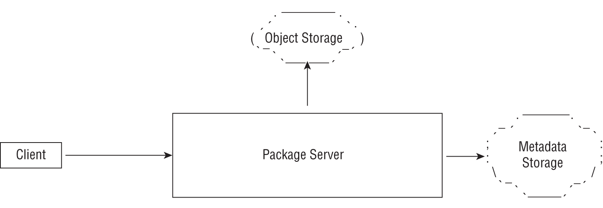
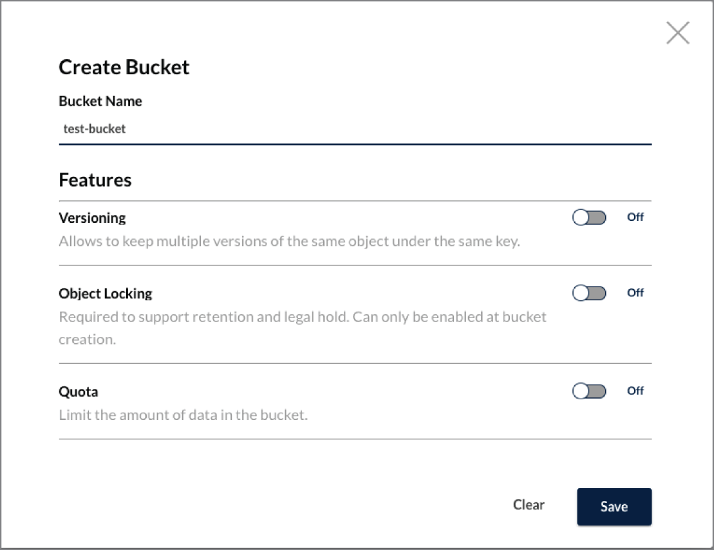
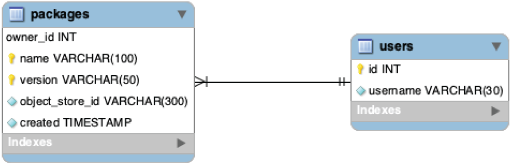

# 使用数据存储
在本章中，你将学习如何与应用程序中的数据存储进行交互。我选择了两种类型的数据存储，基于它们对不同类型应用程序的普遍适用性。你将首先学习与允许存储非结构化数据 blob 的对象存储服务进行交互。然后你将学习与关系数据库交互。我们将使用一个示例 HTTP 服务器作为示例应用程序，我们将在其中实现与数据存储交互相关的各种功能。我们将实现一个服务器来存储软件包，在第 3 章“编写 HTTP 客户端”中首次介绍。它将为其客户提供以下功能：

- 一个客户端可以上传一个或多个包。我们不会太在意确切的文件格式，并允许上传任何文件。
- 每个包都必须有一个与之关联的名称和版本。一个客户端可以上传同一个包的多个版本。
- 客户端应该能够下载特定的包版本。

图 11.1 显示了我们将要实现的场景的架构。我们将两个数据存储与包服务器集成。上传的包将存储在对象存储中。我们将使用 Amazon Web Services Simple Storage Service (S3) 兼容的开源 MinIO 软件作为本地开发的对象存储。为了存储与包相关的元数据，我们将使用关系数据库——MySQL。



图 11.1：示例场景的架构

添加在应用程序中存储数据的能力是必要的，同时也增加了开发和测试它们的复杂性。在本章中，你将学习如何使用自动和手动测试在本地测试功能。你将需要安装额外的软件才能完成本章的其余部分；即 Docker 桌面。本书开头的“入门”一章包含有关如何安装它的说明，因此如果你还没有这样做，现在是这样做的好时机。你还需要能够从 Docker Hub 的镜像注册表下载镜像。让我们开始吧！

## 使用对象存储

Amazon Web Services (AWS) S3、Google Cloud Storage (GCS) 等对象存储服务和 MinIO (https://min.io) 等开源软件通常用于处理任何类型的非结构化应用程序数据读取或写入整个对象——图像、视频和二进制文件是典型的例子。考虑我们将扩展的包服务器。当用户上传包时，我们会将其存储在对象存储中。然后，当用户想要下载包时，我们的应用程序会让他们从包商店下载。对象存储的选择取决于你组织的策略或个人偏好。如果你的应用程序托管在公共云提供商上，你可能最终会使用云提供商的对象存储服务，例如 AWS S3 或 Google Cloud Storage。另一方面，如果你的组织有内部对象存储服务，例如 MinIO，你将使用它。

一旦你选择了数据存储，我们如何与存储服务交互将取决于存储服务本身——通常通过供应商特定的库：例如，https://docs.aws.amazon.com/sdk-for -go/api/service/s3/ 适用于 S3，https://cloud.google.com/go/storage 适用于 Google Cloud Storage，https://github.com/minio/minio-go 适用于 MinIO。我们将采取不同的方法。

我们将使用一个名为 Go Cloud Development Kit (Go CDK) 的项目 https://gocloud.dev，它提供供应商中立的通用 API 来与云和非云服务交互。对象存储是受支持的服务之一。其他包括关系数据库、文档存储和发布订阅系统。我们使用这个项目有两个原因。首先，这允许我们在使用更高级别的抽象与对象存储服务交互时实现关键操作。其次，Go CDK 允许我们通过提供与本地文件系统存储服务交互的功能来编写可测试的代码。这样做的一个理想的副作用是我们的应用程序在一定程度上成为云供应商中立的。

### 与 Package Server 集成
首先，我们将快速熟悉处理传入包上传请求的 HTTP 处理函数。我们将实现将传入的包数据上传到对象存储的功能。

你可能还记得，我们在第 3 章中编写了一个用于将包上传到包服务器的客户端。为了测试它，我们编写了一个测试包服务器（参见代码清单 3.9），我们在其中实现了一个能够处理包上传 HTTP 请求的 HTTP 服务器。在本章中，我们首先要编写一个从测试服务器借用代码的 HTTP 服务器应用程序。我们将实现第 6 章“高级 HTTP 服务器应用程序”中描述的自定义处理程序类型。我们将编写的第一个处理函数将处理包上传请求。以下代码片段显示了用于处理包注册请求的处理程序函数的蓝图，以及用于上传数据的辅助函数：

```go
func uploadData(config appConfig, f *multipart.FileHeader) error {
    config.logger.Printf("Package uploaded: %s\n", f.Filename)
    return nil
}

func packageRegHandler(
    w http.ResponseWriter,
    r *http.Request,
    config appConfig,
) {
    d := pkgRegisterResponse{}
    err := r.ParseMultipartForm(5000)
    # TODO error handling
    mForm := r.MultipartForm
    # TODO Read data from the multipart request data in mForm
    d.ID = fmt.Sprintf(
        "%s-%s-%s",
        packageName,
        packageVersion,
        fHeader.Filename,
    )
    err = uploadData(config, d.ID, fHeader)
    # TODO error handling send response
}
```

传入的请求正文将被编码为多部分/表单数据消息。我们使用 ParseMultipartForm() 方法从请求中读取消息的各个部分，然后调用 uploadData() 函数，目前我们只是记录一条消息。 uploadData() 函数接受两个参数：一个 appConfig 类型的对象和一个 *multipart.FileHeader 类型的对象，它使我们能够访问传入的 multipart/form-data 消息。 appConfig 结构体定义如下：

```go
type appConfig struct {
    logger        *log.Logger
    packageBucket *blob.Bucket
}
```

此结构类型将用于跨处理程序函数共享数据。我们有两个字段：logger，类型为 *log.Logger 的值和 packageBucket，类型为 *blob.Bucket 对象的对象。 packageBucket 字段指的是一个打开的桶，它是对象存储服务中对象的容器。然后，处理程序函数可以使用此对象对存储桶执行各种操作。我们将很快了解创建 *blob.Bucket 对象的详细信息。创建 appConfig 对象后，uploadData() 函数更新如下：

```go
func uploadData(
    config appConfig, objectId string, f *multipart.FileHeader,
) (int64, error) {
    ctx := context.Background()

    fData, err := f.Open()
    if err != nil {
        return 0, err
    }
    defer fData.Close()

    w, err := config.packageBucket.NewWriter(ctx, objectId, nil)
    if err != nil {
        return 0, err
    }

    nBytes, err := io.Copy(w, fData)
    if err != nil {
        return 0, err
    }
    err = w.Close()
    if err != nil {
        return nBytes, err
    }
    return nBytes, nil
}
```

我们首先调用 *multipart.FileHeader 对象的 Open() 方法。该调用返回两个值。第一个 fData 是一个 multipart.File 类型的值，它在 mime/multipart 包中定义，第二个 err 是一个错误值。 multipart.File 类型是一个接口，让我们可以访问请求中的底层文件数据。它嵌入了io.Reader、io.Closer 接口和io 包中的其他接口。

使用 Go CDK 与对象存储服务交互的第一步是打开一个现有的存储桶 - 一个对象容器。没有存储桶就无法存储对象。当我们成功打开一个bucket 时，我们会得到一个*blob.Bucket 类型的对象。 uploadData() 函数的配置对象可以通过 config.packageBucket 字段访问这个对象。然后我们使用三个参数调用在 config.packageBucket 对象上定义的 NewWriter() 方法：

- 第一个参数是 context.Context 值。
- 第二个参数是一个包含标识符或对象名称的字符串，用于标识数据。
- 第三个参数，目前为 nil，是一个 blob.WriterOptions 类型的对象（在 gocloud.dev/blob 包中定义），它允许我们配置与写操作相关的各种选项。你可以设置缓存控制标头、在写入操作期间设置消息完整性检查或设置内容处置标头。

NewWriter() 方法返回两个值：w，类型为 *blob.Writer，和一个错误值。 *blob.Writer 类型满足 io.WriteCloser 接口。然后我们调用 io.Copy() 函数将数据从读取器 fData 复制到写入器 w。该函数返回两个值：nBytes、一个包含复制字节数的 int64 值和一个错误值。当我们在包上传处理函数中记录它时，我们返回复制的字节数。如果错误值为 nil，我们通过调用 Close() 方法关闭 *blob.Writer。

要使用 gocloud.dev/blob 包在 AWS S3 中打开存储桶，我们将空白导入 gocloud.dev/blob/s3blob 包。这是实现与 AWS S3 服务通信功能的驱动程序包。当我们导入它时，它会将自己注册到 gocloud.dev/blob 包中，作为提供与 AWS S3 服务交互支持的包。 Google Cloud Storage 和 Azure Blob Storage 服务也存在类似的包。

以下代码片段在 ap-southeast-2 AWS 区域中打开一个名为 my-bucket 的 AWS S3 存储桶：

```go
import (
    "gocloud.dev/blob"
    _ "gocloud.dev/blob/s3blob"
)
bucket, err := blob.OpenBucket(
    ctx, "s3://my-bucket?region=ap-southeast-2",
)
..
```

我们对 gocloud.dev/blob/s3blob 包使用空白导入，因为我们将只与 gocloud.dev/blob 包进行交互。这是为了明确确保我们的应用程序不会无意中使用任何特定于驱动程序的功能。 blob.OpenBucket() 函数接受两个参数：一个 context.Context 对象和一个包含存储桶 URL 的字符串。为了指定要打开的 S3 存储桶，我们指定了一个 S3 URL，其格式如下：s3://bucket-name?<customisations>。对于本地开发，我们将使用开源的 S3 兼容存储服务 MinIO (https://min.io)，我们可以在本地运行它。为了与本地运行的 MinIO 通信，我们将指定给 OpenBucket() 的 URL 将是 s3://bucket-name?endpoint=http://127.0.0.1:9000&disableSSL=true&s3ForcePathStyle=true。端点查询参数指定对象存储服务请求应发送到的地址。 disableSSL=true 查询参数指定我们希望通过 HTTP（而不是 HTTPS）与存储服务器通信。如果你通过网络与 MinIO 通信；也就是说，在你的本地系统之外，你应该使用 HTTPS 而不是禁用它。 s3ForcePath 样式参数需要强制使用现已弃用的 S3 路径 URL 格式，但需要在我们将运行它时与本地 MinIO 通信。函数调用返回一个 *blob.Bucket 类型的值和一个错误值。如果错误值为 nil，则所有对桶的后续操作都将通过调用在返回的 *blob.Bucket 对象上定义的方法来执行，桶。我们将打开存储桶的功能封装到一个函数中， getBucket() ：

```go
func getBucket(
    bucketName, s3Address, s3Region string,
) (*blob.Bucket, error) {

    urlString := fmt.Sprintf("s3://%s?", bucketName)
    if len(s3Region) != 0 {
        urlString += fmt.Sprintf("region=%s&", s3Region)
    }

    if len(s3Address) != 0 {
        urlString += fmt.Sprintf("endpoint=%s&"+
                                 "disableSSL=true&"+
                                 "s3ForcePathStyle=true",
                                 s3Address,
                                )
    }
    return blob.OpenBucket(context.Background(), urlString)
}
```

当此函数获取 s3Address 的非空值时，它假定我们正在本地与 MinIO 通信并相应地构造 urlString 的值。最后，我们调用 blob.OpenBucket() 函数并返回它返回的值——一个 *blob.Bucket 和一个错误值。这个函数是从服务器的 main() 函数调用的，如下所示：

```go
func main() {
    bucketName := os.Getenv("BUCKET_NAME")
    if len(bucketName) == 0 {
        log.Fatal("Specify Object Storage bucket - BUCKET_NAME")
    }
    s3Address := os.Getenv("S3_ADDR")
    awsRegion := os.Getenv("AWS_DEFAULT_REGION")

    if len(s3Address) == 0 && len(awsRegion) == 0 {
        log.Fatal(
            "Assuming AWS S3 service. Specify 
            AWS_DEFAULT_REGION",
        )
    }

    packageBucket, err := getBucket(
        bucketName, s3Address, awsRegion,
    )
    if err != nil {
        log.Fatal(err)
    }
    defer packageBucket.Close()

    listenAddr := os.Getenv("LISTEN_ADDR")
    if len(listenAddr) == 0 {
        listenAddr = ":8080"
    }

    config := appConfig{
        logger: log.New(
            os.Stdout, "",
            log.Ldate|log.Ltime|log.Lshortfile,
        ),
        packageBucket: packageBucket,
    }

    mux := http.NewServeMux()
    setupHandlers(mux, config)

    log.Fatal(http.ListenAndServe(listenAddr, mux))
}
```

我们在启动时查找三个环境变量：BUCKET_NAME、S3_ADDR 和 AWS_DEFAULT_REGION。必须指定 BUCKET_NAME，并且期望具有该名称的存储桶已存在于对象存储中。如果指定了 S3_ADDR，我们的程序假定我们正在使用本地运行的 MinIO 服务器。如果未指定，则应用程序假定用户想要使用 AWS S3 服务，因此如果未指定要使用的默认 AWS 区域，则会出现错误退出。如果你不熟悉 AWS，则需要默认 AWS 区域，因为 gocloud.dev/blob/s3blob 并且底层 AWS Go SDK 必须知道将 HTTP 请求发送到哪个区域。然后我们调用 getBucket() 函数，如果没有错误，我们创建一个 appConfig 类型的对象，适当地配置 packageBucket 字段。可以在本书源代码存储库的 chap11/pkg-server-1 目录中找到包服务器的完整代码以及到目前为止讨论的修改。确保你可以构建应用程序：

```sh
$ cd chap11/pkg-server-1
$ go build -o pkg-server
```

在运行应用程序之前，我们需要使用应用程序 Docker Desktop 运行 MinIO 服务的本地副本。打开一个新的终端会话，然后在安装了 Docker 并且可以与 Internet 通信的计算机上运行以下命令：

```sh
$ docker run \
    -p 9000:9000 \
    -p 9001:9001 \
    -e MINIO_ROOT_USER=admin \
    -e MINIO_ROOT_PASSWORD=admin123 \
    -ti minio/minio:RELEASE.2021-07-08T01-15-01Z \
    server /data \
    --console-address ":9001"
```

MinIO 通过两个独立的网络端口公开其功能。通过端口 9000 的请求是来自应用程序的对象存储服务 API 调用。这是我们将包服务器指向的端口。第二个端口 9001 配置为控制台地址，用于使用 Web 用户界面与 MinIO 通信。你可以使用主机上的地址 127.0.0.1:9000 和 127.0.0.1:9001 与这些服务进行通信。我们设置root用户名为admin，密码为admin123。我们使用 release RELEASE.2021-07-08T01-15-01Z 来运行本地服务。运行上述命令后，它应该会下载映像并启动一个容器，并且日志应如下所示：

```sh
API: http://172.17.0.2:9000  http://127.0.0.1:9000
RootUser: admin
RootPass: admin123
 
Console: http://172.17.0.2:9001 http://127.0.0.1:9001
RootUser: admin
RootPass: admin123
 
Command-line: https://docs.min.io/docs/minio-client-quickstart-guide
   $ mc alias set myminio http://172.17.0.2:9000 admin admin123
 
Documentation: https://docs.min.io
```

保持服务器运行。通过在浏览器中访问地址 http://127.0.0.1:9001 并分别使用 admin 和 admin123 的用户名和密码登录到 Web UI。然后转到 http://127.0.0.1:9001/buckets 并单击 Create Bucket。指定 test-bucket 作为存储桶名称，然后单击保存（图 11.2）。



图 11.2：在 MinIO 中创建一个bucket

创建存储桶后，返回到你构建包服务器的终端并按如下方式运行它：

```sh
$ cd chap11/pkg-server-1
$ S3_ADDR=http://127.0.0.1:9000 BUCKET_NAME=test-bucket \
   AWS_ACCESS_KEY_ID=admin \
   AWS_SECRET_ACCESS_KEY=admin123 \
   ./pkg-server
```

我们指定包含 MinIO API 可用地址的 S3_ADDR 环境变量。我们使用 BUCKET_NAME 指定要使用的存储桶。 AWS_ACCESS_KEY_ID 和 AWS_SECRET_ACCESS_KEY 环境变量用于指定将用于通过 MinIO API 进行身份验证的凭证。这里我们指定创建的 root 用户名和密码。在服务器运行的情况下，让我们现在请求将包上传到包服务器。

你可以使用任何文件上传。我们将只使用我们拥有源代码的文件之一。在新的终端会话中，使用 curl 命令行程序运行以下命令：

```sh
$ curl -F name=server -F version=0.1 -F filedata=@server.go http://127.0.0.1:8080/api/packages
{"id":"server-0.1-server.go"}
```

我们得到了一个响应，给出了包的标识符，构造为包名-版本-文件名。在运行服务器的终端上，你将看到一条日志语句：

```sh
2021/08/14 08:06:08 handlers.go:46: Package uploaded: server-0.1-server.go. 
Bytes written: 1803
```

如果你现在使用地址 http://127.0.0.1:9001/object-browser/test-bucket 从浏览器访问 MinIO Web UI，你将看到 test-bucket 中有一个对象标识为 server-0.1-服务器。去。太棒了——这太棒了。我们已经将我们的包服务器配置为将指定的文件成功上传到对象存储。保持 MinIO 和包服务器运行。

接下来，让我们编写处理程序函数，以允许应用程序的用户从对象存储服务下载包：

```go
func packageGetHandler(
    w http.ResponseWriter,
    r *http.Request,
    config appConfig,
) {
    queryParams := r.URL.Query()
    packageID := queryParams.Get("id")

    exists, err := config.packageBucket.Exists(
        r.Context(), packageID,
    )
    if err != nil || !exists {
        http.Error(w, "invalid package ID", http.StatusNotFound)
        return
    }

    url, err := config.packageBucket.SignedURL(
        r.Context(),
        packageID,
        nil,
    )
    if err != nil {
        http.Error(
            w,
            err.Error(),
            http.StatusInternalServerError,
        )
        return
    }

    http.Redirect(w, r, url, http.StatusTemporaryRedirect)
}
```

此函数需要作为查询参数传递的确切包标识符，id。然后它将通过调用 *blob.Bucket 对象 packageBucket 的 Exists() 方法来查询对象存储服务以检查对象是否存在。我们使用传入请求的上下文和包标识符调用此方法。它返回两个值：第一个，存在，类型为 bool，和 err，一个错误值。如果对象存在于存储桶中，则exists 中的值为真，否则为假。非 nil 错误值表示在检查对象是否存在时出现意外问题。如果exists 的值为false 或error 值为非nil，我们向客户端返回一个HTTP 404 错误响应。我们明确地执行此检查，因为在为对象创建签名 URL 时，不会检查对象是否存在。如果该对象存在于存储桶中，我们会为该对象创建一个签名 URL，并启动到该 URL 的重定向作为响应。我们在此处使用临时重定向，因为签名 URL 将在你下次请求文件时更改。

签名 URL 允许你的应用程序允许请求者在有限的时间内访问存储桶中的对象。我们使用三个参数调用在 packageBucket 对象上定义的 SignedURL() 方法：传入请求的上下文、为其生成签名 URL 的对象标识符，以及第三个参数的值 nil。第三个参数，如果非 nil，应该是 blob.SignedURLOptions 类型的对象，它允许我们自定义 URL 停止有效的持续时间。例如，你可能希望将 URL 的到期时间设置为 15 分钟，而不是默认的 60 分钟。生成签名 URL 对其他操作也很有用——在存储桶中创建一个对象或删除一个对象。对于这些操作，你需要通过 blob.SignedURLOptions 对象指定 Method 字段设置为 PUT 或 DELETE 而不是默认的 GET 方法。以下是使用自定义到期时间和 PUT 方法创建 blob.SignedURLOptions 对象的示例，允许应用程序用户在有限的时间内创建具有指定标识符的对象：

```go
sOpts := blob.SignedURLOptions{
    Expiry: 15 * time.Minute,
    Method: http.MethodPut, 
}
url, err := config.packageBucket.SignedURL(
    r.Context(),
    packageName,
    &sOpts,
)
```

现在让我们看看实际的包查询行为。你已经运行了包服务器。我们取回了之前上传的包的标识符，现在让我们查询回来：

```sh
$ curl "http://127.0.0.1:8080/api/packages?id=server-0.1-server.go"
<a href="http://127.0.0.1:9000/test-bucket/server-0.1-server.go?
X-Amz-Algorithm=AWS4-HMAC-SHA256&X-Amz-Credential=admin%2F20210814%
2Fap-southeast-2%2Fs3%2Faws4_request&X-Amz-Date=20210814T003039Z&
amp;X-Amz-Expires=3600&X-Amz-SignedHeaders=host&
X-Amz-Signature=3b627ab2ae31e69fba1f8c224c76aae6e24f87982640e
c3373aa8ea
7f94962a2">Temporary Redirect</a>.
```

我们返回到我们查询的对象的签名 URL 的重定向。 URL 指向本地运行的 MinIO 服务器。因此，一旦用户获得签名的 URL，数据将直接从 MinIO 下载。如果我们通过在原始 curl 命令中添加 --location 或在浏览器中打开 URL 来跟踪重定向，你将看到文件内容。

```sh
$ curl --location \
  "http://127.0.0.1:8080/api/packages?id=server-0.1-server.go"
# file contents
```

重定向到引用对象的签名 URL 当然是将数据返回给客户端的一种方法。另一种方法是使用 ReadAll() 方法从应用程序中的存储桶中读取数据或使用 NewReader() 方法获取 io.Reader 并将数据作为响应直接发送给客户端。练习 11.1 会给你一个机会来实现它。

> 练习 11.1：将数据作为响应发送 更新 packageGetHandler() 函数以识别查询参数下载，如果客户端传递该参数，则将直接将文件数据作为响应发回。确保设置正确的 Content-Type 和 Content-Disposition 标头，以便客户端可以决定如何处理文件数据。

使用 MinIO 完成本地开发后，要将你的包服务器指向 AWS S3 存储桶，你需要做的就是指定存储桶名称、正确的访问凭证和区域：

```sh
$ AWS_DEFAULT_REGION=ap-southeast-2 BUCKET_NAME=<your bucker name> \
< AWS_ACCESS_KEY_ID=<aws access key id>\
AWS_SECRET_ACCESS_KEY=<aws-secret-key> ./pkg-server-1
```

接下来，让我们看看如何为处理程序函数编写自动化测试。

### 测试包上传

为了测试包上传功能，我们将使用由 go.dev/blob/fileblob 驱动程序包实现的基于文件系统的存储桶。我们将首先编写一个函数来返回引用基于文件系统的存储桶的 blob.Bucket 对象：

```go
func getTestBucket(tmpDir string) (*blob.Bucket, error) {
    myDir, err := os.MkdirTemp(tmpDir, "test-bucket")
    if err != nil {
        return nil, err
    }
    u, err := url.Parse(fmt.Sprintf("file:///%s", myDir))
    if err != nil {
        return nil, err
    }
    opts := fileblob.Options{
        URLSigner: fileblob.NewURLSignerHMAC(
            u,
            []byte("super secret"),
        ),
    }
    return fileblob.OpenBucket(myDir, &opts)
}
```

我们使用 fileblob 包目录打开一个基于文件系统的存储桶。这样做的原因是能够添加用于创建签名 URL 的功能。我们创建了一个 fileblob.Options 对象，使用以 file:/// 开头的基本 URL、指向我们创建的临时目录的 URL 方案和一个虚拟秘密 super secret 配置一个 URLSigner 函数。

在测试函数中，我们将调用 getTestBucket() 函数并创建 appConfig 对象，如下所示：

```go
func TestPackageGetHandler(t *testing.T) {
    // TODO Get test bucket
    err = packageBucket.WriteAll(
        context.Background(),
        "test-object-id",
        []byte("test-data"),
        nil,
    )
    # TODO Error handling, configuration and test server setup
    var redirectUrl string
    client := http.Client{
        CheckRedirect: func(
            req *http.Request, via []*http.Request,
        ) error {
            redirectUrl = req.URL.String()
            return errors.New("no redirect")
        },
    }

    _, err = client.Get(ts.URL + "/api/packages?id=test-object-id")
    if err == nil {
        t.Fatal("Expected error: no redirect, Got nil")
    }
    if !strings.HasPrefix(redirectUrl, "file:///") {
        t.Fatalf("Expected redirect url to start with file:///,
                 got: %v", redirectUrl)
                 }
}
```

你可以在本书源代码库的 chap11/pkg-server-1 目录中的 package_reg_handler_test.go 文件中找到用于测试包注册处理程序函数的测试函数。

处理程序函数下载包的测试将仅验证重定向行为。如果我们可以验证处理函数是否能够生成重定向作为响应，我们就知道它已经完成了它的工作。以下是我们如何使用新的测试函数 TestPackageGetHandler() 验证这一点，仅显示关键语句：

```go
func TestPackageGetHandler(t *testing.T) {
    // TODO Get test bucket
    err = packageBucket.WriteAll(
        context.Background(),
        "test-object-id",
        []byte("test-data"),
        nil,
    )
    # TODO Error handling, configuration and test server setup
    var redirectUrl string
    client := http.Client{
        CheckRedirect: func(
            req *http.Request, via []*http.Request,
        ) error {
            redirectUrl = req.URL.String()
            return errors.New("no redirect")
        },
    }

    _, err = client.Get(ts.URL + "/api/packages?id=test-object-id")
    if err == nil {
        t.Fatal("Expected error: no redirect, Got nil")
    }
    if !strings.HasPrefix(redirectUrl, "file:///") {
        t.Fatalf("Expected redirect url to start with file:///,
                 got: %v", redirectUrl)
                 }
}
```

我们直接在测试桶中使用精心设计的对象标识符创建一个对象。然后，正如你在第 4 章中回忆的那样，我们必须使用自定义 CheckRedirect 函数创建一个 HTTP 客户端，以确保它不会自动跟随重定向。接下来，我们使用此客户端向测试服务器 URL 发出 HTTP GET 请求，以获取 ID 为 test-object-id 的包。然后，我们验证redirectUrl 中包含重定向位置的字符串值是否以file:/// 开头，指向我们已设置的基于文件系统的存储桶。你可以在本书源代码库的 chap11/pkg-server-1 目录中的 package_get_handler_test.go 文件中找到完整的测试函数。运行 go test 以确保测试通过。

### 访问底层驱动程序类型

到目前为止，你已经了解了如何使用 gocloud.dev/blob 包提供的各种高级接口与 AWS S3 兼容存储服务进行交互。此外，你还学习了如何使用 gocloud.dev/blob/fileblob 包作为测试的文件系统支持的对象存储服务。如果你想在未来更改对象存储服务，你现在需要更改的只是打开存储桶或创建 *blob.Bucket 对象的方式。其余的应用程序代码不需要更改。这就是 gocloud.dev/blob 包为我们提供的力量。

但是，有时你可能需要直接访问底层供应商特定的功能，而 gocloud.dev/blob 不提供这些功能。为了启用此用例，gocloud.dev/blob 包提供了将 gocloud.dev/blob 定义的类型转换为底层供应商特定驱动程序类型的能力。转换成功后，你就可以直接访问底层驱动程序的功能。如果你指的是 AWS S3 中的存储桶，那么你将能够直接访问 AWS SDK for Go 提供的功能以及类似的其他受支持的对象存储服务。

让我们看一个例子。如果我们打开的存储桶不存在，则 blob.OpenBucket() 函数不会返回错误。事实上，gocloud.dev/blob 包不允许我们检查它。但是，底层 AWS 开发工具包的驱动程序特定类型确实允许我们进行检查。考虑以下代码片段：

```go
func main() {
    bucketName := "practicalgo-echorand"
    testBucket, err := blob.OpenBucket(
        context.Background(),
        fmt.Sprintf("s3://%s", bucketName),
    )
    if err != nil {
        log.Fatal(err)
    }
    defer testBucket.Close()

    var s3Svc *s3.S3
    if !testBucket.As(&s3Svc) {
        log.Fatal(
            "Couldn't convert type to underlying S3 
            bucket type",
        )
    }
    _, err = s3Svc.HeadBucket(
        &s3.HeadBucketInput{
            Bucket: &bucketName,
        },
    )
    if err != nil {
        log.Fatalf(
            "Bucket doesn't exist, or 
            insufficient permissions: %v\n",
            err,
        )
    }
}
```

OpenBucket() 函数返回的 *blob.Bucket 对象可转换为 github.com/aws/aws-sdk-go/s3 包中定义的 *s3.S3 类型。因此，我们声明一个 *s3.S3 类型的变量 s3Svc 并调用 testBucket 对象上定义的 As() 方法。如果转换成功，则 As() 方法返回 true，否则返回 false。如果成功，我们就可以使用 s3Svc 对象调用 HeadBucket() 方法，该方法定义在 s3.S3 对象上，以发出 HTTP HEAD 请求，检查存储桶是否存在。非 nil 错误值表示存储桶不存在或当前凭证没有必要的权限。你可以在 chap11/object-store-demo/vendor-as-demo 目录中找到可运行程序列表。要了解 gocloud.dev/blob 公开的底层类型，请查找特定驱动程序的包文档。

终止 MinIO 服务器和包服务器进程。在下一节中，我们将通过添加使用关系数据库存储元数据（名称、版本和与每个包相关的所有者）的功能来更新包服务器。这将另外启用使用包服务器的名称或版本查询包的能力。换句话说，我们通过使用关系数据库向我们的包服务器添加可查询状态。

## 使用关系数据库

关系数据库管理系统的流行示例是 MySQL、PostgreSQL 和 SQLite。对于我们的包服务器，我们将使用 MySQL 作为关系数据库服务器。这些数据库系统建立在存储表和它们之间的关系的概念之上。我们将创建一个数据库 package_server，其中包含两个表：packages 和 users。包表中的一行将包含包名称、版本、以协调世界时 (UTC) 表示的创建时间戳、所有者和标识符，该标识符对于包的每个上传版本都是唯一的。用户表中的一行将包含用于向系统进行身份验证的用户名列和唯一标识系统中用户的标识符。我们不会在我们的应用程序中实施任何身份验证或授权，以保持简单。我们将允许用户上传包的多个版本，并且我们希望我们服务器的用户能够下载包的任何版本。无法重新上传现有的软件包版本。图 11.3 显示了 package_server 数据库的实体关系模型。



图 11.3：包服务器数据库的实体关系图

我们将首先使用 Docker 运行 MySQL 数据库服务器的本地副本，并通过创建预期的数据库表和预填充一些数据来引导服务器。目录 chap11/pkg-server-2/mysql-init 还包含执行此引导操作所需的结构化查询语言 (SQL) 脚本。首先，我们使用文件 01-create-table.sql 中的 SQL 语句创建两个表，用户和包：

```sql
use package_server;
 
CREATE TABLE users (
    id INT PRIMARY KEY AUTO_INCREMENT,
    username VARCHAR(30) NOT NULL
);

CREATE TABLE packages(
    owner_id INT NOT NULL,
    name VARCHAR(100) NOT NULL,
    version VARCHAR(50) NOT NULL,
    object_store_id VARCHAR(300) NOT NULL,
    created TIMESTAMP DEFAULT CURRENT_TIMESTAMP NOT NULL,
    PRIMARY KEY (owner_id, name, version),
    FOREIGN KEY (owner_id)
    REFERENCES users(id)
    ON DELETE CASCADE
);
```

运行第一个脚本后，将运行第二个脚本 02-insert-data.sql 中的 SQL 语句，将五个合成行插入到用户表中：

```sql
INSERT INTO users (username) VALUES ("joe_cool"), ("jane_doe"), 
("go_fer"), ("gopher"), ("bill_bob");
```

这将允许我们选择五个用户之一作为正在上传的包的所有者。从终端会话运行以下命令以使用 Docker 运行本地 MySQL 服务器：

```sh
$ cd chap11/pkg-server-2
$ docker run \
    -p 3306:3306 \
    -e MYSQL_ROOT_PASSWORD=rootpassword \
    -e MYSQL_DATABASE=package_server \
    -e MYSQL_USER=packages_rw \
    -e MYSQL_PASSWORD=password \
    -v "$(pwd)/mysql-init":/docker-entrypoint-initdb.d \
    -ti mysql:8.0.26 \
    --default-authentication-plugin=mysql_native_password
```

保持数据库服务器运行。

### 与 Package Server 集成

为了与关系数据库交互，我们将使用 database/sql 包和一个驱动程序包，这将是特定于我们的应用程序与之交互的数据库的第三方包。 Go 社区在 https://github.com/golang/go/wiki/SQLDrivers 上维护了各种 SQL 数据库的驱动程序列表。如果你使用满足 database/sql 包规定的接口的驱动程序，你的应用程序代码将独立于你与之交互的底层数据库产品。这实际上与使用 gocloud.dev/blob 寻求实现的基于云的对象服务和其他服务非常相似。要使用 database/sql 与 SQL 数据库交互，第一步是使用 sql.Open() 函数创建到它的连接：

```go
db, err := sql.Open("mysql", dsn)
```

该函数接受两个参数。第一个参数是一个包含我们要使用的驱动程序名称的字符串，第二个参数是另一个包含用于连接到数据库的数据源名称 (DSN) 的字符串。每个 SQL 驱动程序都会注册一个名称，指示与之通信的特定关系数据库。我们将使用的驱动程序是 https://github.com/go-sql-driver/mysql 包提供的驱动程序。这个驱动程序的名字是mysql。我们将用于连接到数据库的 DSN 将包含用户名、密码、数据库的网络地址以及我们将连接到的数据库的名称。一个示例 DSN 是 packages_rw:password@tcp(127.0.0.1:3306)/package_server。此 DSN 指定我们要与运行在本地计算机上的 MySQL 服务器上的数据库 package_server 通信，并分别使用 packages_rw 和密码作为用户名和密码侦听端口 3306。

Open() 函数返回两个值：一个 *sql.DB 类型和一个错误值。 *sql.DB 对象封装了一个到数据库的连接池，自动创建和释放连接。你可以分别使用 SetMaxOpenConns()、SetConnMaxLifeTime() 和 SetConnMaxIdleTime() 方法控制打开连接的最大数量、连接的最大生命周期和空闲连接的最大数量。每个方法都接受一个 time.Duration 对象作为参数。需要注意的是，调用 Open() 函数不一定会建立到指定数据库的连接。因此，最好调用 Ping() 方法来验证是否可以使用指定的 DSN 成功建立连接。

我们将定义一个函数来创建并返回一个 *sql.Db 对象：

```go
func getDatabaseConn(
    dbAddr, dbName, dbUser, dbPassword string,
) (*sql.DB, error) {
    dsn := fmt.Sprintf(“%s:%s@tcp(%s)/%s”,
                       dbUser, dbPassword,
                       dbAddr, dbName,
                      )
    return sql.Open(“mysql”, dsn)
}
```

*sql.Db 对象将在服务器应用程序启动时创建，并在服务器的生命周期内保持活动状态。因此，sql.Open() 函数在服务器进程的生命周期内只调用一次。修改后的包服务器的 main() 函数的代码片段显示了这是如何完成的：

```go
func main() {
    // TODO Read object store details
    dbAddr     := os.Getenv("DB_ADDR")
    dbName     := os.Getenv("DB_NAME")
    dbUser     := os.Getenv("DB_USER")
    dbPassword := os.Getenv("DB_PASSWORD")

    if len(dbAddr) == 0 || len(dbName) == 0 || len(dbUser) == 0 
    || len(dbPassword) == 0 {
        log.Fatal(
            "Must specify DB details - DB_ADDR, DB_NAME, 
            DB_USER, DB_PASSWORD",
        )
    }

    db, err := getDatabaseConn(
        dbAddr, dbName,
        dbUser, dbPassword,
    )
    config := appConfig{
        logger: log.New(
            os.Stdout, "",
            log.Ldate|log.Ltime|log.Lshortfile,
        ),
        packageBucket: packageBucket,
        db:            db,
    }
    // Server startup code
}
```

一旦我们有了 *sql.DB 对象，要在服务器上执行查询，我们将调用 Conn() 方法来获取 *sql.Conn 对象：

```go
ctx := context.Background()
conn, err := config.db.Conn(ctx)
defer conn.Close()
```

一旦我们完成了连接，我们必须确保调用 Close() 方法，以便将连接返回到池中。将 *sql.DB 对象视为维护真实 *sql.Conn 对象的底层池的抽象可能会有所帮助。一旦我们有了一个连接，也就是一个 *sql.Conn 对象，我们就可以执行 SQL 查询了。对于只会获取数据的查询，即 SELECT 语句，我们将使用 *sql.Conn 对象的 QueryContext() 方法。对于我们将执行 INSERT、DELETE 或 UPDATE 等操作的查询，我们将使用 *sql.Conn 对象的 ExecContext() 方法。让我们通过添加从包服务器中的关系数据库存储和查询数据的功能来学习如何使用这些方法。

将包上传到对象存储后，我们将通过在新函数 updateDb() 中使用 INSERT SQL 语句向包表添加新行来存储包的元数据。包注册处理程序函数如下所示：

```go
// This always returns the owner id as one of [1, 5] as the
// bootstrapping code only
// populates the users table with these records and since we have
// foreign key relationships
// the package owner must be one of those
func getOwnerId() int {
    return rand.Intn(4) + 1
}

func packageRegHandler(
    w http.ResponseWriter,
    r *http.Request,
    config appConfig,
) {
    # TODO Read the incoming data
    packageOwner := getOwnerId()
    # Upload data to object store
    nBytes, err := uploadData(config, d.ID, fHeader)
    # TODO Error handling
    # Add package metadata to database
    err = updateDb(
        config,
        pkgRow{
            OwnerId:       packageOwner,
            Name:          packageName,
            Version:       packageVersion,
            ObjectStoreId: d.ID,
        },
    )
    # TODO Send back response
}
```

你会记得我们在设置数据库时在用户表中插入了五行。我们定义了 getOwnerId() 函数来返回一个介于 1 和 5 之间的整数，这两个整数都与包的所有者相对应。 updateDb() 函数的定义如下：

```go
func updateDb(config appConfig, row pkgRow) error {
    ctx := context.Background()
    conn, err := config.db.Conn(ctx)
    if err != nil {
        return err
    }
    defer conn.Close()
    result, err := conn.ExecContext(
        ctx,
        `INSERT INTO packages
                (owner_id, name, version, object_store_id)
                VALUES (?,?,?,?);`,
        row.OwnerId, row.Name, row.Version, row.ObjectStoreId,
    )
    if err != nil {
        return err
    }
    nRows, err := result.RowsAffected()
    if err != nil {
        return err
    }
    if nRows != 1 {
        return fmt.Errorf(
            "expected 1 row to be inserted, Got: %v",
            nRows,
        )
    }
    return nil
}
```

该函数使用两个参数调用。第一个 config 是一个 appConfig 对象，它包含一个新字段 db，类型为 *sql.DB，指的是到 MySQL 数据库的连接池。然后我们使用 config.db.Conn(ctx) 从这个池中获得一个连接。第二个参数 row 是一个 pkgRow 类型的对象，其定义如下：

```go
type pkgRow struct {
    OwnerId       int
    Name          string
    Version       string
    ObjectStoreId string
    Created       string
}
```

pkgRow 对应于存储在包表中的一行，当向数据库表中插入一行或查询一行时，它将是我们应用程序在内存中的包表示。如果我们成功获得连接，我们按如下方式运行 INSERT 查询：

```go
result, err := conn.ExecContext(
    ctx,
    `INSERT INTO packages
                (owner_id, name, version, object_store_id)
                VALUES (?,?,?,?);`,
    row.OwnerId, row.Name, row.Version, row.ObjectStoreId,
)
```

ExecContext() 方法的第一个参数是context.Context 类型的对象。第二个参数是要执行的 SQL 查询。请注意，我们没有将值作为查询的一部分传递，而是使用占位符字符 ?。这可以防止我们应用程序的恶意用户进行 SQL 注入攻击。然后我们以相同的顺序传递我们想要用于列的不同值。在内部，Go MySQL 驱动程序使用 MySQL 对准备好的语句的支持来执行查询。它首先创建准备好的语句。然后它发送用于执行准备好的语句的值。 ExecContext() 方法返回两个值：sql.Result 类型的结果和错误值 err。 sql.Result 类型是一个接口，定义如下：

```go
type Result interface {
    LastInsertId() (int64, error)
    RowsAffected() (int64, error)
}
```

这两种方法的行为都依赖于数据库。如果我们从对 ExecContext() 方法的调用中返回一个 nil 错误，则该语句已成功执行。那么，如果我们调用LastInsertId()方法，返回的值可能是成功的INSERT、DELETE或UPDATE操作对应的自动递增列的值。由于我们在packages 表中没有任何自增列，如果我们调用这个方法，我们将返回一个值0。RowsAffected() 方法返回受刚刚执行的语句影响的行数。这有助于确保执行的 SQL 语句达到预期效果。在 updateDb() 函数中，我们预计应该影响一行；即插入。如果不是这种情况，我们将返回错误。

接下来，我们将更新 packageGetHandler() 函数，以便用户可以通过指定元数据（所有者 ID、名称和版本）来下载包数据。我们定义了一个新类型 pkgQueryParams 来封装查询参数：

```go
type pkgQueryParams struct {
    name    string
    version string
    ownerId int
}
```

处理函数更新如下：

```go
func packageGetHandler(
    w http.ResponseWriter, r *http.Request, config appConfig,
) {
    queryParams := r.URL.Query()
    owner := queryParams.Get("owner_id")
    name := queryParams.Get("name")
    version := queryParams.Get("version")
    // TODO Return a HTTP 400 Bad Request error if
    // any of the above is missing

    ownerId, err := strconv.Atoi(owner)

    // TODO Return a HTTP 400 error if the conversion was
    // not successful

    q := pkgQueryParams{
        ownerId: ownerId,
        version: version,
        name:    name,
    }
    pkgResults, err := queryDb(
        config, q,
    )
    // TODO error handling

    if len(pkgResults) == 0 {
        http.Error(w, "No package found", http.StatusNotFound)
        return
    }

    url, err := config.packageBucket.SignedURL(
        r.Context(),
        pkgResults[0].ObjectStoreId,
        nil,
    )
    if err != nil {
        http.Error(
            w, err.Error(), http.StatusInternalServerError,
        )
        return
    }
    http.Redirect(w, r, url, http.StatusTemporaryRedirect)
}
```

在处理函数中，我们在传入的请求 URL 中查找三个查询参数：owner_id、name 和 version。如果没有指定任何参数或 owner_id 的值无法成功转换为整数，我们将返回 HTTP 错误请求错误。

然后我们创建一个 pkgQueryParams 类型的新对象，其中包含这些查询参数的值并调用 queryDb() 函数。 queryDb() 函数返回两个值：第一个是 pkgRow 对象的切片，第二个是错误值。如果我们返回一个空切片，我们会发送一个 HTTP 404 状态作为响应。否则，我们检索切片中的第一项，调用 config.packageObject 中定义的 SignedURL() 方法生成签名 URL，然后重定向到它。接下来我们看看queryDb()函数的定义。

该函数将首先构建要发送到数据库的查询，其格式为 SELECT * FROM packages WHERE owner_id=1 AND name=test-package AND version=0.1。尽管在这种情况下我们必须指定所有条件，但我们将以任何一个条件都足以获取包的方式编写函数。 （在练习 11.2 时你会发现这很有用。）因此，我们必须能够构建一个查询，例如 SELECT * FROM packages WHERE owner_id=1 AND name=test-package 或 SELECT * FROM packages WHERE owner_id=1 。

以下代码片段显示了我们构建查询的部分 queryDb() 函数：

```go
func queryDb(
    config appConfig, params pkgQueryParams,
) ([]pkgRow, error) {

    args := []interface{}{}
    conditions := []string{}
    if params.ownerId != 0 {
        conditions = append(conditions, "owner_id=?")
        args = append(args, params.ownerId)
    }
    if len(params.name) != 0 {
        conditions = append(conditions, "name=?")
        args = append(args, params.name)
    }
    if len(params.version) != 0 {
        conditions = append(conditions, "version=?")
        args = append(args, params.version)
    }

    if len(conditions) == 0 {
        return nil, fmt.Errorf("no query conditions found")
    }

    query := fmt.Sprintf(
        "SELECT * FROM packages WHERE %s",
        strings.Join(conditions, " AND "),
    )
    // TODO Execute the query
}
```

我们创建了两个切片，我们将根据 params 对象中的字段逐步填充它们。 args 是空接口 interface{ } 类型的切片，我们将在此切片中存储 owner_id、name 或 version 的值。我们需要使它成为 []interface{}{} 类型，而不是 []string，因为 QueryContext() 期望以该格式提供占位符值。第二个切片是 []string{} 类型的条件，我们将在其中添加将成为查询一部分的条件。我们检查指定了哪些字段，然后将相应的条件和相应的占位符值分别附加到条件和 args 切片。如果没有指定任何条件，我们将返回错误。

最后，我们使用带有条件切片内容的 strings.Join() 函数，用 AND（带有前导和后继空格）连接元素。通过调用 fmt.Sprintf() 函数获得的结果字符串现在可以执行了：

```go
func queryDb(
    config appConfig, params pkgQueryParams,
) ([]pkgRow, error) {
    ctx := context.Background()
    conn, err := config.db.Conn(ctx)
    if err != nil {
        log.Fatal(err)
    }
    defer conn.Close()

    // TODO Build the query as above

    rows, err := conn.QueryContext(ctx, query, args…)
    if err != nil {
        return nil, err
    }
    defer rows.Close()
    // TODO Read the results
}
```

QueryContext() 函数接受三个参数：

- 第一个参数是 context.Context 类型的对象。
- 第二个参数是一个包含要执行的查询的字符串。
- 第三个参数是一部分 interface{} 值，其中包含查询中占位符参数的值。

它返回两个值：第一个，rows，是database/sql 包中定义的*sql.Rows 类型的对象，第二个是错误值。如果我们得到一个非 nil 错误值，则查询无法成功执行，我们从函数中返回。然而，如果我们得到一个 nil 错误值，我们会设置一个对 rows.Close() 方法的延迟调用并继续读取返回的结果。调用 rows.Close() 将确保连接返回到池中。

我们一次读取一行结果，如下枚举行对象：

```go
func queryDb(
    config appConfig, params pkgQueryParams,
) ([]pkgRow, error) {

    // TODO Build the query as above

    // TODO Execute the query as above

    var pkgResults []pkgRow
    for rows.Next() {
        var pkg pkgRow
        if err := rows.Scan(
            &pkg.OwnerId, &pkg.Name, &pkg.Version,
            &pkg.ObjectStoreId, &pkg.Created,
        ); err != nil {
            return nil, err
        }
        pkgResults = append(pkgResults, pkg)
    }

    if err := rows.Err(); err != nil {
        return nil, err
    }
    return pkgResults, nil
}
```

调用rows.Next() 方法启动读取操作。当没有任何内容可供读取或读取行时出现错误时，它返回 false。

然后我们调用rows.Scan() 方法，将引用传递给我们希望读取各个列值的目标变量。我们必须确保引用和列的顺序匹配。如果 Scan() 成功，我们将 pkg 中的值附加到切片 pkgResults 。

一旦我们读完所有的行，或者在读行时出现错误，即退出for循环，我们调用Err()方法检查是否有错误。如果是，我们返回它，否则我们返回切片、pkgResults 和一个 nil 错误值。

你可以在本书源代码存储库的 chap11/pkg-server-2 目录中找到具有对象存储服务和数据库集成的包服务器的新版本。 db_store.go 文件包含与数据库交互的函数。现在让我们尝试一下我们添加的新功能。请记住在单独的终端会话中也启动本地 MinIO 服务，除非你直接使用 AWS S3 存储桶。如果你没有在本地运行 MySQL 数据库，请确保你也这样做了。让我们构建并运行包服务器：

```sh
$ cd chap11/pkg-server-2
$ go build
$ AWS_ACCESS_KEY_ID=admin \
  AWS_SECRET_ACCESS_KEY=admin123 \
  BUCKET_NAME=test-bucket \
  S3_ADDR=localhost:9000 \
  DB_ADDR=localhost:3006 \
  DB_NAME=package_server \
  DB_USER=packages_rw \
  DB_PASSWORD=password ./pkg-server
```

从一个新的终端会话中，首先让我们尝试下载一个不存在的包：

```sh
$ curl "http://127.0.0.1:8080/api/packages?name=test-package&version=0.1&owner_id=1"
No package found
```

太好了，现在让我们添加一个包：

```sh
$ curl -F name=test-package -F version=0.1 \
-F filedata=@image.tgz http://127.0.0.1:8080/api/packages
{"id":"2/test-package-0.1-image.tgz"}
```

你将在 chap11/pkg-server-2 目录中找到 image.tgz 文件。当然，你可以随意使用任何其他文件。请注意，响应中还包含所有者的用户 ID 2，你可能会有所不同，因为我们随机分配了一个所有者。接下来，让我们尝试下载包，确保你使用的元数据与你使用的相应值匹配：

```sh
$ curl --location "http://127.0.0.1:8080/api/packages?name=test-package&version=0.1&owner_id=2"
Warning: Binary output can mess up your terminal. Use "--output -" 
to tell
Warning: curl to output it to your terminal anyway, or consider 
"--output
Warning: <FILE>" to save to a file.
```

curl 默认不显示输出，因为响应是非文本文件。如果你改用浏览器，你上传的文件将被下载或内联显示内容。伟大的！我们现在已经验证对象存储服务和数据库现在都与包服务器集成。你可以将你的应用程序指向在其他地方运行的 MySQL 数据库服务器，例如通过 AWS RDS，并为其提供相应的连接详细信息，一切都应该像本地一样正常工作。

接下来你有一个练习来巩固你的理解，练习 11.2。

> 练习 11.2：包查询端点 更新包服务器以允许用户使用所有者 ID、名称或版本查询包详细信息。仅指定版本无效。不指定任何查询参数将返回所有包详细信息。作为响应返回给客户端的包元数据应该是 JSON 格式的字符串。
>
> 你可能希望使用现有的 /api/packages 端点来实现此功能，并实现一个新的 API 端点来下载包。

### 测试数据存储
在测试数据库交互时，可以采用多种方法。使用模拟、使用内存中的 SQL 数据库和运行数据库的本地副本是其中的一些。我们将采用第三种方法。它允许我们测试我们的应用程序，类似于它在生产环境中的配置方式，配置为使用真实的数据库服务器。我们将使用 Docker 容器来运行 MySQL 的本地副本，按照我们在上一节中所做的方式对其进行引导，然后启动指向该数据库服务器副本的应用程序。一旦测试完成执行，MySQL 容器将自动终止。为了协调这些测试容器的创建和终止，我们将使用第三方包：https://github.com/testcontainers/testcontainers-go/。使用这个包，我们将编写一个函数 getTestDb()，它将返回一个 *sql.DB 对象，该对象配置为与启动的测试数据库服务器进行通信：


你会记得，在创建本地 MySQL Docker 容器时，我们从 chap11/pkg-server-2 目录卷挂载了 mysql-init 目录，以便我们可以创建表并将记录插入到用户表中。在创建测试容器时，我们也会这样做。我们首先使用 os 包中的 os.Stat() 函数来确保目录存在，然后构造目录的绝对路径，将其存储在 bindMountPath 中。

然后我们创建一个容器请求如下：

```go
func getTestDb() (testcontainers.Container, *sql.DB, error) {
    // TODO Insert the code shown earlier
    waitForSql := wait.ForSQL("3306/tcp", "mysql",
                              func(p nat.Port) string {
                                  return "root:rootpw@tcp(" +
                                  "127.0.0.1:" + p.Port() +
                                  ")/package_server"
                              })
    waitForSql.WithPollInterval(5 * time.Second)

    req := testcontainers.ContainerRequest{
        Image:        "mysql:8.0.26",
        ExposedPorts: []string{"3306/tcp"},
        Env: map[string]string{
            "MYSQL_DATABASE":      "package_server",
            "MYSQL_USER":          "packages_rw",
            "MYSQL_PASSWORD":      "password",
            "MYSQL_ROOT_PASSWORD": "rootpw",
        },
        BindMounts: map[string]string{
            bindMountPath: "/docker-entrypoint-initdb.d",
        },
        Cmd: []string{
            "--default-authentication-plugin=
            mysql_native_password",
        },
        WaitingFor: waitForSql,
    }

    // TODO Start container and create *sql.Db object
 
}
```

创建容器的第一步是创建 testcontainers 包（https://github.com/testcontainers/testcontainers-go/）中定义的 testcontainers.ContainerRequest 类型的对象：

- Image 字段对应于我们要用于容器的 Docker 镜像。
- ExposedPorts 字段是一个格式为 port/protocol 的字符串片段，其中包含我们想要向主机公开的端口。我们只想公开 MySQL 进程正在侦听的端口；即 3306。请注意，我们没有指定主机端口映射，因为我们将动态检索映射的主机端口。
- Env 字段是我们要在容器内设置的环境变量的映射。我们使用相关的环境变量设置数据库名称、用户、密码和 root 密码。
- BindMounts 是一个包含容器卷安装的映射。这里我们只有一个卷挂载——主机上的 mysql-init 目录应该挂载在容器内的 /docker-entrypoint-initdb.d 。
- Cmd 字段是一个字符串，其中包含要在容器启动时指定给程序的命令行参数。
- WaitingFor 字段指定等待策略。该值必须是一个满足 wait.Strategy 类型的对象，wait.Strategy 是一个在 testcontainers/wait 包中定义的接口。它本质上是确保容器创建函数（显示在下一个代码片段中）在指定的等待策略得到满足之前不会返回。该包包含了一个SQL数据库的等待策略，由testcontainers/wait包中的waitForSql类型实现。它使用指定的驱动程序和数据库连接详细信息执行查询 SELECT 1 以检查数据库是否准备就绪。我们在这里需要做的就是调用带有三个参数的 wait.ForSQL() 函数：服务器进程正在侦听的容器内的端口、使用的驱动程序以及构建用于连接到数据库的 DSN 的函数。它通过调用调用函数的 nat.Port 对象的 p.Port() 方法来检索主机上的映射端口。我们还将轮询间隔设置为 5 秒，以便它每 5 秒只检查一次准备情况。

最后一步是启动容器并通过连接到启动的容器来创建 *sql.DB 对象：

```go
func getTestDb() (testcontainers.Container, *sql.DB, error) {
    // TODO Insert the code shown earlier
    // TODO Create the container request as shown above

    ctx := context.Background()
    mysqlC, err := testcontainers.GenericContainer(
        ctx,
        testcontainers.GenericContainerRequest{
            ContainerRequest: req,
            Started:          true,
        })
    if err != nil {
        return mysqlC, nil, err
    }

    addr, err := mysqlC.PortEndpoint(ctx, "3306", "")
    if err != nil {
        return mysqlC, nil, err
    }
    db, err := getDatabaseConn(
        addr, "package_server",
        "packages_rw", "password",
    )
    if err != nil {
        return mysqlC, nil, nil
    }
    return mysqlC, db, nil
}
```

testcontainers.GenericContainer() 函数接受两个参数。第一个是 context.Context 类型的值，你可以使用它来控制你希望允许容器准备多长时间。第二个参数是一个testcontainers.GenericContainerRequest类型的对象，我们指定了两个字段：ContainerRequest，它的值是我们之前创建的容器请求对象req；并将 Started 设置为 true，因为我们要启动容器。此函数返回两个值：第一个是 testcontainers.Container 类型的对象，第二个是错误值。如果函数返回一个 nil 错误值，我们调用 PortEndpoint() 方法来获取我们可以用来从主机连接到容器的地址。然后我们调用getDatabaseConn()方法获取*sql.DB对象。

你可以在 chap11/pkg-server2/test_utils.go 文件中找到 getTestDb() 函数的定义。有了创建测试 MySQL 容器的能力，我们现在可以开始为处理程序函数编写测试以及只为数据库交互函数编写测试。例如，对包 get 处理程序函数的测试将定义如下：

```go
func TestPackageGetHandler(t *testing.T) {
    packageBucket, err := getTestBucket(t.TempDir())
    testObjectId := "pkg-0.1-pkg-0.1.tar.gz"
    // create a test object
    err = packageBucket.WriteAll(
        context.Background(),
        testObjectId, []byte("test-data"),
        nil,
    )

    testC, testDb, err := getTestDb()
    if err != nil {
        t.Fatal(err)
    }
    defer testC.Terminate(context.Background())

    config := appConfig{
        logger: log.New(
            os.Stdout, "", 
            log.Ldate|log.Ltime|log.Lshortfile,
        ),
        packageBucket: packageBucket,
        db:            testDb,
    }

    // update package metadata for the test object
    err = updateDb(
        config,
        pkgRow{
            OwnerId:       1,
            Name:          "pkg",
            Version:       "0.1",
            ObjectStoreId: testObjectId,
        },
    )
    if err != nil {
        t.Fatal(err)
    }

    // TODO Make HTTP requests and verify results
}
```

我们调用 getTestDb() 函数来获取 *sql.DB 对象。然后我们对返回的 testcontainers.Container 值 testC 的 Terminate() 方法进行延迟调用，以便容器在测试运行结束时终止。

然后我们使用 db 字段的值创建一个 appConfig 对象到 testDb。接下来，我们调用 updateDb() 函数为测试包添加包元数据。这对应于我们之前在函数中创建的测试对象。然后我们发出一个 HTTP 请求来下载包数据并验证重定向行为。你可以在 package_get_handler_test.go 文件中找到测试的完整定义以及另一个测试。在 package_reg_handler_test.go 文件中，你还将找到用于测试包注册功能的测试函数。

接下来，我们将讨论你在使用数据库时可能遇到的几个特定的常见数据类型转换场景。

### 数据类型转换

当我们调用 *sql.Rows 对象的 Scan() 方法时，驱动程序包正在执行从数据库中表示的列的原始数据类型到我们的应用程序中表示的目标变量类型的自动类型转换。当我们使用 ExecContext() 方法执行 INSERT 或 UPDATE 语句时，会发生相反的过程。 Scan() 方法的文档描述了有关转换操作的指南。

我们要讨论的第一个场景是需要转换 TIMESTAMP（以及相关的列类型 DATETIME 和 TIME）。再次考虑 pkgRow 结构：

```go
type pkgRow struct {
    OwnerId       int
    Name          string
    Version       string
    ObjectStoreId string
    Created       string
}
```

Created 字段用于存储从packages 表中查询到的created 列的值。创建的列被声明为 TIMESTAMP 类型。在 MySQL 中，这意味着它将始终将日期和时间存储为协调世界时 (UTC) 值，例如 2022-01-19 03:14:07。当我们执行 Scan() 方法时，会读取创建的列的值，然后将其作为字符串存储在指定 pkgRow 对象的 Created 字段中。然后，你可以使用 time 包中的 time.Parse() 函数将此字符串转换为 time.Time 对象，如下所示：

```go
// results contain the sql.Rows object obtained via calling queryDb()
layout := "2006-01-02 15:04:05"
created := results[0].Created
parsedTime, err := time.Parse(layout, created)
if err != nil {
    t.Fatal(err)
}
```

另一种方法可能是让你利用 MySQL 驱动程序的自动解析功能。如果在连接数据库时在DSN 中添加parseTime=true，它会自动尝试将TIMESTAMP、DATETIME 和DATE 列解析为time.Time 类型。 getDatabaseConn() 函数将显示如下：

```go
func getDatabaseConn(
    dbAddr, dbName, dbUser, dbPassword string,
) (*sql.DB, error) {
    dsn := fmt.Sprintf(
        "%s:%s@tcp(%s)/%s?parseTime=true",
        dbUser, dbPassword,
        dbAddr, dbName,
    )
    return sql.Open("mysql", dsn)
}
```

然后我们将重新定义 pkgRow 结构，使 Created 字段的类型为 time.Time ：

```go
type pkgRow struct {
    // other fields as earlier
    Created       time.Time
}
```

现在，当我们调用 Scan() 函数时，Created 字段将包含 created 列的值，UTC 中的包创建时间作为 time.Time 值。但是，值得注意的是，如果解析失败， Scan() 方法将失败。因此，如果你不信任数据库中的数据，可能值得考虑明确解析应用程序中的 TIMESTAMP 和其他相关字段。

在第二种情况下，我们将研究如何处理来自数据库的 NULL 数据。假设我们向包表中添加了一个新列 repo_url ：

```sql
CREATE TABLE packages(
    -- TODO other columns
    repo_url VARCHAR(300) DEFAULT NULL,
)
```

此列将可选地包含指向包的源代码存储库的 URL。如果你尝试将此列的 NULL 值扫描为字符串数据类型，则会失败。因此，database/sql 包定义了特殊的数据类型来处理 NULL 值。此处使用的正确类型是 sql.NullString 类型：

```go
type pkgRow struct {
    // other fields
    RepoURL       sql.NullString
}
```

sql.NullString 定义了一个布尔字段 Valid，如果 repo_url 列中存储了非 NULL 值，则该字段将为 true。如果 Valid 的值为真，则字符串字段包含字符串本身。向数据库添加一行看起来也会略有不同。首先，我们创建一个 pkgRow 对象，如下所示：

```go
pkgRow{
    // other fields
    RepoURL: sql.NullString{
        String: “http://github.com/practicalgo/code”,
        Valid: true,
    },
},
```

然后，我们将更新并执行 updateDb() 函数，如下所示：

```go
func updateDb(config appConfig, row pkgRow) error {
    # TODO: Get DB connection
    columnNames := []string{
        "owner_id", "name", "version", "object_store_id",
    }
    valuesPlaceholder := []string{"?", "?", "?", "?"}
    args := []interface{}{
        row.OwnerId, row.Name, row.Version, row.ObjectStoreId,
    }

    if row.RepoURL.Valid {
        columnNames = append(columnNames, "repo_url")
        valuesPlaceholder = append(valuesPlaceholder, "?")
        args = append(args, row.RepoURL.String)
    }
    query := fmt.Sprintf(
        "INSERT INTO packages (%s) VALUES (%s);", 
        strings.Join(columnNames, ","),
        strings.Join(valuesPlaceholder, ","),
    )

    result, err := conn.ExecContext(
        ctx, query, args…,
    )
    # TODO process results
}
```

由于 repo_url 列不是强制性的，我们检查 pkgRow 对象是否具有有效的 RepoURL 字段，如果是，则更新 SQL 语句以解决该问题。

除了 sql.NullString 类型之外，database/sql 包还定义了等效类型来处理 time.Time、float64、int32、int64 和其他 Go 类型的 NULL 列值。在本书源代码库的 chap11/mysql-demo 目录中，你将找到代码清单和测试，你可以通过这些测试来更好地理解前面的概念。

在本章的最后一节，你将学习如何从应用程序使用数据库事务。

### 使用数据库事务
要启动事务，我们将调用在 *sql.Conn 对象上定义的 BeginTx() 方法。它返回两个值：第一个值是 *sql.Tx 类型，第二个是错误值。如果我们成功获得了 *sql.Tx 值，我们将使用在该对象上定义的 ExecContext() 方法执行 SQL 查询。这是包服务器的修改后的 updateDb() 函数的示例：

```go
func updateDb(ctx context.Context, config appConfig, row pkgRow) error {
    conn, err := config.db.Conn(ctx)
    if err != nil {
        return err
    }
    defer conn.Close()

    tx, err := conn.BeginTx(ctx, nil)
    if err != nil {
        return err
    }

    result, err := tx.ExecContext(
        ctx,
        `INSERT INTO packages 
(owner_id, name, version, object_store_id) VALUES (?,?,?,?);`,
        row.OwnerId, row.Name, row.Version, row.ObjectStoreId,
    )
    if err != nil {
        rollbackErr := tx.Rollback()
        log.Printf("Txn Rollback Error:%v\n", rollbackErr)
        return err
    } 
    return tx.Commit()
}
```

BeginTx() 方法接受两个参数：第一个是 context.Context 类型的对象，第二个是 database/sql 包中定义的 sql.TxOptions 类型的对象：

```go
type TxOptions struct {
    Isolation IsolationLevel
    ReadOnly  bool
}
```

Isolation 字段指定事务的隔离级别。如果未指定，则默认为 MySQL 驱动程序的默认隔离级别。我们使用的 MySQL 驱动程序使用 MySQL 存储引擎的默认隔离级别。

如果我们在执行查询时遇到错误，我们会调用 Rollback() 方法来回滚事务。如果我们在回滚事务时遇到错误，我们会记录它并返回原始错误。如果查询成功执行，我们会根据需要执行任何其他查询。如果所有查询都成功执行，我们调用 tx.Commit() 方法提交事务。 Commit() 方法返回一个错误值，我们也返回该值。

在应用程序级别，在事务中运行查询的一大优点是，如果取消创建事务时指定的上下文，它将自动回滚。这允许我们在我们的服务器中实现行为，如果客户端取消请求或以其他方式取消，事务也会自动回滚。例如，我们可以更新包注册处理函数如下：

```go
func packageRegHandler(
    w http.ResponseWriter,
    r *http.Request,
    config appConfig,
) {
    // TODO Upload package to object store
    err = updateDb(
        r.Context(),
        config,
        pkgRow{
            OwnerId:       packageOwner,
            Name:          packageName,
            Version:       packageVersion,
            ObjectStoreId: d.ID,
        },
    )
    // TODO: other code
}
```

类似的策略也可以在你的 gRPC 应用程序中实现以响应客户端断开连接。你可以在本书源存储库的目录 chap11/pkg-server-2-transaction 中使用事务找到包服务器代码的更新实现。

## 概括

在本章中，你学习了如何从应用程序持久存储数据。我们从学习如何在对象存储服务中存储非结构化数据 blob 开始。我们使用 gocloud.dev/blob 包以供应商中立的方式与对象存储服务进行交互。使用此包，切换对象存储服务将需要对你的应用程序进行最少的更改。此外，它还允许我们使用 gocloud.dev/blob/fileblob 包对我们的功能进行测试，该包实现了基于文件系统的对象存储服务。

然后，你学习了如何在我们的应用程序中将数据存储在关系数据库中。你学习了使用由 database/sql 包提供的标准接口和符合该接口的 MySQL 驱动程序来存储和查询 MySQL 数据。与 gocloud.dev 一样，database/sql 允许我们编写在切换数据库供应商时需要最少更改的应用程序。你学习了如何使用有用的第三方包来测试你的应用程序，这允许我们在本地容器中运行 MySQL。

而已！你已经完成了本书的最后一章。在这两个附录中，你将学习向应用程序添加检测功能，并熟悉分发和部署应用程序的有用技术。