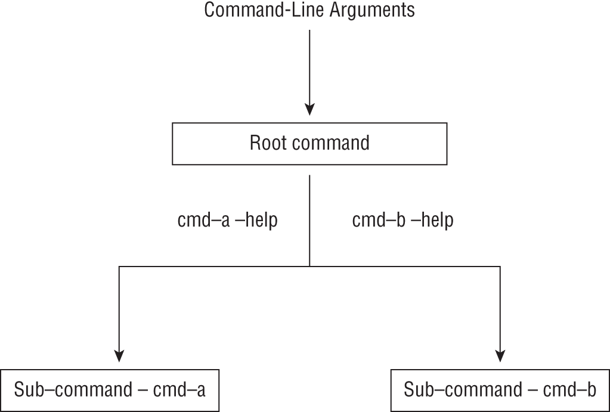
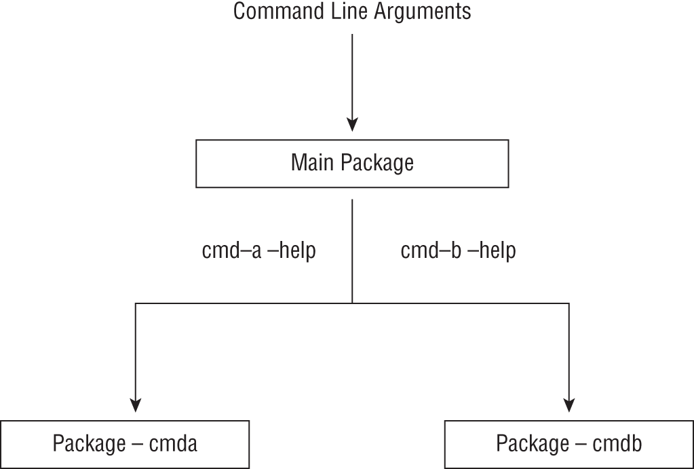

# 高级命令行应用程序
在本章中，你将学习如何使用标志包来实现带有子命令的命令行应用程序。然后，你将看到如何使用上下文在命令行应用程序中强制执行可预测的行为。最后，你将学习如何在应用程序中组合上下文和处理操作系统信号。让我们跳进去。

## 实现子命令
子命令是一种将命令行应用程序的功能拆分为具有自己的选项和参数的逻辑独立命令的方法。你有一个顶级命令——你的应用程序——然后你有一组子命令，每个子命令都有自己的选项和参数。例如，Go 工具链作为单个应用程序 go 分发，它是顶级命令。作为 Go 开发人员，你将通过专用的子命令（例如 build、fmt 和 test）与其各种功能进行交互。

你会记得在第 1 章中，要创建命令行应用程序，你首先要创建一个 FlagSet 对象。要使用子命令创建应用程序，你将为每个子命令创建一个 FlagSet 对象。然后，根据指定的子命令，相应的 FlagSet 对象用于解析剩余的命令行参数（见图 2.1）。



图 2.1：主应用程序查看命令行参数并在可能的情况下调用适当的子命令处理程序。

考虑具有两个子命令的应用程序的 main() 函数， – cmd-a 和 cmd-b ：

```go
func main() {
    var err error
    if len(os.Args) < 2 {
        printUsage(os.Stdout)
        os.Exit(1)
    }
    switch os.Args[1] {
        case "cmd-a":
        err = handleCmdA(os.Stdout, os.Args[2:])
        case "cmd-b":
        err = handleCmdB(os.Stdout, os.Args[2:])
        default:
        printUsage(os.Stdout)
    }

    if err != nil {
        fmt.Println(err)
    }
    os.Exit(1)
}
```

os.Args 切片包含调用应用程序的命令行参数。我们将处理三种输入情况：

1. 如果第二个参数是 cmd-a，则调用 handleCmdA() 函数。
2. 如果第二个参数是 cmd-b，则调用 handleCmdB() 函数。
3. 如果在没有任何子命令的情况下调用应用程序，或者在上面的情况 1 或情况 2 中都没有列出，则调用 printUsage() 函数以打印帮助消息并退出。

handleCmdA() 函数实现如下：

```go
func handleCmdA(w io.Writer, args []string) error {
    var v string
    fs := flag.NewFlagSet("cmd-a", flag.ContinueOnError)
    fs.SetOutput(w)
    fs.StringVar(&v, "verb", "argument-value", "Argument 1")
    err := fs.Parse(args)
    if err != nil {
        return err
    }
    fmt.Fprintf(w, "Executing command A")
    return nil
}
```

上面的函数看起来与你之前在第 1 章中作为greeter 应用程序的一部分实现的 parseArgs() 函数非常相似。它创建一个新的 FlagSet 对象，执行各种选项的设置，并解析特定的参数片段。 handleCmdB() 函数将为 cmd-b 子命令执行自己的设置。

printUsage() 函数定义如下：

```go
func printUsage(w io.Writer) {
    fmt.Fprintf(w, "Usage: %s [cmd-a|cmd-b] -h\n", os.Args[0])
    handleCmdA(w, []string{"-h"})
    handleCmdB(w, []string{"-h"})
}
```

我们首先通过 fmt.Fprintf() 函数为应用程序打印一行使用消息，然后使用 -h 作为参数切片中的唯一元素调用各个子命令处理函数。这会导致这些子命令显示它们自己的帮助消息。

完整的程序如清单 2.1 所示。

清单 2.1：在命令行应用程序中实现子命令

```go
// chap2/sub-cmd-example/main.go
package main
 
import (
    "flag"
    "fmt"
    "io"
    "os"
)
 
// TODO Insert handleCmdaA() implementation as earlier
 
func handleCmdB(w io.Writer, args []string) error {
    var v string
    fs := flag.NewFlagSet("cmd-b", flag.ContinueOnError)
    fs.SetOutput(w)
    fs.StringVar(&v, "verb", "argument-value", "Argument 1")
    err := fs.Parse(args)
    if err != nil {
        return err
    }
    fmt.Fprintf(w, "Executing command B")
    return nil
}
 
// TODO Insert printUsage() implementation as earlier
 
 
func main() {
    var err error
    if len(os.Args) < 2 {
        printUsage(os.Stdout)
        os.Exit(1)
    }
    switch os.Args[1] {
        case "cmd-a":
        err = handleCmdA(os.Stdout, os.Args[2:])
        case "cmd-b":
        err = handleCmdB(os.Stdout, os.Args[2:])
        default:
        printUsage(os.Stdout)
    }

    if err != nil {
        fmt.Fprintln(os.Stdout, err)
        os.Exit(1)
    }
}
```

创建一个新目录 chap2/sub-cmd-example/，并在其中初始化一个模块：

```sh
$ mkdir -p chap2/sub-cmd-example
$ cd chap2/sub-cmd-example
$ go mod init github.com/username/sub-cmd-example
```

接下来，将代码清单 2.1 作为文件 main.go 保存在其中。不带任何参数构建并运行应用程序：

```sh
$ go build -o application
 
$ ./application
Usage: ./application [cmd-a|cmd-b] -h
Usage of cmd-a:
  -verb string
  	  Argument 1 (default "argument-value")
Usage of cmd-b:
  -verb string
  	  Argument 1 (default "argument-value")
```

尝试执行任何子命令：

```sh
$ ./application cmd-a
Executing command A
 
$ ./application cmd-b
Executing command B
```

你现在已经看到了如何通过创建多个 FlagSet 对象来使用子命令实现命令行应用程序的示例。每个子命令都像一个独立的命令行应用程序一样构建。因此，实现子命令是分离应用程序不相关功能的好方法。例如，go build 子命令提供所有与构建相关的功能，而 go test 子命令为 Go 项目提供所有与测试相关的功能。

让我们通过讨论使此具有可扩展性的策略来继续这一探索。

### 子命令驱动的应用程序架构

在开发命令行应用程序时，保持主包精简并为子命令实现创建一个或多个单独的包是一个好主意。你的主包将解析命令行参数并调用相关的子命令处理函数。如果提供的参数无法识别，则会显示一条帮助消息，其中包含所有已识别子命令的用法消息（参见图 2.2）。

接下来，你奠定了通用命令行网络客户端的基础，你将在后面的章节中构建它。我们将把这个程序称为 mync（我的网络客户端的简称）。现在，你将忽略子命令的实现，并在后面的章节中填写实现时再回来讨论。



图 2.2：主包实现了 root 命令。子命令在它自己的包中实现。

我们先来看看main包的实现。在这里，我们将只有一个文件 main.go 来启动（见清单 2.2）。

清单 2.2：主包的实现

```go
// chap2/sub-cmd-arch/main.go
package main
 
import (
    "errors"
    "fmt"
    "github.com/username/chap2/sub-cmd-arch/cmd"
    "io"
    "os"
)
 
var errInvalidSubCommand = errors.New("Invalid sub-command specified")
 
func printUsage(w io.Writer) {
    fmt.Fprintf(w, "Usage: mync [http|grpc] -h\n")
    cmd.HandleHttp(w, []string{"-h"})
    cmd.HandleGrpc(w, []string{"-h"})
}
 
func handleCommand(w io.Writer, args []string) error {
    var err error

    if len(args) < 1 {
        err = errInvalidSubCommand
    } else {
        switch args[0] {
            case "http":
            err = cmd.HandleHttp(w, args[1:])
            case "grpc":
            err = cmd.HandleGrpc(w, args[1:])
            case "-h":
            printUsage(w)
            case "-help":
            printUsage(w)
            default:
            err = errInvalidSubCommand
        }
    }
    if errors.Is(err, cmd.ErrNoServerSpecified) || errors.Is(err, errInvalidSubCommand) {
        fmt.Fprintln(w, err)
        printUsage(w)
    }
    return err
}
 
func main() {
    err := handleCommand(os.Stdout, os.Args[1:])
    if err != nil {
        os.Exit(1)
    }
}
```

在顶部，我们正在导入 cmd 包，这是一个包含子命令实现的子包。由于我们将为应用程序初始化一个模块，因此我们为 cmd 包指定了绝对导入路径。 main() 函数使用从第二个参数开始指定的所有参数调用 handleCommand() 函数：

```go
err := handleCommand(os.Args[1:])
```

如果 handleCommand() 函数发现它收到了一个空切片，这意味着没有指定命令行参数，它会返回一个自定义错误值：

```go
if len(args) < 1 {
    err = errInvalidSubCommand
}
```

如果指定了命令行参数，则定义 switch..case 构造以根据切片的第一个元素 args 调用适当的命令处理函数：

1. 如果此元素是 http 或 grpc，则调用相应的处理程序函数。
2. 如果第一个元素是 -h 或 -help，它会调用 printUsage() 函数。
3. 如果它不符合上述任何条件，则调用 printUsage() 函数并返回自定义错误值。

printUsage() 函数首先使用 fmt.Fprintf(w, "Usage: mync [http|grpc] -h\n") 打印一条消息，然后使用仅包含“-h”的参数切片调用子命令实现.

创建一个新目录，chap2/sub-cmd-arch，并在其中初始化一个模块：

```sh
$ mkdir -p chap2/sub-cmd-arch
$ cd chap2/sub-cmd-arch
$ go mod init github.com/username/chap2/sub-cmd-arch/
```

将清单 2.2 保存为上述目录中的 main.go。

接下来让我们看看 HandleHttp() 函数，它处理 http 子命令（见代码清单 2.3）。

清单 2.3：HandleHttp() 函数的实现

```go
// chap2/sub-cmd-arch/cmd/httpCmd.go
package cmd
 
import (
    "flag"
    "fmt"
    "io"
)
 
type httpConfig struct {
    url  string
    verb string
}
 
func HandleHttp(w io.Writer, args []string) error {
    var v string
    fs := flag.NewFlagSet("http", flag.ContinueOnError)
    fs.SetOutput(w)
    fs.StringVar(&v, "verb", "GET", "HTTP method")

    fs.Usage = func() {
        var usageString = `http: A HTTP client. http: <options> server`
        fmt.Fprintf(w, usageString)
        fmt.Fprintln(w)
        fmt.Fprintln(w)
        fmt.Fprintln(w, "Options: ")
        fs.PrintDefaults()
    }

    err := fs.Parse(args)
    if err != nil {
        return err
    }

    if fs.NArg() != 1 {
        return ErrNoServerSpecified
    }

    c := httpConfig{verb: v}
    c.url = fs.Arg(0)
    fmt.Fprintln(w, "Executing http command")
    return nil
}
```

HandleHttp() 函数创建一个 FlagSet 对象并使用选项、自定义用法和其他错误处理对其进行配置。

在你之前创建的目录中创建一个新的子目录 cmd，并将代码清单 2.3 保存为 httpCmd.go。

HandleGrpc() 函数以类似的方式实现（见代码清单 2.4）。

清单 2.4：HandleGrpc() 函数的实现

```go
// chap2/sub-cmd-arch/cmd/grpcCmd.go
package cmd
 
import (
    "flag"
    "fmt"
    "io"
)
 
type grpcConfig struct {
    server string
    method string
    body   string
}
 
func HandleGrpc(w io.Writer, args []string) error {
    c := grpcConfig{}
    fs := flag.NewFlagSet("grpc", flag.ContinueOnError)
    fs.SetOutput(w)
    fs.StringVar(&c.method, "method", "", "Method to call")
    fs.StringVar(&c.body, "body", "", "Body of request")
    fs.Usage = func() {
        var usageString = ` grpc: A gRPC client. grpc: <options> server`
        fmt.Fprintf(w, usageString)
        fmt.Fprintln(w)
        fmt.Fprintln(w)
        fmt.Fprintln(w, "Options: ")
        fs.PrintDefaults()
    }

    err := fs.Parse(args)
    if err != nil {
        return err
    }
    if fs.NArg() != 1 {
        return ErrNoServerSpecified
    }
    c.server = fs.Arg(0)
    fmt.Fprintln(w, "Executing grpc command")
    return nil
}
```

将清单 2.4 保存为 cmd 子目录中的 grpcCmd.go。

自定义错误值 ErrNoServerSpecified 在 cmd 包中的一个单独文件中创建，如清单 2.5 所示。

清单 2.5：自定义错误值

```go
import "errors"
 
var ErrNoServerSpecified = errors.New("You have to specify the remote server.")
```

在 cmd 子目录中，将代码清单 2.5 保存为 errors.go。你最终会得到一个如下所示的源代码树结构：

```sh
.
|____cmd
| |____grpcCmd.go
| |____httpCmd.go
| |____errors.go
|____go.mod
|____main.go
```

从模块的根目录构建应用程序：

```sh
$ go build -o application
```

尝试使用不同的参数运行构建应用程序，从 -help 或 -h 开始：

```sh
$ ./application --help
Usage: mync [http|grpc] -h
 
http: A HTTP client.
 
http: <options> server
 
Options:
  -verb string
            HTTP method (default "GET")
 
grpc: A gRPC client.
 
grpc: <options> server
 
Options:
  -body string
            Body of request
  -method string
            Method to call
```

在我们继续之前，让我们确保我们对 main 和 cmd 包实现的功能进行了单元测试。

### 测试主包
首先，让我们为主包编写单元测试。 handleCommand() 是关键函数，它也调用包中的其他函数。它声明如下：

```go
err := handleCommand(w io.Writer, args []string)
```

在测试中，我们将使用包含程序可能调用的参数的字符串切片调用该函数，并验证预期的行为。让我们看看测试配置：

```go
testConfigs := []struct {
    args   []string
    output string
    err    error
}{
    // Tests the behavior when no arguments are specified to
    // the application
    {
        args:   []string{},
        err:    errInvalidSubCommand,
        output: "Invalid sub-command specified\n" + usageMessage,
    },
    // Tests the behavior when "-h" is specified as an argument
    // to the application

    {
        args:   []string{"-h"},
        err:    nil,
        output: usageMessage,
    },
    // Tests the behavior when an unrecognized sub-command is
    // to the application
    {
        args:   []string{"foo"},
        err:    errInvalidSubCommand,
        output: "Invalid sub-command specified\n" + usageMessage,
    },
}
```

完整的测试如清单 2.6 所示。

清单 2.6：主包的单元测试

```go
// chap2/sub-cmd-arch/handle_command_test.go
package main
 
import (
    "bytes"
    "testing"
)
 
func TestHandleCommand(t *testing.T) {
    usageMessage := `Usage: mync [http|grpc] -h

http: A HTTP client.

http: <options> server

Options: 
  -verb string
            HTTP method (default "GET")

grpc: A gRPC client.

grpc: <options> server

Options: 
  -body string
            Body of request
  -method string
            Method to call
`
    // TODO Insert testConfigs from above

    byteBuf := new(bytes.Buffer)
    for _, tc := range testConfigs {
        err := handleCommand(byteBuf, tc.args)
        if tc.err == nil && err != nil {
            t.Fatalf("Expected nil error, got %v", err)
        }

        if tc.err != nil && err.Error() != tc.err.Error() {
            t.Fatalf("Expected error %v, got %v", tc.err, err)
        }

        if len(tc.output) != 0 {
            gotOutput := byteBuf.String()
            if tc.output != gotOutput {
                t.Errorf("Expected output to be: %#v, Got: %#v", tc.output, gotOutput)
            }
        }
        byteBuf.Reset()
    }
}
```

将代码清单 2.6 作为 handle_command_test.go 保存在与主包相同的目录中（参见代码清单 2.2）。

我们还没有编写测试的一种行为是，当指定了有效的子命令时，主包从 cmd 包中调用正确的函数。练习 2.1 为你提供了这样做的机会。

> 练习 2.1：测试子命令调用 更新 handleCommand() 函数的测试，以验证在指定有效子命令时调用了正确的子命令实现。你会发现为练习 1.1 的解决方案建议的方法在这里也很有用。

### 测试 Cmd 包

要测试 cmd 包，你将定义类似的测试用例。以下是 TestHandleHttp() 函数的测试用例：

```go
testConfigs := []struct {
    args   []string
    output string
    err    error
}{
    // Test behavior when the http sub-command is called with no
    // positional argument specified
    {
        args: []string{},
        err:  ErrNoServerSpecified,
    },
    // Test behavior when the http sub-command is called with "-h"
    {
        args:   []string{"-h"},
        err:    errors.New("flag: help requested"),
        output: usageMessage,
    },
    // Test behavior when the http sub-command is called
    // with a positional argument specifying the server URL
    {
        args:   []string{"http://localhost"},
        err:    nil,
        output: "Executing http command\n",
    },
}
```

你可以在 chap2/sub-cmd-arch/cmd/handle_http_test.go 中找到完整的测试。

TestHandleGrpc() 函数的测试配置如下：

```go
testConfigs := []struct {
    args   []string
    err    error
    output string
}{
    // Test behavior when the grpc sub-command is called with no
    // positional argument specified

    {
        args: []string{},
        err:  ErrNoServerSpecified,
    },
    // Test behavior when the grpc sub-command is called with "-h"
    {
        args:   []string{"-h"},
        err:    errors.New("flag: help requested"),
        output: usageMessage,
    },
    // Test behavior when the http sub-command is called
    // with a positional argument specifying the server URL
    {
        args:   []string{"-method", "service.host.local/method", "-body", "{}", "http://localhost"},
        err:    nil,
        output: "Executing grpc command\n",
    },
}
```

你可以在 chap2/sub-cmd-arch/cmd/handle_grpc_test.go 中找到完整的测试。

应用程序的源代码树现在应如下所示：

```sh
.
|____cmd
| |____grpcCmd.go
| |____handle_grpc_test.go
| |____handle_http_test.go
| |____httpCmd.go
| |____errors.go
|____handle_command_test.go
|____go.mod
|____main.go
```

从模块的根目录运行所有测试：

```sh
$ go test -v ./…
=== RUN   TestHandleCommand
--- PASS: TestHandleCommand (0.00s)
PASS
ok          github.com/practicalgo/code/chap2/sub-cmd-arch        0.456s
=== RUN   TestHandleGrpc
--- PASS: TestHandleGrpc (0.00s)
=== RUN   TestHandleHttp
--- PASS: TestHandleHttp (0.00s)
PASS
ok          github.com/practicalgo/code/chap2/sub-cmd-arch/cmd    0.720s
```

非常好。你现在有两个包的单元测试。你编写了一个测试来验证主包在指定空或无效子命令时显示错误，并在指定有效子命令时调用正确的子命令。你还为 cmd 包编写了一个测试，以验证子命令实现的行为是否符合预期。

在练习 2.2 中，你将向 http 子命令添加验证以仅允许三种 HTTP 方法：GET、POST 和 HEAD。

> 练习 2.2：HTTP 方法验证器 你将在本练习中向 http 子命令添加验证。你将确保方法选项只允许三个值：GET（默认值）、POST 和 HEAD。

如果该方法产生除这些值之外的任何值，程序应以非零退出代码退出并打印错误“无效的 HTTP 方法”。编写测试以验证验证。

在本节中，你学习了如何使用子命令编写命令行应用程序。在编写大型命令行应用程序时，将功能组织到单独的子命令中可以改善用户体验。接下来，你将学习如何在命令行应用程序中实现一定程度的可预测性和稳健性。

## 使你的应用程序健壮
健壮应用程序的一个标志是对其运行时行为强制执行一定级别的控制。例如，当你的程序发出 HTTP 请求时，你可能希望它在用户指定的秒数内完成，如果没有，则退出并显示错误消息。当这些措施被强制执行时，程序的行为对用户来说更容易预测。标准库中的上下文包允许应用程序强制执行此类控制。它定义了一个 Context 结构类型和三个函数——withDeadline()、withCancel() 和 withTimeout()——以在代码执行周围强制执行某些运行时保证。你会发现需要将上下文对象作为第一个参数传递的各种标准库包。一些示例是 net、net/http 和 os/exec 包中的函数。尽管在与外部资源通信时使用上下文是最常见的，但它们当然同样适用于可能存在不可预测行为的任何其他功能。

### 带有截止日期的用户输入

让我们考虑一个示例，你的程序要求用户输入，用户必须输入输入内容并在 5 秒内按 Enter 键，否则它将继续使用默认名称。虽然是一个人为的示例，但它说明了如何对应用程序中的任何自定义代码强制执行超时。

我们先来看main()函数：

```go
func main() {
    allowedDuration := totalDuration * time.Second        

    ctx, cancel := context.WithTimeout(context.Background(), allowedDuration)
    defer cancel()

    name, err := getNameContext(ctx)

    if err != nil && !errors.Is(err, context.DeadlineExceeded) {
        fmt.Fprintf(os.Stdout, "%v\n", err)
        os.Exit(1)
    }
    fmt.Fprintln(os.Stdout, name)
}
```

该函数使用 context.WithTimeout() 函数创建一个新上下文。 context.WithTimeout() 函数接受两个参数：第一个是父 Context 对象，第二个是 time.Duration 对象，指定时间（以毫秒、秒或分钟为单位），在此之后上下文将过期。这里我们将超时设置为 5 秒：

```go
allowedDuration := totalDuration * time.Second
```

接下来，我们创建 Context 对象：

```go
ctx, cancel := context.WithTimeout(context.Background(), allowedDuration)
defer cancel()
```

因为我们没有另一个上下文来扮演父上下文的角色，所以我们使用 context.Background() 创建一个新的空上下文。 WithTimeout() 函数返回两个值：创建的上下文 ctx 和取消函数 cancel。有必要在延迟语句中调用取消函数，以便始终在函数返回之前调用它。然后我们调用 getNameContext() 函数如下：

```go
name, err := getNameContext(ctx)
```

如果返回的错误是预期的 context.DeadlineExceeded，我们不会向用户显示它，只显示名称；否则我们显示它并以非零退出代码退出：

```go
if err != nil && !errors.Is(err, context.DeadlineExceeded) {
    fmt.Fprintf(os.Stdout, "%v\n", err)
    os.Exit(1)
}
fmt.Fprintln(os.Stdout, name)
```

现在让我们看看 getNameContext() 函数：

```go
func getNameContext(ctx context.Context) (string, error) {
    var err error
    name := "Default Name"
    c := make(chan error, 1)

    go func() {
        name, err = getName(os.Stdin, os.Stdout)
        c <- err
    }()

    select {
        case <-ctx.Done():
        return name, ctx.Err()
        case err := <-c:
        return name, err
    }
}
```

该功能实现的总体思路如下：

1. 在 goroutine 中执行 getName() 函数。
2. 函数返回后，将错误值写入通道。
3. 创建一个 select..case 块以等待两个通道上的读取操作：
    1. 由 ctx.Done() 函数写入的通道
    2. getName() 函数返回时写入的通道
4. 根据上面的步骤 a 或 b 中的哪一个先完成，要么返回上下文截止时间超出错误以及默认名称，要么返回 getName() 函数返回的值。

完整代码如清单 2.7 所示。

清单 2.7：为用户输入实现超时

```go
// chap2/user-input-timeout/main.go
package main
 
import (
    "bufio"
    "context"
    "errors"
    "fmt"
    "io"
    "os"
    "time"
)
 
var totalDuration time.Duration = 5
 
func getName(r io.Reader, w io.Writer) (string, error) {
    scanner := bufio.NewScanner(r)
    msg := "Your name please? Press the Enter key when done"
    fmt.Fprintln(w, msg)

    scanner.Scan()
    if err := scanner.Err(); err != nil {
        return "", err
    }
    name := scanner.Text()
    if len(name) == 0 {
        return "", errors.New("You entered an empty name")
    }
    return name, nil
}
 
// TODO Insert getNameContext() definition as above
 
// TODO Insert main() definition as above
```

创建一个新目录，chap2/user-input-timeout，并在其中初始化一个模块：

```sh
$ mkdir -p chap2/user-input-timeout
$ cd chap2/user-input-timeout
$ go mod init github.com/username/user-input-timeout
```

接下来，将代码清单 2.7 保存为 main.go。按如下方式构建它：

```sh
$ go build -o application
```

运行程序。如果你在 5 秒内没有输入任何名称，你将看到以下内容：

```sh
$ ./application
Your name please? Press the Enter key when done
Default Name
```

但是，如果你输入名称并在 5 秒内按 Enter，你将看到输入的名称：

```sh
$ ./application
Your name please? Press the Enter key when done
John C

John C
```

你学会了使用 WithTimeout() 函数来创建一个允许你强制执行相对于当前时间的限制的上下文。另一方面，WithDeadline() 函数在你想要强制执行现实世界的最后期限时很有用。例如，如果你想确保某个函数必须在 6 月 28 日上午 10:00 之前执行，你可以使用通过 WithDeadline() 创建的上下文。

接下来，作为练习 2.3 的一部分，你将学习在你的应用程序中测试此类超时行为。

> 练习 2.3：单元测试超时行为 编写一个测试来验证超时行为。一种直接的方法是在测试中根本不提供任何输入，以便超过最后期限。当然，你还应该测试“快乐路径”，即你提供输入且不超过截止日期的地方。建议使用较短的超时时间——大约 100 毫秒，以避免耗时的测试。

### 处理用户信号

我们触及了许多标准库函数接受上下文作为参数的事实。让我们看看它是如何使用 os/exec 包的 execCommandContext() 函数工作的。这变得有用的一种情况是当你想要强制执行这些命令的最长时间时。再一次，这可以通过使用通过 WithTimeout() 函数创建的上下文来实现：

```go
package main
 
import (
    "context"
    "fmt"
    "os"
    "os/exec"
    "time"
)
 
func main() {
    ctx, cancel := context.WithTimeout(context.Background(), 10*time.Second)
    defer cancel()
    if err := exec.CommandContext(ctx, "sleep", "20").Run(); err != nil {
        fmt.Fprintln(os.Stdout, err)
    }
}
```

在 Linux/MacOS 上运行时，上面的代码片段将产生以下错误：

```sh
signal: killed
```

CommandContext() 函数会在上下文过期时强制终止外部程序。在上面的代码中，我们设置了一个会在 10 秒后取消的上下文。然后我们使用上下文来执行命令“sleep”，“20”，它将休眠 20 秒。因此命令被杀死。因此，在你希望应用程序执行外部命令但希望有保证的行为（命令必须在一定时间内完成执行）的情况下，你可以使用上述技术来实现。

接下来让我们看看在程序中引入另一个控制点——用户。用户信号是用户中断程序正常工作流程的一种方式。 Linux 和 MacOS 上的两个常见用户信号是按下 Ctrl+C 组合键时的 SIGINT 和执行 kill 命令时的 SIGTERM。如果使用 SIGINT 或 SIGTERM 信号超时尚未到期，我们希望允许用户能够在任何时间点取消此外部程序。

以下是执行此操作所涉及的步骤：

1. 使用 WithTimeout() 函数创建上下文。
2. 设置一个信号处理程序，它将为 SIGINT 和 SIGTERM 信号创建一个处理程序。当接收到其中一个信号时，信号处理代码将手动调用步骤 1 中返回的取消函数。
3. 使用在步骤 1 中创建的上下文使用 CommandContext() 函数执行外部程序。

第 1 步在函数 createContextWithTimeout() 中实现：

```go
func createContextWithTimeout(d time.Duration) (context.Context, context.CancelFunc) {
    ctx, cancel := context.WithTimeout(context.Background(), d)
    return ctx, cancel
}
```

调用上下文包中的 WithTimeout() 函数来创建一个上下文，该上下文在指定的时间单位 d 到期时被取消。第一个参数是通过调用 context.Background() 函数创建的一个空的非 nil 上下文。返回上下文 ctx 和取消函数取消。我们在这里不调用取消函数，因为我们需要在程序的整个生命周期中都存在上下文。

在 setupSignalHandler() 函数中实现了第 2 步：

```go
func setupSignalHandler(w io.Writer, cancelFunc context.CancelFunc) {
    c := make(chan os.Signal, 1)
    signal.Notify(c, syscall.SIGINT, syscall.SIGTERM)        
    go func() {
        s := <-c
        fmt.Fprintf(w, "Got signal:%v\n", s)
        cancelFunc()
    }()
}
```

该函数构造了一种处理 SIGINT 和 SIGTERM 信号的方法。容量为 1 的通道使用 Signal 类型（在 os 包中定义）创建。然后我们从信号包中调用 Notify() 函数，本质上是为 syscall.SIGINT 和 syscall.SIGTERM 信号设置监听通道。我们设置了一个 goroutine 来等待这个信号。当我们得到一个时，我们调用cancelFunc()函数，它是上面创建的ctx对应的上下文取消函数。当我们调用这个函数时，os.execCommandContext() 的实现会认识到这一点并最终强制终止命令。当然，如果没有收到 SIGINT 或 SIGTERM 信号，则允许命令根据定义的上下文 ctx 正常执行。

步骤3由以下函数实现：

```go
func executeCommand(ctx context.Context, command string, arg string) error {
    return exec.CommandContext(ctx, command, arg).Run()
}
```

完整的程序如清单 2.8 所示。

清单 2.8：处理用户信号

```go
/ chap2/user-signal/main.go
package main
 
import (
    "context"
    "fmt"
    "io"
    "os"
    "os/exec"
    "os/signal"
    "time"
)
 
// TODO Insert definition of createContextWithTimeout() as above
// TODO Insert definition of setupSignalHandler() as above
// TODO Insert definition of executeCommand as above
 
 
func main() {
    if len(os.Args) != 3 {
        fmt.Fprintf(os.Stdout, "Usage: %s <command> <argument>\n", os.Args[0])
        os.Exit(1)
    }
    command := os.Args[1]
    arg := os.Args[2]  

    // Implement Step 1
    cmdTimeout := 30 * time.Second
    ctx, cancel := createContextWithTimeout(cmdTimeout)
    defer cancel()

    // Implement Step 2
    setupSignalHandler(os.Stdout, cancel)

    // Implement Step 3
    err := executeCommand(ctx, command, arg)
    if err != nil {
        fmt.Fprintln(os.Stdout, err)
        os.Exit(1)
    }
}
```

main() 函数首先检查是否指定了预期的参数数量。这里我们实现了一个基本的用户界面，并期望应用程序作为 ./application sleep 60 执行，其中 sleep 是要执行的命令，60 是命令的参数。然后我们将要执行的命令和它的参数存储在两个字符串变量中：--command 和 arg。然后使用指定 30 秒超时的持续时间对象调用 createContextWithTimeout() 函数。该函数返回一个上下文 ctx 和一个上下文取消函数取消。在下一个语句中，我们在延迟调用中调用该函数。

然后我们调用 setupSignalHandler() 函数，向它传递两个参数： – os.Stdout 和上下文的取消函数 cancel 。

最后，我们使用创建的上下文对象 ctx 调用 executeCommand() 函数；要执行的命令，命令；以及命令的参数arg。如果有错误返回，则打印出来。

创建一个新目录，chap2/user-signal，并在其中初始化一个模块：

```sh
$ mkdir -p chap2/user-signal
$ cd chap2/user-signal
$ go mod init github.com/username/user-signal
```

接下来，将代码清单 2.8 保存为一个新文件 main.go，并构建它：

```sh
$ go build -o application
```

考虑到超时设置为 30 秒，让我们尝试使用睡眠时间值执行 sleep 命令：

```sh
% ./application sleep 60
^CGot signal:interrupt
signal: interrupt
```

我们要求 sleep 命令休眠 60 秒，但通过按 Ctrl+C 手动中止它。错误消息告诉我们命令是如何中止的。

接下来，我们休眠 10 秒：

```sh
% ./application sleep 10
```

由于 10 秒低于上下文超时 30 秒，因此它干净地退出。最后，让我们执行 sleep 命令 31 秒：

```sh
% ./listing7 sleep 31
signal: killed
```

现在我们可以看到超时上下文开始并终止了进程。

## 概括

在本章中，你了解了实现可伸缩命令行应用程序的模式。 你学习了如何为你的应用程序实现基于子命令的接口，并在此基础上为具有子命令的应用程序设计可扩展的架构。 然后你学会了使用上下文包来实现对应用程序运行时行为的某些控制。 最后，你使用 goroutine 和通道来允许用户使用上下文和信号中断应用程序。

在下一章中，当你学习编写 HTTP 客户端时，我们将继续探索编写命令行应用程序的世界。 你将在构建我们在本章中奠定基础的 HTTP 客户端实现时这样做。