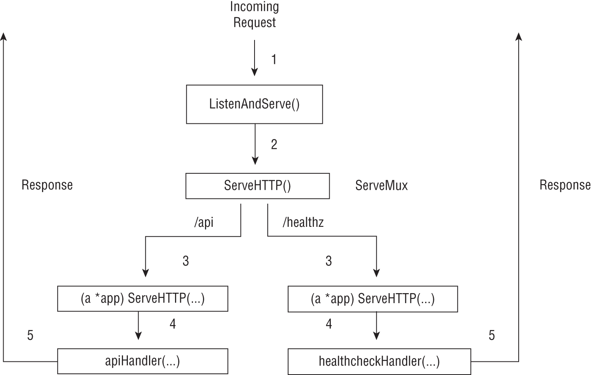
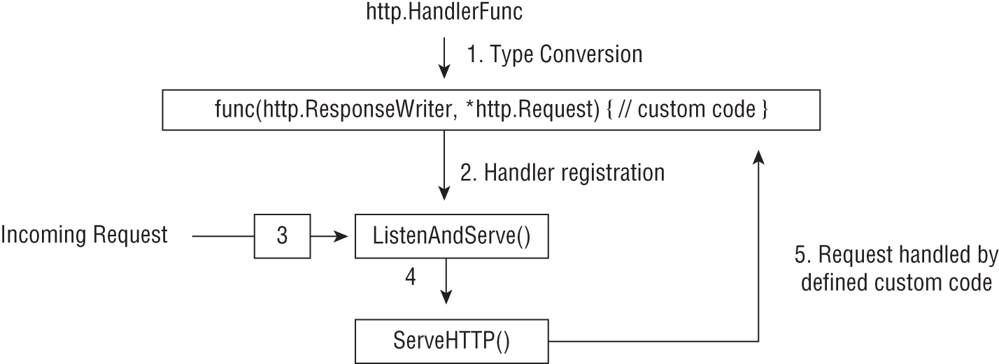
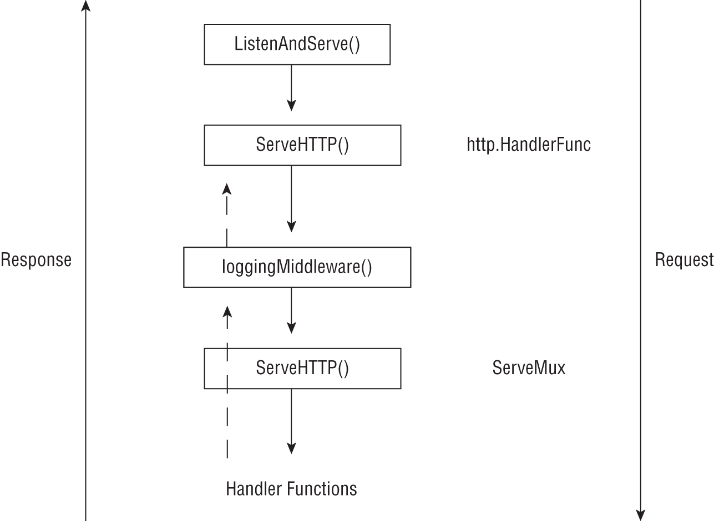
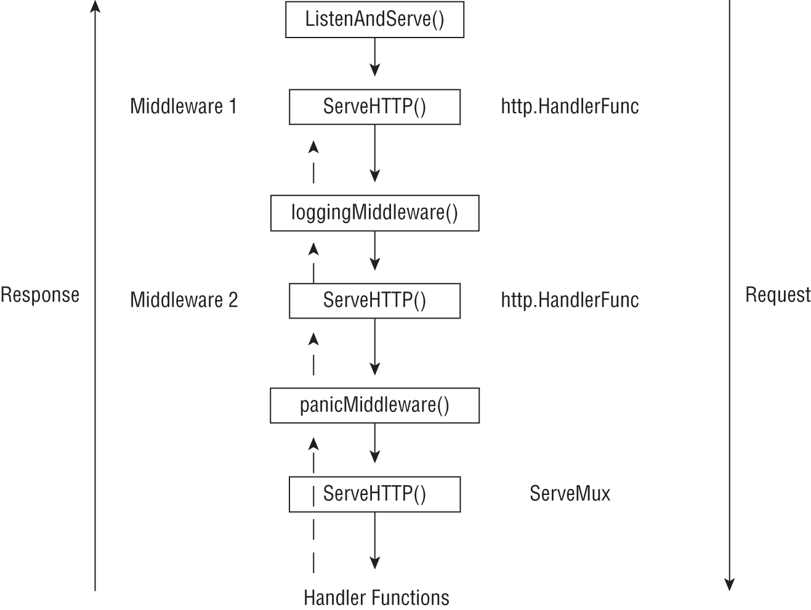

# 高级 HTTP 服务器应用程序
在本章中，你将学习在编写生产质量的 HTTP 服务器应用程序时有用的技术。你将首先了解 http.Handler 类型，然后你将使用它来跨处理程序函数共享数据。然后你将学习如何将公共服务器功能实现为中间件。你将了解 http.HandlerFunc 类型并使用它来定义和链接中间件。你将通过查看组织服务器应用程序和测试各种组件的策略来结束本章。让我们开始吧！

## 处理程序类型
在本节中，你将了解 http.Handler 类型——一种支持 HTTP 服务器在 Go 中工作的基本机制。你现在已经熟悉了启动 HTTP 服务器的 http.ListenAndServe( ) 函数。形式上，这个函数的签名如下：

```go
func ListenAndServe(addr string, handler Handler)
```

第一个参数是要监听的网络地址，第二个对象是 net/http 包中定义的 http.Handler 类型的值，如下所示：

```go
type Handler interface {
    ServeHTTP(ResponseWriter, *Request)
}
```

因此，http.ListenAndServe() 函数的第二个参数可以是任何实现 http.Handler 接口的对象。我们如何创建这样的对象？你现在已经熟悉了用于构建 HTTP 服务器应用程序的以下模式：

```go
mux := http.NewServeMux()
// register handlers with mux
http.ListenAndServe(addr, mux)
```

回想一下 http.NewServeMux() 函数返回一个类型为 http.ServeMux 的值。事实证明，这个值通过定义一个 ServeHTTP() 方法来满足 Handler 接口。当 HTTP 服务器应用程序收到请求时，会调用 ServeMux 对象的 ServeHTTP() 方法，然后将请求路由到特定的处理函数（如果找到）。

与任何其他接口一样，你可以定义自己的类型以满足 http.Handler 接口，如下所示：

```go
type myType struct {}
(t *myType) func ServeHTTP(w http.ResponseWriter, r *http.Request) {
    fmt.Printf(w, “Hello World”)
}
http.ListenAndServe(“:8080”, myType{})
```

当你向上述定义的服务器发出请求时，将调用 myType 对象上定义的 ServeHTTP() 方法并发送响应。你什么时候可能想要实现自定义 http.Handler 类型？一种情况是当你想要在所有处理程序函数之间共享数据时。例如，你可以在启动时只初始化一个对象，然后在所有处理程序函数之间共享它，而不是使用全局对象。接下来，让我们看看如何将自定义处理程序类型与 http.ServeMux 对象结合起来，以便在处理程序函数之间共享数据。

## 跨处理函数共享数据

在前一章中，你了解到可以使用请求的上下文在请求的整个生命周期内存储数据。这对于存储请求范围的数据很有用，例如请求标识符、身份验证后的用户标识符等。你需要在典型的服务器应用程序中存储另一类数据，例如初始化的记录器对象或打开的数据库连接对象。一旦服务器启动，这些对象就会被初始化，然后通过所有 HTTP 处理程序函数进行访问。

让我们定义一个结构类型 appConfig 来包含服务器应用程序的配置数据：

```go
type appConfig struct {
    logger *log.Logger
}
```

struct 类型包含一个字段 logger，类型为 *log.Logger。将另一个结构类型 app 定义为自定义 http.Handler 类型：

```go
type app struct {
    config  appConfig
    handler func(
        w http.ResponseWriter,r *http.Request,config appConfig,
    )
}
```

一个 app 对象将包含一个 appConfig 类型的对象和一个签名为 func(http.ResponseWriter, *http.Request, config appConfig) 的函数。这个函数将是一个标准的 HTTP 处理函数，但它接受一个额外的参数——一个 appConfig 类型的值。这就是我们将配置值注入处理函数的方式。由于 app 类型将实现 http.Handler 接口，我们将定义一个 ServeHTTP() 方法如下：

```go
func (a app) ServeHTTP(w http.ResponseWriter, r *http.Request) {
    a.handler(w, r, a.config)
}
```

我们已经实现了一个自定义的 http.Handler 类型，并为跨处理程序函数共享数据奠定了基础。让我们举一个例子处理函数：

```go
func healthCheckHandler(w http.ResponseWriter, r *http.Request, config
appConfig) {
    if r.Method != http.MethodGet {
        http.Error(w, "Method not allowed", http.StatusMethodNotAllowed)
        return
    }
    config.logger.Println("Handling healthcheck request")
    fmt.Fprintf(w, "ok")
}
```

在处理程序函数中，我们处理请求。如果请求方法不是 GET，我们发送一个错误响应。否则，我们使用配置对象中可用的已配置记录器来记录示例消息并发送回响应。

要注册此处理程序函数，我们将使用以下模式：

```go
config := appConfig{
    logger: log.New(
        os.Stdout, "", log.Ldate|log.Ltime|log.Lshortfile,
    ),
}
mux := http.NewServeMux()
setupHandlers(mux, config)
```

我们创建一个 appConfig 类型的值。在这里，我们配置了一个记录到标准输出的记录器，并将其设置为记录日期、时间、文件名和行号。然后我们通过调用 http.NewServeMux() 创建一个新的 http.ServeMux 对象。接下来，我们使用创建的 ServeMux 对象和 appConfig 对象调用 setupHandlers() 函数。 setupHandlers()的定义如下：

```go
func setupHandlers(mux *http.ServeMux, config appConfig) {
    mux.Handle("/healthz", &app{config: config, handler: healthCheckHandler})
    mux.Handle("/api", &app{config: config, handler: apiHandler})
}
```

我们使用两个参数调用 http.ServeMux 对象 mux 的 Handle() 方法。第一个参数是要处理的请求路径，第二个参数是 app 类型的对象——我们自定义的 http.Handler 类型。因此，每个路径和处理程序函数注册都涉及创建一个新的应用程序对象。 Handle() 方法类似于 HandleFunc() 方法，你迄今为止一直在使用它来注册请求处理程序，除了第二个参数。 HandleFunc() 方法接受任何带有签名 func(http.ResponseWriter, *http.Request) 的函数作为参数，而 Handle() 方法要求第二个参数是实现 http.Handler 接口的对象。

图 6.1 演示了 http.ServeMux 对象和自定义处理程序类型如何协同工作来处理请求。

总而言之，对于传入的请求，http.ServeMux 对象的 ServeHTTP() 方法会检查是否存在为该路径注册的有效处理程序对象。如果找到，则调用处理程序对象的相应 ServeHTTP() 方法，然后调用已注册的处理程序函数。处理程序函数处理请求并发送响应，然后将控制权返回给处理程序对象的 ServeHTTP() 方法。清单 6.1 显示了一个使用自定义类型的完整 HTTP 服务器应用程序。



图 6.1：使用自定义处理程序类型时 HTTP 服务器的请求处理

清单 6.1：使用自定义处理程序类型的 HTTP 服务器

```go
// chap6/http-handler-type/server.go
package main
 
import (
    "fmt"
    "log"
    "net/http"
    "os"
)
 
type appConfig struct {
    logger *log.Logger
}
 
type app struct {
    config  appConfig
    handler func(
        w http.ResponseWriter,r *http.Request,config appConfig,
    )
}
 
func (a *app) ServeHTTP(w http.ResponseWriter, r *http.Request) {
    a.handler(w, r, a.config)
}
 
func apiHandler(w http.ResponseWriter, r *http.Request, config appConfig) {
    config.logger.Println("Handling API request")
    fmt.Fprintf(w, "Hello, world!")
}
 
// TODO Insert definition of healthcheckHandler() from earlier
// TODO Insert definition of setupHandlers() from earlier
 
func main() {
    listenAddr := os.Getenv("LISTEN_ADDR")
    if len(listenAddr) == 0 {
        listenAddr = ":8080"
    }

    config := appConfig{
        logger: log.New(
            os.Stdout, "" log.Ldate|log.Ltime|log.Lshortfile,
        ),
    }

    mux := http.NewServeMux()
    setupHandlers(mux, config)

    log.Fatal(http.ListenAndServe(listenAddr, mux))
}
```

创建一个新目录，chap6/http-handler-type，并在其中初始化一个模块：

```sh
$ mkdir -p chap6/http-handler-type
$ cd chap6/http-handler-type
$ go mod init github.com/username/http-handler-type
```

接下来，将代码清单 6.1 保存为一个新文件 server.go。构建并运行服务器：

```sh
$ go build -o server
$ ./server
```

在新的终端会话中，使用 curl 发出 HTTP 请求：

```sh
$ curl localhost:8080/api
Hello, world!
```

在服务器的终端上，你将看到一条显示 API 请求的日志消息：

```sh
2021/03/08 10:31:00 server.go:24: Handling API request
```

如果你向 /healthz API 端点发出请求，你将看到类似的日志消息。

太好了。你现在知道如何在处理程序函数之间共享记录器对象。在现实生活中的应用程序中，你将需要共享其他对象，例如远程服务的初始化客户端或数据库连接对象，你将能够使用此技术来做到这一点。它比使用全局范围的值更健壮，并且会自动生成对测试友好的服务器。

这里值得注意的一点是，自定义 http.Handler 类型还允许你在服务器应用程序中实现其他模式，例如集中式错误报告机制。练习 6.1 为你提供了实现这一点的机会。

> 练习 6.1：集中式错误处理 定义应用类型如下：
>
> ```go
> type app struct {
>     config  appConfig
>     h func(w http.ResponseWriter,r *http.Request,conf appConfig) error
> }
> ```
>
> 接下来，你定义处理程序函数（根据字段 h 定义）以返回错误值，而不是直接向客户端报告错误。在应用程序对象的 ServeHTTP() 方法中，你可以将错误报告或记录到错误跟踪服务，然后将原始错误发送回客户端。

接下来，你将学习如何在服务器中处理 HTTP 请求时实现经常使用的模式——将常见操作实现为服务器中间件。

## 编写服务器中间件

服务器端中间件允许你在处理请求时自动运行常见操作。例如，你可能希望记录每个请求，为每个请求添加一个请求标识符，或者检查请求是否指定了关联的身份验证凭据。服务器本身负责调用相应的操作，而不是在每个 HTTP 处理程序函数中复制逻辑。处理程序函数可以专注于业务逻辑。你将学习两种实现中间件的模式：首先，你将学习如何使用自定义 http.Handler 类型来实现中间件，然后你将学习如何使用 HandlerFunc 技术来实现。

自定义 HTTP 处理程序技术
在上一节中，你学习了如何定义自定义处理程序类型以在处理程序函数之间共享数据。自定义类型 app 的 ServeHTTP() 方法实现如下：

```go
func (a *app) ServeHTTP(w http.ResponseWriter, r *http.Request) {
    a.handler(w, r, a.config)
}
```

如果你将上述方法更新为如下所示，你将实现一个中间件来记录处理请求所花费的时间：

```go
func (a *app) ServeHTTP(w http.ResponseWriter, r *http.Request) {
    startTime := time.Now()
    a.handler(w, r, a.config)
    a.config.logger.Printf(
        "path=%s method=%s duration=%f", r.URL.Path, r.Method,         
        time.Now().Sub(startTime).Seconds(),
    )
}
```

当你将清单 6.1 中的 ServeHTTP() 方法替换为上述代码并向 /api 或 /healthz 端点发出请求时，你将看到如下日志（全部在一行中）：

```sh
2021/03/09 08:47:27 server.go:23: path=/healthz method=GET 
duration=0.000327
```

但是，如果你向未注册的路径发出请求，你将看不到任何日志。回想一下，应用程序类型的 ServeHTTP() 方法仅在为路径注册了处理程序时才被调用。为了解决这个问题，我们将创建一个中间件来包装 ServeMux 对象。

### HandlerFunc 技术

http.HandlerFunc 是标准库中定义的一个类型，如下所示：

```go
type HandlerFunc func(ResponseWriter, *Request)
```


该类型还实现了 ServeHTTP() 方法，从而实现了 http.Handler 接口。与任何其他类型一样，我们可以使用表达式 HandlerFunc(func(w http.ResponseWriter, r *http.Request))。图 6.2 演示了一个请求是如何被转换为 http.HandlerFunc 类型的函数处理的。



图 6.2：HTTP 服务器在使用 http.HandlerFunc 类型时的请求处理

为什么我们需要这样的类型？它使我们能够编写一个包含任何其他 http.Handler 值 h 并返回另一个 http.Handler 的函数。假设我们想使用这种技术实现一个日志中间件。下面是我们如何写一个：

```go
func loggingMiddleware(h http.Handler) http.Handler {
    return http.HandlerFunc(
        func(w http.ResponseWriter, r *http.Request) {
            startTime := time.Now()
            h.ServeHTTP(w, r)
            log.Printf(
                "path=%s method=%s duration=%f",
                r.URL.Path, r.Method, time.Now().Sub(startTime).Seconds(),
            )
        })
}
```

然后我们将创建一个 ServeMux 对象并将其与 ListenAndServe() 函数一起使用，如下所示：

```go
mux := http.NewServeMux()
setupHandlers(mux, config)
m := loggingMiddleware(mux)
http.ListenAndServe(listenAddr, m)
```

我们创建 ServeMux 对象并注册请求处理程序。然后我们调用 loggingMiddleware() 函数，将 ServeMux 对象作为参数传递。这就是我们将 ServeMux 对象包装在 loggingMiddleware 函数中的方式。由于 loggingMiddleware() 函数返回的值实现了 http.Handler 接口，因此我们在调用 ListenAndServe() 函数时将其指定为处理程序。

图 6.3 演示了当我们使用外部 http.Handler 类型 loggingMiddleware 包装 http.ServeMux 对象时如何处理请求。我们将 http.ServeMux 对象称为包装处理程序。

当一个请求进来时，它首先被 http.HandlerFunc 实现的 ServeHTTP() 方法处理。作为处理的一部分，此方法调用 loggingMiddleware() 函数返回的函数。在这个函数的主体内，一个计时器被启动，然后被包装的处理程序的 serveHTTP() 方法被调用，然后调用请求处理程序。请求处理程序完成对请求的处理后，执行返回到 loggingMiddleware() 函数返回的函数，其中记录了请求的详细信息。

由于 http.HandlerFunc 类型使我们能够编写一个封装任何其他 http.Handler 值 h 并返回另一个 http.Handler 的函数，因此我们可以设置中间件链，你将在接下来学习。



### 链式中间件
将服务器应用程序的通用功能实现为中间件，可以很好地分离服务器中的业务逻辑与其他方面（例如日志记录、错误处理和身份验证）之间的关注点。这通常导致能够通过多个中间件处理请求。 http.HandlerFunc 类型可以轻松设置多个中间件来处理请求。你可能会发现此技术有用的一种情况是，如果在处理请求时意外调用了 panic() 函数，则能够调用 recovery() 函数。对 panic() 函数的调用可能由你编写的应用程序代码启动，在你正在使用的包中，或者它可能由 go 运行时启动。一旦调用了这个函数，请求处理就终止了。但是，当你设置一个定义了recover() 函数的中间件时，你可以记录panic的详细信息或继续执行你在服务器中配置的任何其他中间件。首先，我们将实现一个panic处理中间件，然后实现一个服务器，将上一节中实现的日志记录中间件和panic处理中间件链接在一起。

panic处理中间件如下：

```go
func panicMiddleware(h http.Handler) http.Handler {
    return http.HandlerFunc(
        func(w http.ResponseWriter, r *http.Request) {
            defer func() {
                if rValue := recover(); rValue != nil {
                    log.Println("panic detected", rValue)
                    w.WriteHeader(http.StatusInternalServerError)
                    fmt.Fprintf(w, "Unexpected server error")
                }
            }()
            h.ServeHTTP(w, r)
        })
}
```

我们设置了一个延迟函数调用，我们使用recover() 函数来探测在处理请求时是否发生了panic。如果有，我们记录一条消息，将 HTTP 状态设置为 500，并发送“意外服务器错误”响应。这是因为在处理请求时很可能发生了一些不好的事情，并且处理程序很可能没有成功地向客户端发送任何响应。设置延迟调用后，我们调用包装处理程序的 ServeHTTP() 方法。

接下来，让我们看看我们将如何设置服务器，使其结合日志记录中间件和panic处理中间件：

```go
config := appConfig{
    logger: log.New(
        os.Stdout, "", log.Ldate|log.Ltime|log.Lshortfile,
    ),
}
mux := http.NewServeMux()
setupHandlers(mux, &config)
m := loggingMiddleware(panicMiddleware(mux))
err := http.ListenAndServe(listenAddr, m)
```

上面的关键语句被突出显示。首先，我们调用 panicMiddleware() 函数来包装 ServeMux 对象。然后将返回的 http.Handler 值作为参数传递给 loggingMiddleware() 函数。然后将此调用的返回值配置为 ListenAndServe() 调用的处理程序。图 6.4 显示了传入请求如何通过配置的中间件流向 ServeMux 对象的 ServeHTTP() 方法。

在链接中间件时，最里面的中间件是在处理你的请求（和来自处理程序函数的响应）时最先执行的中间件，最外面的中间件是最后执行的中间件。

清单 6.2 显示了一个完整的服务器应用程序，用于说明使用 http.HandlerFunc 类型的链接中间件。



图 6.4：使用多个中间件时 HTTP 服务器的请求处理

清单 6.2：使用 http.HandleFunc 链接中间件

```go
// chap6/middleware-chaining/server.go
package main
 
import (
    "fmt"
    "log"
    "net/http"
    "os"
    "time"
)
 
type appConfig struct {
    logger *log.Logger
}
 
type app struct {
    config  appConfig
    handler func(
        w http.ResponseWriter,r *http.Request,config appConfig,
    )
}
 
func (a app) ServeHTTP(w http.ResponseWriter, r *http.Request) {
    a.handler(w, r, a.config)
}
 
// TODO Insert definition of apiHandler() from Listing 6.1
// TODO Insert definition of healthCheckHandler() from Listing 6.1
 
func panicHandler(
    w http.ResponseWriter, r *http.Request,config appConfig,
) {
    panic("I panicked")
}
 
func setupHandlers(mux *http.ServeMux, config appConfig) {
    mux.Handle(
        "/healthz", 
        &app{config: config, handler: healthCheckHandler},
    )
    mux.Handle("/api", &app{config: config, handler: apiHandler})
    mux.Handle("/panic",
               &app{config: config, handler: panicHandler},
              )
}
 
// TODO Insert definition of loggingMiddleware() from earlier
// TODO Insert definition of panicMiddleware() from earlier
 
func main() {
    listenAddr := os.Getenv("LISTEN_ADDR")
    if len(listenAddr) == 0 {
        listenAddr = ":8080"
    }

    config := appConfig{
        logger: log.New(
            os.Stdout, "", log.Ldate|log.Ltime|log.Lshortfile,
        ),
    }

    mux := http.NewServeMux()
    setupHandlers(mux, config)

    m := loggingMiddleware(panicMiddleware(mux))

    log.Fatal(http.ListenAndServe(listenAddr, m))
 }
```

我们定义了一个新的处理函数 panicHandler() 来处理对 /panic 路径的任何请求。为了说明panic处理中间件panicMiddleware()的工作原理，我们需要在这个处理函数中做的就是用一些文本调用panic()函数。这是中间件中的recover() 函数将恢复的值。然后我们在 main() 中设置中间件链，并使用 loggingMiddleware() 函数返回的处理程序调用 ListenAndServe() 函数。

创建一个新目录，中间件链，并在其中初始化一个模块：

```sh
$ mkdir -p chap6/middleware-chaining
$ cd chap6/ middleware-chaining
$ go mod init github.com/username/middleware-chaining
```

接下来，将代码清单 6.2 保存为一个新文件 server.go。构建并运行服务器，如下所示：

```sh
$ go build -o server
$ ./server
```

从单独的终端，使用 curl 或其他 HTTP 客户端向服务器的 /panic 端点发出请求：

```sh
$ curl http://localhost:8080/panic
Unexpected server error occurred
```

在打开服务器应用程序的终端上，你将看到类似于以下的日志（都在同一行）：

```sh
2021/03/16 14:17:34 panic detected I panicked
2021/03/16 14:17:34 protocol=HTTP/1.1 path=/panic method=GET
duration=0.001575
```

你可以看到恢复的值是“I panicked”，这是你使用 panic() 函数调用的字符串。因此，你已验证panic处理中间件正在工作。它恢复处理函数中发生的panic，记录它，并适当地设置响应。一旦它完成了它的工作，响应就会通过日志中间件传递到客户端。

太好了。现在你已经知道如何设置中间件链，是时候在练习 6.2 中测试你的理解了。

> 练习 6.2：在中间件中附加请求标识符 在前一章的代码清单 5.4 中，你学习了如何在请求的上下文中存储请求标识符。你从每个请求处理程序调用 addRequestID() 函数来执行此操作。
>
> 你现在知道中间件更适合执行此类操作。编写一个中间件，将请求 ID 与每个请求相关联。更新清单 6.2 中的服务器应用程序以记录请求 ID。

到目前为止，在本章中，你已经学习了许多用于在我们的服务器应用程序中实现功能的新模式。你已经了解了如何使用自定义处理程序类型来跨处理程序共享数据并实现中间件。此外，为了能够包装 ServeMux 对象，你了解了使用 HandlerFunc 类型实现中间件的新技术。你不能仅使用自定义处理程序类型来实现相同的目标吗？是的，但这会涉及更多的工作。但是，如果你的中间件实现了一个复杂的服务器功能，那么使用自定义处理程序类型来实现它是一个很好的方法。你可以将中间件功能分离为具有数据和方法的自定义类型。你仍然可以使用我们在此处应用的方法来设置中间件链。

对于复杂的服务器应用程序，开始考虑如何组织各种组件至关重要，这将我们带到下一部分。你将了解一种组织服务器代码并为不同组件编写自动化测试的方法。

## 为复杂的服务器应用程序编写测试

在第 5 章“构建 HTTP 服务器”中，你编写的服务器应用程序由三个主要功能组成：编写处理程序函数、使用 ServeMux 对象注册处理程序以及调用 ListenAndServe() 来启动服务器。所有功能都在主包中实现，这是非常简单的服务器应用程序的一个很好的起点。但是，当你开始编写更复杂的服务器时，你会发现将应用程序分解为多个包是一种更实用的方法。

一种方法是为应用程序的每个关注领域提供一个单独的包：配置管理、中间件和处理程序函数，以及将它们编排在一起的主包，最后调用 ListenAndServe() 函数来启动服务器。让我们接下来这样做。

### 代码组织

我们现在将重写代码清单 6.2 中的服务器应用程序，这样我们就有四个包：main、config、handlers 和 middleware。创建一个新目录，complex-server，并在其中使用 go mod init 初始化一个新模块：

```sh
$ mkdir complex-server
$ cd complex-server
$ go mod init github.com/username/chap6/complex-server
```

在模块目录中创建三个子目录，config、handlers 和 middleware。

在 config 目录中将代码清单 6.3 保存为 config.go。

清单 6.3：管理应用程序配置

```go
// chap6/complex-server/config/config.go
package config
 
import (
    "io"
    "log"
)
 
type AppConfig struct {
    Logger *log.Logger
}
 
func InitConfig(w io.Writer) AppConfig {
    return AppConfig{
        Logger: log.New(
            w, "", log.Ldate|log.Ltime|log.Lshortfile,
        ),
    }
}
```

我们将 appConfig 结构重命名为 AppConfig，以便我们可以从包外部访问它。我们还添加了一个 InitConfig() 方法，该方法接受用于初始化记录器的 io.Writer 值，并返回一个 AppConfig 值。

接下来，在 handlers 子目录中将代码清单 6.4 保存为 handlers.go。

清单 6.4：请求处理程序

```go
// chap6/complex-server/handlers/handlers.go
package handlers
 
import (
    "fmt"
    "net/http"

    "github.com/username/chap6/complex-server/config"
)
 
type app struct {
    conf    config.AppConfig
    handler func(
        w http.ResponseWriter,
        r *http.Request,
        conf config.AppConfig,
    )
}
 
func (a app) ServeHTTP(w http.ResponseWriter, r *http.Request) {
    a.handler(w, r, a.conf)
}
 
func apiHandler(
    w http.ResponseWriter, 
    r *http.Request, 
    conf config.AppConfig,
) {
    fmt.Fprintf(w, "Hello, world!")
}
 
func healthCheckHandler(
    w http.ResponseWriter, 
    r *http.Request, 
    conf config.AppConfig,
) {
    if r.Method != "GET" {
        conf.Logger.Printf("error=\"Invalid request\" path=%s method=%s", r.URL.Path, r.Method)
                           http.Error(
                               w, 
                               "Method not allowed", 
                               http.StatusMethodNotAllowed,
                           )
                           return
                           }
                           fmt.Fprintf(w, "ok")
}
 
func panicHandler(
    w http.ResponseWriter,
    r *http.Request, 
    conf config.AppConfig,
) {
    panic("I panicked")
}
```

我们使用导入路径“ github.com/username/chap6/complex-server/config ”导入配置包，并定义应用程序类型和处理函数。你会注意到我们已经取消了处理程序函数中的请求日志记录，这当然是由于我们的服务器现在将拥有日志记录中间件。但是，在大多数生产场景中，你将需要记录消息或访问其他配置数据，因此 config 参数已保留为首次引入时的状态。

将代码清单 6.5 保存为 register.go 也保存在 handlers 子目录中。

清单 6.5：设置请求处理程序

```go
// chap6/complex-server/handlers/register.go
package handlers
 
import (
    "net/http"
    "github.com/username/chap6/complex-server/config"
)
 
func Register(mux *http.ServeMux, conf config.AppConfig) {
    mux.Handle(
        "/healthz",
        &app{conf: conf, handler: healthCheckHandler},
    )
    mux.Handle(
        "/api",
        &app{conf: conf, handler: apiHandler},
    )
    mux.Handle(
        "/panic",
        &app{conf: conf, handler: panicHandler},
    )
}
```

Register() 函数接受一个 ServeMux 对象和一个 config.AppConfig 值，并注册请求处理程序。

接下来，将代码清单 6.6 保存为中间件目录中的 middleware.go。这里我们定义了服务器的中间件。请注意我们现在如何将配置对象传递给中间件，以便我们可以访问配置的 Logger 。

清单 6.6：日志记录和panic处理中间件

```go
// chap6/complex-server/middleware/middleware.go
package middleware
import (
    "fmt"
    "log"
    "net/http"
    "time"
    "github.com/username/chap6/complex-server/config"
)
 
func loggingMiddleware(
    h http.Handler, c config.AppConfig,
) http.Handler {
    return http.HandlerFunc(
        func(w http.ResponseWriter, r *http.Request) {
            t1 := time.Now()
            h.ServeHTTP(w, r)
            requestDuration := time.Now().Sub(t1).Seconds()
            c.Logger.Printf(
                "protocol=%s path=%s method=%s 
                duration=%f", 
                r.Proto, r.URL.Path,
                r.Method, requestDuration,
            )
        })
}
 
func panicMiddleware(h http.Handler, c config.AppConfig) http.Handler {
    return http.HandlerFunc(func(w http.ResponseWriter, r *http.Request) {
        defer func() {
            if rValue := recover(); rValue != nil {
                c.Logger.Println("panic detected", rValue)
                w.WriteHeader(http.StatusInternalServerError)
                fmt.Fprintf(w, "Unexpected server error occurred")
            }
        }()
        h.ServeHTTP(w, r)
    })
}
```

接下来，将代码清单 6.7 也保存为中间件子目录中的 register.go。

清单 6.7：中间件注册

```go
/ chap6/complex-server/middleware/register.go
package middleware
import (
    "net/http"
    "github.com/username/chap6/complex-server/config"
)
 
func RegisterMiddleware(
    mux *http.ServeMux,
    c config.AppConfig,
) http.Handler {
    return loggingMiddleware(panicMiddleware(mux, c), c)
}
```

RegisterMiddleware() 函数为特定的 ServeMux 对象设置中间件链。

最后，在模块目录的根目录下将代码清单 6.8 保存为 server.go。

清单 6.8：主服务器

```go
// chap6/complex-server/server.go
package main
 
import (
    "io"
    "log"
    "net/http"
    "os"

    "github.com/username/chap6/complex-server/config"
    "github.com/username/chap6/complex-server/handlers"
    "github.com/username/chap6/complex-server/middleware"
)
 
func setupServer(mux *http.ServeMux, w io.Writer) http.Handler {
    conf := config.InitConfig(w)

    handlers.Register(mux, conf)
    return middleware.RegisterMiddleware(mux, conf)
}
 
func main() {
    listenAddr := os.Getenv("LISTEN_ADDR")
    if len(listenAddr) == 0 {
        listenAddr = ":8080"
    }

    mux := http.NewServeMux()
    wrappedMux := setupServer(mux, os.Stdout)

    log.Fatal(http.ListenAndServe(listenAddr, wrappedMux))
}
```

setupServer() 函数通过调用 config.InitConfig() 函数来初始化应用程序的配置。然后它通过调用 handlers.Register() 函数向 ServeMux 对象 mux 注册处理程序函数。最后，它注册中间件，然后返回包装的 handler.Handler 值。在main()函数中，我们创建了一个ServeMux对象，调用setupServer()函数，最后调用ListenAndServe()函数。

从 complex-server 目录构建并运行服务器：

```sh
$ go build -o server
$ ./server
```

从单独的终端会话中，向服务器发出一些请求，以确保它仍按预期运行。完成后，让我们继续编写自动化测试。

### 测试处理程序函数

有两种方法可以测试处理程序函数。一种方法涉及使用 httptest.NewServer() 启动测试 HTTP 服务器，然后针对该测试服务器发出请求。你在第 5 章中采用了这种方法来测试处理程序函数。第二种方法是直接测试处理程序函数，而无需启动测试服务器。当你想单独测试处理程序函数时，此技术很有用 - 忽略服务器应用程序的其余部分。在任何大型服务器应用程序中，这是推荐的方法。让我们考虑定义如下的 apiHandler() 函数：

```go
func apiHandler(
    w http.ResponseWriter, 
    r *http.Request,
    conf config.AppConfig,
) {
    fmt.Fprintf(w, "Hello, world!")
}
```

为了单独测试这个处理程序函数，我们将创建一个测试响应编写器、一个测试请求和一个 AppConfig 值。

要创建测试响应编写器，我们将使用 httptest.NewRecorder() 函数。该函数返回一个类型为 httptest.ResponseRecorder 的值，它实现了 http.ResponseWriter 接口：

```go
w := httptest.NewRecorder()
```

要创建测试请求，我们将使用 httptest.NewRequest() 函数：

```go
r := httptest.NewRequest("GET", "/api", nil)
```

httptest.NewRequest() 函数的第一个参数是 HTTP 请求类型——GET、POST 等。第二个参数可以是 URL（如 http://my.host.domain/api）或路径（如 /api）。第三个参数是请求体，这里是nil。创建一个 AppConfig 值：

```go
b := new(bytes.Buffer)
c := config.InitConfig(b)
```

然后调用 apiHandler() 函数：

```go
apiHandler(w, r, c)
```

w 中记录的响应是使用 w.Result() 获得的。它返回一个 *http.Response 类型的值。清单 6.9 显示了测试函数。

清单 6.9：测试 API 处理函数

```go
// chap6/complex-server/handlers/handler_test.go
package handlers
 
import (
    "bytes"
    "io"
    "net/http"
    "net/http/httptest"
    "testing"

    "github.com/username/chap6/complex-server/config"
)
 
func TestApiHandler(t *testing.T) {
    r := httptest.NewRequest("GET", "/api", nil)
    w := httptest.NewRecorder()

    b := new(bytes.Buffer)
    c := config.InitConfig(b)

    apiHandler(w, r, c)

    resp := w.Result()
    body, err := io.ReadAll(resp.Body)
    if err != nil {
        t.Fatalf("Error reading response body: %v", err)
    }

    if resp.StatusCode != http.StatusOK {
        t.Errorf(
            "Expected response status: %v, Got: %v\n",
            http.StatusOK, resp.StatusCode,
        )
    }

    expectedResponseBody := "Hello, world!"

    if string(body) != expectedResponseBody {
        t.Errorf(
            "Expected response: %s, Got: %s\n",
            expectedResponseBody, string(body),
        )
    }
}
```

检索响应后，使用 w.Result()，我们通过 StatusCode 字段检索状态代码，通过 resp.Body 检索正文。我们将它们与预期值进行比较。在 handlers 子目录中将代码清单 6.9 保存为 handlers_test.go，并运行以下测试：

```sh
$ go test  -v
=== RUN   TestApiHandler
--- PASS: TestApiHandler (0.00s)
PASS
ok          github.com/practicalgo/code/chap6/complex-server/handlers        0.576s
```

同样，你可以为每个其他处理程序函数编写测试。对于 healthCheckHandler() 函数，你可能想要测试当处理程序接收到除 GET 之外的 HTTP 请求时的行为。练习 6.3 为你提供了这样做的机会。

> 练习 6.3：测试 HEALTHCHECKHANDLER 函数 为 healthCheckHandler() 函数定义一个测试函数。它应该测试 GET 和其他 HTTP 请求类型的行为。

测试 panicHandler() 函数怎么样？因为我们知道这个函数所做的只是调用 panic() 函数，所以这里要测试的更有用的组件是panic处理中间件。让我们看看如何为我们的服务器应用程序测试中间件。

### 测试中间件

让我们考虑一下 panicMiddleware() 函数签名：func panicMiddleware(h http.Handler, c config.AppConfig) http.Handler。该函数的参数是处理程序值 h ；要包装的处理程序；和一个 config.AppConfig 值：

```go
b := new(bytes.Buffer)
c := config.InitConfig(b)
m := http.NewServeMux()
handlers.Register(m, c)
h := panicMiddleware(m, c)
```

我们创建一个 http.ServeMux 对象，注册处理函数，然后调用 panicMiddleware() 函数。返回的值，另一个 http.Handler 值，将被另一个中间件包装或传递给真实服务器的 http.ListenAndServe() 函数调用。但是，为了测试中间件，我们将直接调用处理程序的 ServeHTTP() 方法：

```go
r := httptest.NewRequest("GET", "/panic", nil)
w := httptest.NewRecorder()
h.ServeHTTP(w, r)
```

清单 6.10 显示了完整的测试函数。

代码清单 6.10：panic处理中间件的测试

```go
// chap6/complex-server/middleware/middleware_test.go
package middleware
 
import (
    "bytes"
    "io"
    "net/http"
    "net/http/httptest"
    "testing"

    "github.com/username/chap6/complex-server/config"
    "github.com/username/chap6/complex-server/handlers"
)
 
func TestPanicMiddleware(t *testing.T) {
    b := new(bytes.Buffer)
    c := config.InitConfig(b)

    m := http.NewServeMux()
    handlers.Register(m, c)

    h := panicMiddleware(m, c)

    r := httptest.NewRequest("GET", "/panic", nil)
    w := httptest.NewRecorder()
    h.ServeHTTP(w, r)

    resp := w.Result()

    body, err := io.ReadAll(resp.Body)
    if err != nil {
        t.Fatalf("Error reading response body: %v", err)
    }

    if resp.StatusCode != http.StatusInternalServerError {
        t.Errorf(
            "Expected response status: %v, Got: %v\n",
            http.StatusOK,
            resp.StatusCode,
        )
    }

    expectedResponseBody := "Unexpected server error occurred"

    if string(body) != expectedResponseBody {
        t.Errorf(
            "Expected response: %s, Got: %s\n",
            expectedResponseBody,
            string(body),
        )
    }
}
```

调用从 panicMiddleware() 返回的处理程序的 ServeHTTP() 方法模拟了 ListenAndServe() 函数的行为，同时单独测试了panic处理程序的行为。将代码清单 6.10 保存为中间件子目录中的 middleware_test.go 并运行以下测试：

```sh
$ go test -v
=== RUN   TestPanicMiddleware
--- PASS: TestPanicMiddleware (0.00s)
PASS
ok          github.com/practicalgo/code/chap6/complex-server/middleware        0.615s
```

这种技术对于单独测试中间件很有用。如果你想测试整个中间件链是否按预期工作怎么办？接下来让我们为此编写一个测试。

### 测试服务器启动
对于清单 6.8 中的服务器应用程序，函数 setupServer() 创建服务器配置并注册请求处理程序和中间件链。因此，测试服务器启动行为将归结为测试此功能。

首先，我们将创建新的 http.ServeMux 和 bytes.Buffer 对象并调用 setupServer() 函数：

```go
b := new(bytes.Buffer)
mux := http.NewServeMux()
wrappedMux := setupServer(mux, b)
```

然后我们将使用 httptest.NewServer() 函数来启动一个测试 HTTP 服务器并指定wrappedMux 作为处理程序：

```sh
ts := httptest.NewServer(wrappedMux)
defer ts.Close()
```

一旦我们运行了测试服务器，我们将发送 HTTP 请求并验证以下内容：

1. 响应状态和正文内容符合预期
2. 日志中间件和panic处理中间件按预期工作

清单 6.11 显示了用于验证服务器设置的测试函数。

清单 6.11：测试服务器设置

```go
// chap6/complex-server/server_test.go
package main
 
import (
    "bytes"
    "io"
    "net/http"
    "net/http/httptest"
    "strings"
    "testing"
)
 
func TestSetupServer(t *testing.T) {
    b := new(bytes.Buffer)
    mux := http.NewServeMux()
    wrappedMux := setupServer(mux, b)
    ts := httptest.NewServer(wrappedMux)
    defer ts.Close()

    resp, err := http.Get(ts.URL + "/panic")
    if err != nil {
        t.Fatal(err)
    }
    defer resp.Body.Close()
    _, err = io.ReadAll(resp.Body)
    if err != nil {
        t.Error(err)
    }        
    if resp.StatusCode != http.StatusInternalServerError {
        t.Errorf(
            "Expected response status to be: %v, Got: %v",
            http.StatusInternalServerError,
            resp.StatusCode,
        )
    }

    logs := b.String()
    expectedLogFragments := []string{
        "path=/panic method=GET duration=",
        "panic detected",
    }
    for _, log := range expectedLogFragments {
        if !strings.Contains(logs, log) {
            t.Errorf(
                "Expected logs to contain: %s, Got: %s",
                log, logs,
            )
        }
    }
}
```

在测试函数中，我们在调用 setupServer() 函数后启动测试服务器并向 /panic 端点发出 HTTP 请求。然后我们验证响应状态是 500 Internal Server Error。在剩下的测试中，我们验证预期的日志是否已经写入配置的 io.Writer，b。将代码清单 6.11 作为 server_test.go 保存在与 server.go 相同的目录中（其中存储代码清单 6.8）并运行测试：

```sh
$ go test -v
=== RUN TestSetupServer
--- PASS: TestSetupServer (0.00s)
PASS
ok         github.com/practicalgo/code/chap6/complex-server        0.711s
```

上述测试功能测试服务器设置，包括中间件链的功能。在为服务器应用程序编写测试时，孤立地测试组件然后测试哪些测试验证组件的集成总是一个好主意。对于处理程序和中间件，你编写了单元测试以在不启动 HTTP 服务器的情况下单独测试它们。对于最终的服务器设置测试，你启动了一个测试 HTTP 服务器来测试请求处理程序和中间件的集成。

## 概括

你通过学习 http.Handler 接口开始本章。你了解了 http.ServeMux 是如何实现此接口的类型，然后编写了你自己的类型来实现该接口。你看到了如何将 ServeMux 对象与你自己的处理程序实现集成，以便在处理程序函数之间共享数据。

接下来，你学习了编写服务器中间件，首先通过实现自定义 Handler 类型，然后使用 http.HandlerFunc 类型。你还学习了如何将服务器中的中间件链接在一起，以便你可以将公共服务器功能实现为独立的即插即用组件。

最后，你了解了一种组织和测试服务器应用程序及其各种组件的方法。

在下一章“生产就绪 HTTP 服务器”中，你将探索使 HTTP 服务器应用程序准备好部署的技术。