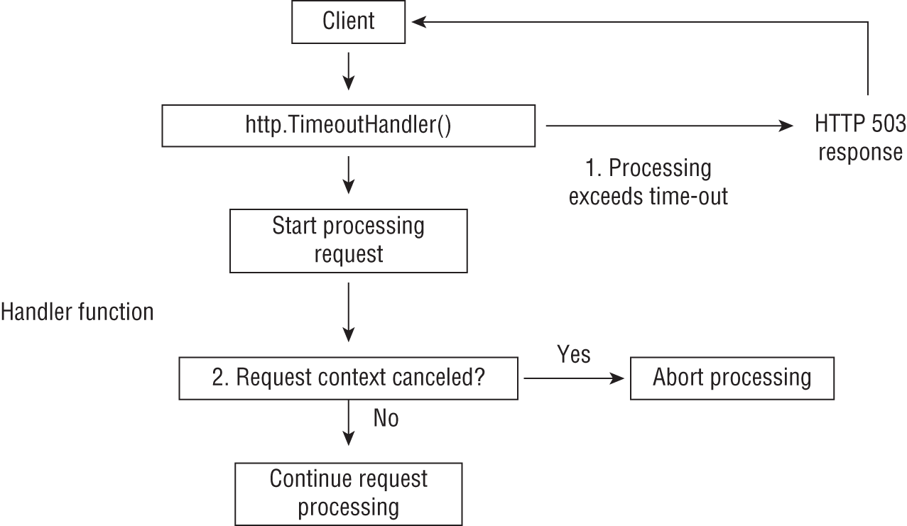
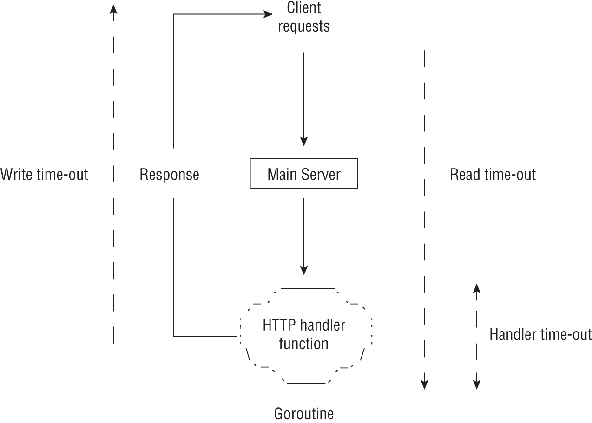
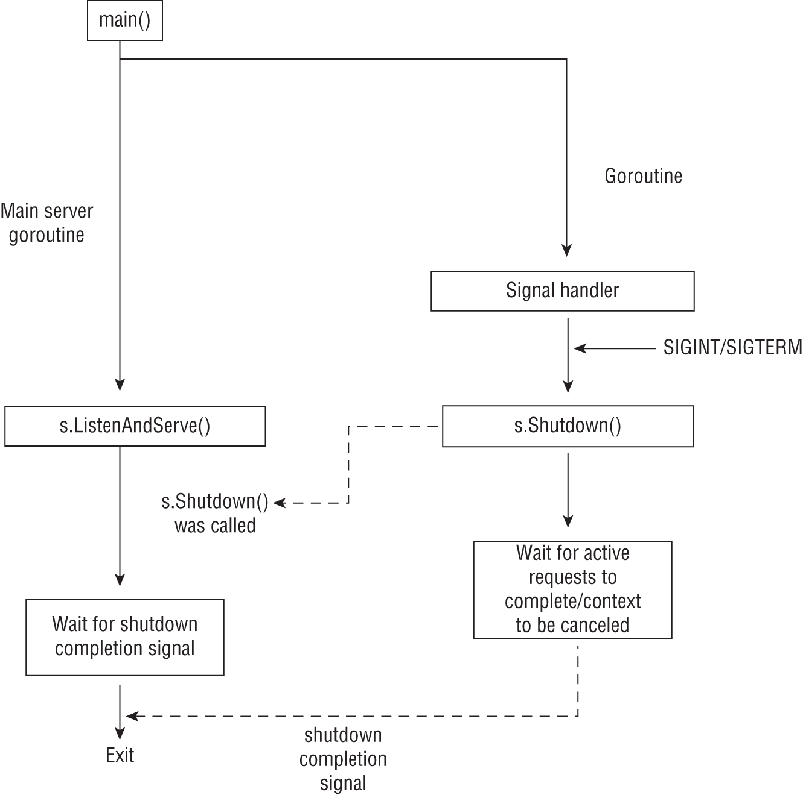

# 生产就绪的 HTTP 服务器
在本章中，你将学习提高 HTTP 服务器应用程序健壮性和稳定性的技术。你将学习如何在服务器请求处理生命周期的各个点实现超时、中止请求处理以保留服务器资源以及实现正常关闭。最后，你将学习如何配置你的 HTTP 服务器，以便在客户端和你的服务器之间有一个安全的通信通道。让我们开始吧！

中止请求处理
考虑你的 Web 应用程序提供的特定功能 - 例如，允许用户根据某些参数对大型数据集执行搜索。在向用户提供此功能之前，你执行了大量测试，并发现所有测试场景的搜索请求都在 500 毫秒内完成。但是，一旦用户开始在他们的应用程序中使用该功能，你就会发现，对于某些搜索条件，请求可能需要长达 30 秒才能完成，有时甚至不会成功。更糟糕的是，相同的搜索在重试时会在 500 毫秒内成功完成。你现在担心这可能会导致你的应用程序被利用，因为多个此类请求可能使其无法满足任何请求——操作系统资源是有限的——打开文件描述符、内存等。听起来很熟悉？这就是拒绝服务 (DoS) 攻击的实现方式！

当你开始研究这种奇怪的行为以提出修复方案时，你希望在你的服务器中插入一个安全机制。为此，你将对该请求的处理程序强制执行超时。如果此操作花费的时间超过 10 秒，你将中止请求处理并返回错误响应。这样做将实现两个目标：你的服务器资源不会与这些请求捆绑在一起，这比预期花费的时间更长，并且你的客户端会得到一个快速响应，告诉他们他们的请求无法完成。然后他们可以简单地重试并可能获得成功的响应。让我们看看如何在 HTTP 服务器应用程序中实现这种行为。

http.TimeoutHandler() 函数是 net/http 包中定义的中间件，它创建一个新的 http.Handler 对象包装另一个 http.Handler 对象，如果内部处理程序没有在指定的持续时间内完成，向客户端发送 503 Service Unavailable HTTP 响应。让我们考虑一个处理函数：

```go
func handleUserAPI(w http.ResponseWriter, r *http.Request) {
    log.Println("I started processing the request")
    time.Sleep(15 * time.Second)
    fmt.Fprintf(w, "Hello world!")
    log.Println("I finished processing the request")
}
```

我们调用 time.Sleep() 函数来模拟处理请求时的 15 秒延迟。 15 秒过后，它将发送响应 Hello world!给客户。日志将帮助我们更好地理解处理程序函数与超时处理程序的交互，你很快就会看到。

接下来，我们将使用 http.TimeoutHandler() 函数包装 handleUsersAPI() 函数，以便在 14 秒后（就在处理程序函数从睡眠中唤醒之前）将 HTTP 503 响应发送到客户端。 http.TimeoutHandler() 函数的签名定义如下：

```go
func TimeoutHandler(h Handler, dt time.Duration, msg string) Handler
```

它的参数是一个对象，h，满足http.Handler接口的传入处理程序；一个 time.Duration 对象，dt，它包含我们希望客户端等待处理程序完成的最大持续时间（以毫秒或秒为单位）；和包含将与 HTTP 503 响应一起发送到客户端的消息的字符串值。因此，要包装 handleUsersAPI() 处理函数，我们首先将其转换为满足 http.Handler 接口的值：

```go
userHandler := http.HandlerFunc(handleUserAPI)
```

然后我们调用 http.TimeoutHandler() 函数，超时持续时间为 14 秒：

```go
timeoutDuration := 14 * time.Second
hTimeout := http.TimeoutHandler(
    userHandler, timeoutDuration, "I ran out of time",
)
```

返回的对象 hTimeout 满足 http.Handler 接口并包装传入的处理程序 userHandler，并实现了超时逻辑。然后可以使用 ServeMux 对象注册它以直接或作为中间件链的一部分处理请求，如下例所示：

```go
mux := http.NewServeMux()
mux.Handle("/api/users/", hTimeout)
```

清单 7.1 展示了一个可运行的 HTTP 服务器的完整示例，展示了 handleUserAPI 处理程序和 http.TimeoutHandler() 函数的集成。

代码清单 7.1：对处理函数强制超时

```go
// chap7/handle-func-timeout/server.go
package main
 
import (
    "fmt"
    "log"
    "net/http"
    "time"
)
 
// TODO Insert handleUserAPI() function from above
 
func main() {

    listenAddr := os.Getenv("LISTEN_ADDR")
    if len(listenAddr) == 0 {
        listenAddr = ":8080"
    }

    timeoutDuration := 14 * time.Second

    userHandler := http.HandlerFunc(handleUserAPI)
    hTimeout := http.TimeoutHandler(
        userHandler, 
        timeoutDuration, 
        "I ran out of time",
    )
    mux := http.NewServeMux()
    mux.Handle("/api/users/", hTimeout)

    log.Fatal(http.ListenAndServe(listenAddr, mux))
}
```

创建一个新目录，chap7/handle-func-timeout，并在其中初始化一个模块：

```sh
$ mkdir -p chap7/handle-func-timeout
$ cd chap7/http-handler-type
$ go mod init github.com/username/handle-func-timeout
```

接下来，将代码清单 7.1 保存为 server.go。构建并运行应用程序：

```sh
$ go build -o server
$ ./server
```

从单独的终端，使用 curl（添加 -v 选项）向 /api/users/ 端点发出请求：

```sh
$ curl -v localhost:8080/api/users/
# output snipped #
>
< HTTP/1.1 503 Service Unavailable
# output snipped #
```

我没时间了
客户端收到 503 Service Unavailable 响应以及一条消息“我没时间了”。在你运行服务器的终端上，你将看到如下日志：

```sh
2021/04/24 09:26:19 I started processing the request
2021/04/24 09:26:34 I finished processing the request
```

上面的日志显示，即使客户端已经发送了 HTTP 503 响应，处理程序函数 usersAPIHandler 仍在继续执行，从而终止连接。在这种情况下，让处理程序函数完成然后让运行时处理清理不是一个交易破坏者。但是，在我们将实现此超时的场景中，例如对于开头所述的搜索功能，允许处理程序继续运行可能会破坏强制执行超时的目的。它将继续消耗服务器上的资源。因此，我们需要做一些工作，以确保一旦超时处理程序启动，处理程序就停止执行任何进一步的处理。接下来让我们研究执行此操作的方法。

## 中止请求处理的策略

你在第 5 章中了解到，处理程序函数处理的传入请求具有关联的上下文。当客户端的连接关闭时，这个上下文被取消。因此，在服务器端，如果我们在继续处理请求之前检查上下文是否已被取消，我们可以在 http.TimeoutHandler() 已经将 HTTP 503 响应发送回客户端时中止处理。图 7.1 以图形方式说明了这一点。



图 7.1：超时处理程序启动时中止请求处理

让我们考虑一个更新版本的 handleUserAPI() 函数：

```go
func handleUserAPI(w http.ResponseWriter, r *http.Request) {
    log.Println("I started processing the request")
    time.Sleep(15 * time.Second)

    log.Println(
        "Before continuing, i will check if the timeout
        has already expired",
    )
    if r.Context().Err() != nil {
        log.Printf(
            "Aborting further processing: %v\n",
            r.Context().Err(),
        )
        return
    }
    fmt.Fprintf(w, "Hello world!")
    log.Println("I finished processing the request")
}
```

在调用 time.Sleep() 函数之后，我们使用 r.Context() 方法检索请求的上下文。然后我们检查对 Err() 方法的调用是否返回非 nil 错误值。如果返回非 nil 错误值，则客户端连接现在关闭，因此我们从处理程序函数返回。由于客户端已经离开，我们通过中止请求处理来节省系统资源或防止不可预测的行为。你可以在本书源代码库的 chap7/abort-processing-timeout 目录中找到具有上述处理程序函数的可运行服务器。此策略要求你以了解客户端连接状态的方式编写处理程序函数，然后使用它来决定是否继续处理请求。

在另一种情况下，如果你的处理程序函数正在发出网络请求，例如对另一个服务的 HTTP 请求，你应该将请求的上下文与传出请求一起传递。然后，当超时处理程序启动（从而取消上下文）时，将根本不会发出传出的 HTTP 请求。当然，在这种情况下，你不必做这项工作，因为标准库的 HTTP 客户端已经支持传递上下文，正如你在第 4 章中学到的那样。让我们回顾一个示例来说明这一点。

考虑一个函数 doSomeWork()，它是一个真正需要 2 秒才能完成的函数的代理：

```go
func doSomeWork() {
    time.Sleep(2 * time.Second)
}
```

接下来，考虑一个调用 doSomeWork() 函数的更新的 handleUserAPI() 函数：

```go
func handleUserAPI(w http.ResponseWriter, r *http.Request) {
    log.Println("I started processing the request")

    doSomeWork()


    req, err := http.NewRequestWithContext(
        r.Context(),
        "GET",
        "http://localhost:8080/ping", nil,
    )
    if err != nil {
        http.Error(
            w, err.Error(),
            http.StatusInternalServerError,
        )
        return
    }
    client := &http.Client{}
    log.Println("Outgoing HTTP request")

    resp, err := client.Do(req)
    if err != nil {
        log.Printf("Error making request: %v\n", err)
        http.Error(
            w, err.Error(),
            http.StatusInternalServerError,
        )
        return
    }
    defer resp.Body.Close()
    data, _ := io.ReadAll(resp.Body)

    fmt.Fprint(w, string(data))
    log.Println("I finished processing the request")
}
```

handleUserAPI() 函数首先调用 doSomeWork() 函数，然后在 /ping 路径上为另一个 HTTP 应用程序发出 HTTP GET 请求——在本例中，为简单起见，是同一个应用程序。它使用 http.NewRequestWithContext() 函数来构造 HTTP 请求，要求它使用正在处理的当前请求的上下文作为其上下文。然后将从 GET 请求中获得的响应作为响应发回。我们期望如果超时处理程序中止请求处理，则不会发出此请求。清单 7.2 显示了一个可运行的服务器应用程序。

代码清单 7.2：在处理函数上强制超时

```go
// chap7/network-request-timeout/server.go
package main
 
import (
    "fmt"
    "io"
    "log"
    "net/http"
    "time"
)
 
func handlePing(w http.ResponseWriter, r *http.Request) {
    log.Println("ping: Got a request")
    fmt.Fprintf(w, "pong")
}
 
func doSomeOtherWork() {
    time.Sleep(2 * time.Second)
}
 
// TODO Insert the updated handleUserAPI() function from earlier
 
func main() {
    listenAddr := os.Getenv("LISTEN_ADDR")
    if len(listenAddr) == 0 {
        listenAddr = ":8080"
    }

    timeoutDuration := 1 * time.Second

    userHandler := http.HandlerFunc(handleUserAPI)
    hTimeout := http.TimeoutHandler(
        userHandler,
        timeoutDuration,
        "I ran out of time"        ,
    )

    mux := http.NewServeMux()
    mux.Handle("/api/users/", hTimeout)
    mux.HandleFunc("/ping", handlePing)

    log.Fatal(http.ListenAndServe(listenAddr, mux))
}
```

我们现在使用 userHandler 对象调用 http.TimeoutHandler() 函数并设置 1 秒的超时。 doSomeWork() 函数需要 2 秒才能完成。

创建一个新目录，chap7/network-request-timeout，并在其中初始化一个模块：

```sh
$ mkdir -p chap7/network-request-timeout
$ cd chap7/network-request-timeout
$ go mod init github.com/username/network-request-timeout
```

接下来，将代码清单 7.2 保存为 server.go。构建并运行应用程序：

```sh
$ go build -o server
$ ./server
```

在单独的终端中，使用 curl（添加 -v 选项）向 /api/users/ 路径上的应用程序发出请求：

```sh
$ curl -v localhost:8080/api/users/
# output snipped #
>
< HTTP/1.1 503 Service Unavailable
# output snipped #
```

我没时间了
客户端收到 503 Service Unavailable 响应以及一条消息“我没时间了”。在服务器日志中可以观察到更有趣的行为：

```sh
2021/04/25 17:43:41 I started processing the request
2021/04/25 17:43:43 Outgoing HTTP request
2021/04/25 17:43:43 Error making request: Get
"http://localhost:8080/ping": context deadline exceeded
```


handleUserAPI() 函数开始处理请求。然后，2 秒后它尝试发出 HTTP GET 请求。在此尝试期间，我们收到一条错误消息，指出已超出上下文截止日期，因此请求处理中止。

你可能会好奇，发出的 HTTP GET 请求究竟是何时中止的。是在 DNS 查找之后还是在与服务器建立 TCP 连接之后？练习 7.1 让你有机会找出答案。

> 练习 7.1：跟踪传出客户端行为 在第 4 章中，你使用 net/http/httptrace 包来了解 HTTP 客户端中的连接池行为。 httptrace.ClientTrace 结构体还有许多其他字段，例如 TCP 连接建立开始时的 ConnectStart 和 HTTP 请求完成时的 WroteRequest。你可以使用这些字段来探查 HTTP 请求的不同阶段。对于本练习，更新代码清单 7.2 以将 httptrace.ClientTrace 结构集成到你的 HTTP 客户端，以便它记录传出请求的不同阶段。
>
> 集成 httptrace.ClientTrace 后，尝试在 doSomeWork() 函数中将超时持续时间更改为大于睡眠持续时间。

在本节中，你已经看到了在使用 http.TimeoutHandler() 函数时中止请求处理的两种策略。当你必须明确检查超时时，第一种策略很有用，而当你使用理解上下文的标准库函数时，第二种策略很有用。当服务器启动客户端断开连接时，这些策略很有用。在下一节中，你将学习如何处理客户端发起断开连接的场景。

### 处理客户端断开连接

考虑本章前面的搜索功能的场景。你现在已对处理程序函数的操作实施了最大超时。经过进一步分析，你意识到目前某些特定情况的搜索操作将是昂贵的，因此所花费的时间将比其他情况更多。因此，你希望你的用户在这些情况下等待操作完成。但是，你现在在用户中看到了一种行为，即他们会请求执行昂贵的搜索操作，然后终止他们的连接，因为他们认为这不会完成。然后他们再试一次。这会导致你的服务器正在处理许多此类请求，但由于客户端已经断开连接，因此结果没有用。因此，我们不想在这种情况下继续处理请求。

为了响应客户端断开连接，你将再次使用请求的上下文。事实上，代码清单 7.2 中的 handleUserAPI() 函数已经以这种方式编写了。不同之处在于客户端将发起断开连接而不是服务器。我们现在将修改该函数以探索使用请求上下文检测客户端断开连接的另一种模式：

```go
func handleUserAPI(w http.ResponseWriter, r *http.Request) {
    done := make(chan bool)

    log.Println("I started processing the request")

    // TODO Make the outgoing request as earlier in Listing 7.2

    data, _ := io.ReadAll(resp.Body)

    log.Println("Processing the response i got")

    go func() {
        doSomeWork(data)
        done <- true
    }()

    select {
        case <-done:
        log.Println(
            "doSomeWork done:Continuing request processing",
        )
        case <-r.Context().Done():
        log.Printf(
            "Aborting request processing: %v\n",
            r.Context().Err(),
        )
        return
    }

    fmt.Fprint(w, string(data))
    log.Println("I finished processing the request")
}
```

收到请求后，处理程序函数发出一个传出的 HTTP GET 调用。如前所述，我们将传入请求的上下文作为此请求的一部分进行传递。一旦收到响应，它就会调用 goroutine 中的 doSomeWork() 函数。一旦函数返回，我们将 true 写入 done 通道。然后我们有一个 select..case 块，我们在其中等待两个通道 - done 和通过调用 r.Context.Done() 方法返回的通道。如果我们首先在 done 通道上获得值，我们将继续处理请求。如果我们首先在第二个通道上获得一个值，则上下文已被取消，我们通过从处理程序函数返回来中止请求处理。我们还将对服务器的其他部分进行一些更改。清单 7.3 显示了实现这些更改的服务器。

代码清单 7.3：处理客户端断开连接

```go
/ chap7/client-disconnect-handling/server.go
package main
 
import (
    "fmt"
    "io"
    "log"
    "net/http"
    "time"
)
 
func handlePing(w http.ResponseWriter, r *http.Request) {
    log.Println("ping: Got a request")
    time.Sleep(10 * time.Second)
    fmt.Fprintf(w, "pong")
}
 
func doSomeWork(data []byte) {
    time.Sleep(15 * time.Second)
}
 
// TODO Insert the modified handleUserAPI function
 
func main() {
    listenAddr := os.Getenv("LISTEN_ADDR")
    if len(listenAddr) == 0 {
        listenAddr = ":8080"
    }


    timeoutDuration := 30 * time.Second

    userHandler := http.HandlerFunc(handleUserAPI)
    hTimeout := http.TimeoutHandler(
        userHandler,
        timeoutDuration,
        "I ran out of time",
    )

    mux := http.NewServeMux()
    mux.Handle("/api/users/", hTimeout)
    mux.HandleFunc("/ping", handlePing)

    log.Fatal(http.ListenAndServe(listenAddr, mux))
}
```

我们将 doSomeWork() 中的睡眠持续时间增加到 15 秒，并在 handlePing() 函数中引入了 10 秒的睡眠。我们还将超时处理程序的持续时间增加到 30 秒。已进行这些更改以反映与搜索功能性能相关的新发现。因此，在此版本的服务器中，超时处理程序不会中止请求处理——这是有意为之。

创建一个新目录，chap7/client-disconnect-handling，并在其中初始化一个模块：

```sh
$ mkdir -p chap7/client-disconnect-handling
$ cd chap7/client-disconnect-handling
$ go mod init github.com/username/client-disconnect-handling
```

接下来，将代码清单 7.3 保存为 server.go。构建并运行应用程序：

```sh
$ go build -o server
$ ./server
```

在单独的终端中，使用 curl 向 /api/users/ 路径上的应用程序发出请求，并在 10 秒过去之前，按 Ctrl+C 中止请求：

```sh
$ curl -v localhost:8080/api/users/
..
* Connected to localhost (::1) port 8080 (#0)
..
^C
```

在运行服务器的终端上，你将看到以下日志：

```sh
2021/04/26 09:25:17 I started processing the request
2021/04/26 09:25:17 Outgoing HTTP request
2021/04/26 09:25:17 ping: Got a request
2021/04/26 09:25:18 Error making request: Get "http://localhost:8080/ping": context canceled
```

从日志中，你可以看到 handlePing() 函数收到了请求，但它在执行完成之前被取消以响应你中止请求。请注意，日志消息现在显示上下文已取消（而不是超出上下文截止日期）。尝试在 10 秒后但又过了 15 秒之前中止请求。

你已经学会了实现在服务器应用程序中中止请求处理以响应配置的超时或客户端的技术。实施此模式的目标是在发生意外情况时围绕行为引入可预测性。然而，这些技术专注于单独的处理程序函数。接下来，我们将从整个服务器应用程序的角度来看实现健壮性。但是，在此之前，你需要尝试一个练习（练习 7.2）。

> 练习 7.2：测试请求中止行为 你刚刚学会了在检测到客户端断开连接时中止请求的处理。编写一个测试来验证这种行为。验证清单 7.3 中实现的服务器日志足以作为测试。要在测试中模拟客户端断开连接，你会发现参考第 4 章中的 HTTP 客户端超时配置很有用。

## 服务器范围的超时
我们将首先研究为所有处理程序函数实现全局超时。然后我们将更上一层楼，查看在请求到达处理程序函数之前发生的网络通信，并学习如何在请求-响应过程的各个阶段引入健壮性。

为所有处理程序函数实现超时
甚至在你注意到生产中运行的任何应用程序出现特定问题之前，你可能希望对所有处理程序函数实施硬超时。这将为所有请求处理程序的延迟提供上限，并防止不可预见的情况占用你的服务器资源。为此，你将再次使用 http.TimeoutHandler() 函数。你会记得该函数的签名如下：

```go
func TimeoutHandler(h Handler, dt time.Duration, msg string) Handler
```

这里要进行的一个关键观察是包装的处理程序对象 h 必须满足 http.Handler 接口。此外，你在第 6 章中了解到 http.ServeMux 类型的值满足相同的接口。因此，要在所有处理程序函数中实现全局超时，你需要做的就是使用 ServeMux 对象作为处理程序值调用 http.TimeoutHandler() 函数，然后使用返回的值调用 http.ListenAndServe()处理程序：

```go
mux := http.ServeMux()
mux.HandleFunc("/api/users/", userAPIHandler)
mux.HandleFunc("/healthz", healthcheckHandler)
mTimeout := http.TimeoutHandler(mux, 5*time.Second, "I ran out of time")
http.ListenAndServe(":8080", mTimeout)
```

有了上述设置，所有注册的请求处理程序在超时处理程序启动并中止请求处理之前最多有五秒钟的时间。你可以在本书源代码分发的 chap7/global-handler-timeout 目录中找到一个演示全局处理程序超时的可运行示例。当然，你也可以将全局处理程序超时与特定于处理程序的超时结合起来，以实现更精细的超时。将全局处理程序超时与中止处理请求的策略相结合可确保你的服务器在应用程序中出现意外情况时能够更快地失败。

接下来，我们将从处理程序超时开始上一级，并着眼于使服务器免受请求处理程序之外可能发生的问题的影响。

### 实现服务器超时
当客户端向 HTTP 应用程序发出请求时，以下步骤发生在高层（忽略任何已注册的中间件）：

1. 客户端连接被服务器的主 goroutine 接受；也就是说，调用 http.ListenAndServe() 函数的位置。
2. 服务器会部分读取请求以找出请求的路径，例如 /api/users/ 或 /healthz 。
3. 如果为路径注册了一个处理程序，服务器例程会创建一个 http.Request 对象，其中包含请求标头和所有与请求相关的信息，正如你在第 5 章中学到的那样。
4. 然后调用处理程序来处理请求，处理请求然后将响应写回客户端。根据处理程序的逻辑，它可能会或可能不会读取请求正文。

在正常情况下，上述所有步骤都在相当短的时间内发生——几毫秒，或者根据请求，几十秒。然而，我们的目标是考虑当涉及不良网络连接或恶意行为者时的异常情况。考虑一个场景，处理程序开始读取上面的请求（在第 4 步中），但客户端恶意地从未停止发送数据。当服务器将响应写入客户端但客户端恶意缓慢读取响应时，类似的情况适用，因此服务器需要比其他情况更长的时间。在这两种情况下，许多此类客户端会继续消耗服务器资源，从而使服务器无法执行任何功能。为了在这种情况下为你的服务器应用程序提供一定程度的安全性，你可以使用读取和写入超时值配置你的服务器。

图 7.2 显示了处理请求上下文中的不同超时。你已经了解了可以使用 http.TimeoutHandler() 函数为每个处理程序配置的超时。那么为什么我们需要其他超时呢？对于传入的请求流，通过配置 http.TimeoutHandler() 函数强制执行的超时仅在请求到达为路径配置的 HTTP 处理程序函数时才适用。超时在此之前不会生效。对于传出响应流，此函数强制执行的超时根本没有帮助，因为设计的 http.TimeoutHandler() 函数会在超时后向客户端写入响应，因此可能会受到恶意软件的影响客户端或网络平等。接下来，你将学习如何配置服务器级读取和写入超时。



图 7.2：在处理 HTTP 请求时发挥作用的不同超时

启动 HTTP 服务器的 http.ListenAndServe() 函数定义如下（从 Go 1.16 开始）：

```go
func ListenAndServe(addr string, handler Handler) error {
    server := &Server{Addr: addr, Handler: handler}
    return server.ListenAndServe()
}
```

它创建一个类型为 http.Server 的对象，它是在 net/http 包中定义的结构类型。然后它在其上调用 ListenAndServe() 方法。为了进一步配置服务器，例如添加读写超时，我们必须自己创建一个自定义的服务器对象并调用 ListenAndServe() 方法：

```go
s := http.Server{
    Addr:         ":8080",
    Handler:      mux,
    ReadTimeout:  5 * time.Second,
    WriteTimeout: 5 * time.Second,
}
log.Fatal(s.ListenAndServe())
```

我们创建一个 http.Server 对象，s，指定几个字段：

- Addr：与我们希望服务器侦听的地址相对应的字符串。在这里，我们希望服务器侦听地址 ":8080" 。
- Handler：满足 http.Handler 接口的对象。这里我们指定一个类型为 http.ServeMux, mux 的对象。
- ReadTimeout：一个 time.Duration 对象，表示服务器必须读取传入请求的最长时间。这里我们指定它为 5 秒。
- WriteTimeout：一个 time.Duration 对象，表示服务器必须写入响应的最长时间。这里我们指定它为 5 秒。

然后我们在这个对象上调用 ListenAndServe() 方法。清单 7.4 显示了一个配置了读写超时的服务器。它为 /api/users/ 路径注册单个请求处理程序。

清单 7.4：配置服务器超时

```go
// chap7/server-timeouts/server.go
package main
 
import (
    "fmt"
    "io"
    "log"
    "net/http"
    "os"
    "time"
)
 
func handleUserAPI(w http.ResponseWriter, r *http.Request) {
    log.Println("I started processing the request")
    defer r.Body.Close()

    data, err := io.ReadAll(r.Body)
    if err != nil {
        log.Printf("Error reading body: %v\n", err)
        http.Error(
            w, "Error reading body",
            http.StatusInternalServerError,
        )
        return
    }
    log.Println(string(data))
    fmt.Fprintf(w, "Hello world!")
    log.Println("I finished processing the request")
}
 
func main() {
    listenAddr := os.Getenv("LISTEN_ADDR")
    if len(listenAddr) == 0 {
        listenAddr = ":8080"
    }

    mux := http.NewServeMux()
    mux.HandleFunc("/api/users/", handleUserAPI)

    s := http.Server{
        Addr:         listenAddr,
        Handler:      mux,
        ReadTimeout:  5 * time.Second,
        WriteTimeout: 5 * time.Second,
    }
    log.Fatal(s.ListenAndServe())
}
```

handleUsersAPI() 函数期望对它的请求将具有主体。我们在其中添加了各种日志语句，以确保我们可以了解配置的超时如何影响服务器行为。它将读取正文，记录它，然后发送响应“Hello world！”给客户。如果在读取正文时出现错误，它将记录该错误，然后将错误发送回客户端。创建一个新目录，chap7/server-timeout，并在其中初始化一个模块：

```sh
$ mkdir -p chap7/server-timeout
$ cd chap7/server-timeout
$ go mod init github.com/username/server-timeout
```

接下来，将代码清单 7.4 保存为 server.go。构建并运行应用程序：

```shell
$ go build -o server
$ ./server
```

在单独的终端中，使用 curl 向它发出以下请求：

```sh
$ curl --request POST http://localhost:8080/api/users/ \
    --data "Hello server"
Hello world!
```

上面的 curl 命令使用“Hello server”作为请求正文发出 HTTP POST 请求。在服务器端，你将看到以下日志语句：

```sh
2021/05/02 14:03:08 I started processing the request
2021/05/02 14:03:08 Hello server
2021/05/02 14:03:08 I finished processing the request
```

这是服务器在正常情况下的行为。保持服务器运行。

使用你在第 5 章题为“将数据作为响应流式传输”的部分中学到的一些技术，你可以实现一个发送请求正文非常缓慢的 HTTP 客户端。你可以在源代码库的 chap7/client-slow-write 目录中找到客户端代码。在 main.go 文件中，你将看到 longRunningProcess() 函数，该函数将相同的字符串写入 io.Pipe 的写入端，读取端连接到 HTTP 请求以 1 秒的时间在 for 循环中发送在每次迭代之间休眠：

```go
func longRunningProcess(w *io.PipeWriter) {
    for i := 0; i <= 10; i++ {
        fmt.Fprintf(w, "hello")
        time.Sleep(1 * time.Second)
    }
    w.Close()
}
```

只要循环继续执行，服务器就会继续读取请求正文。由于服务器的读取超时设置为 5 秒，我们预计请求处理程序永远不会完成读取完整的请求。让我们验证一下。

构建客户端并按如下方式运行它（当你运行服务器时）：

```sh
$ go build -o client-slow-write
 
$ ./client-slow-write
2021/05/02 15:37:32 Starting client request
2021/05/02 15:37:37 Error when sending the request: Post "http://localhost:8080/api/users/": write tcp 
[::1]:52195->[::1]:8080: use of closed network connection
```

上面错误的关键是客户端通过关闭的网络连接发送数据，我们看到我们在 5 秒后收到错误，这是服务器的读取超时。

在服务器端，你将看到如下日志语句：

```sh
2021/05/02 15:37:32 I started processing the request
2021/05/02 15:37:37 Error reading body: read tcp
[::1]:8080->[::1]:52195: i/o timeout
```

处理程序开始处理请求。它开始读取请求正文，并且在 5 秒后，由于读取超时已到期，因此在执行此操作时出错。

因此，服务器和请求处理程序中的读写超时在流式请求和响应的上下文中具有一些有趣的含义。当服务器配置了 ReadTimeout 时，它将关闭客户端连接，从而中止当前正在处理的任何请求。这当然意味着为将从客户端读取流请求（第 5 章）的服务器设置读取超时值是不可能的，因为理论上客户端可以永远继续发送数据。在这种情况下，你的一个或多个请求处理程序期望处理流请求，你可能希望改为设置 ReadHeaderTimeout 配置，该配置仅在读取标头时强制超时。这至少可以使你的服务器对某些恶意和不受欢迎的客户端请求全局免疫。同样，如果你的服务器将其响应作为流发送，则 WriteTimeout 将无法强制执行，除非你对完成流传输所需的时间有一个估计的上限。读取（或写入）流数据使得使用 http.TimeoutHandler() 函数强制超时也很难实现。默认情况下，从 Go 1.16 开始，标准库的输入/输出函数都不支持取消。因此，超时到期事件不会取消处理程序函数中任何正在进行的输入或输出，并且只有在操作完成后才会检测到。

到目前为止，你已经了解了在遇到意外行为时提高服务器应用程序健壮性的技术，这种行为对于通过计算机网络公开的任何程序都是常见的。接下来，你将研究实现在你的服务器正在计划终止时引入可预测性的技术，例如部署新版本的服务器或作为云基础架构中扩展操作的一部分。

## 实现正常关机

正常关闭 HTTP 服务器意味着在服务器停止之前尝试不中断任何正在进行的请求处理。从本质上讲，实现优雅的服务器关闭有两件事：

- 停止接收任何新请求。
- 不要终止任何已经在处理的请求。

幸运的是，net/http 库已经通过 http.Server 对象上定义的 Shutdown() 方法使这个工具可用。调用此方法时，服务器停止接收任何新请求，终止任何空闲连接，然后等待任何正在运行的请求处理函数完成处理后再返回。你可以通过传递 context.Context 对象来控制等待的时间。让我们首先编写一个函数来设置信号处理程序（类似于你在第 2 章中为命令行应用程序实现它的方式）并在定义的服务器对象 s 上调用 Shutdown() 方法，当 SIGINT 或 SIGTERM 信号出现时已收到：

```go
func shutDown(
    ctx context.Context,
    s *http.Server,
    waitForShutdownCompletion chan struct{},
) {
    sigch := make(chan os.Signal, 1)
    signal.Notify(sigch, syscall.SIGINT, syscall.SIGTERM)
    sig := <-sigch
    log.Printf("Got signal: %v . Server shutting down.", sig)
    if err := s.Shutdown(ctx); err != nil {
        log.Printf("Error during shutdown: %v", err)
    }
    waitForShutdownCompletion <- struct{}{}
}
```

使用三个参数调用 shutdown() 函数：

- ctx ：一个 context.Context 对象，它允许你控制 Shutdown() 方法等待现有请求处理完成的时间
- s : 代表服务器的 http.Server 对象，当收到信号时将关闭
- waitForShutdownCompletion : struct{} 类型的通道

当程序接收到 SIGINT 或 SIGTERM 之一时，它将调用 Shutdown() 方法。 当调用返回时，struct{}{} 将被写入到 waitForShutdownCompletion 通道。 这将向主服务器例程表明关闭过程已完成，它可以继续并自行终止。

图 7.3 以图形方式说明了 Shutdown() 和 ListenAndServe() 方法如何交互。 清单 7.5 展示了一个实现优雅关闭的服务器。



代码清单 7.5：在服务器中实现优雅关闭

```go
// chap7/graceful-shutdown/server.go
package main
 
import (
    "context"
    "fmt"
    "io"
    "log"
    "net/http"
    "os"
    "os/signal"
    "syscall"
    "time"
)
 
// TODO Insert definition of handleUserAPI() from Listing 7.4
// TODO Insert definition of shutDown() from above
 
func main() {
    listenAddr := os.Getenv("LISTEN_ADDR")
    if len(listenAddr) == 0 {
        listenAddr = ":8080"
    }

    waitForShutdownCompletion := make(chan struct{})
    ctx, cancel := context.WithTimeout(
        context.Background(), 30*time.Second,
    )
    defer cancel()

    mux := http.NewServeMux()
    mux.HandleFunc("/api/users/", handleUserAPI)

    s := http.Server{
        Addr:    listenAddr,
        Handler: mux,
    }

    go shutDown(ctx, &s, waitForShutdownCompletion)

    err := s.ListenAndServe()
    log.Print(
        "Waiting for shutdown to complete..",
    )
    <-waitForShutdownCompletion
    log.Fatal(err)
}
```

waitForShutdownCompletion 通道将帮助我们编排主服务器 goroutine 和运行 shutdown() 函数的 goroutine。我们使用 context.WithTimeout() 函数创建一个上下文，它将在 30 秒后取消。这配置了服务器的 Shutdown() 方法等待所有现有请求被处理的最长时间。

然后我们在 goroutine 中调用 shutdown() 函数并调用 s.ListenAndServe() 函数。请注意，我们不会在调用 log.Fatal() 时调用此函数。这是因为在调用 Shutdown() 方法时，ListenAndServe() 函数会立即返回，因此服务器将退出，而无需等待 Shutdown() 方法返回。因此，我们将返回的错误值存储在 err 中，记录一条消息，然后等待一个值写入到 waitForShutdownCompletion 通道，这会阻止服务器终止。一旦我们在这个通道上收到一个值，我们就会记录错误并退出。

创建一个新目录，chap7/graceful-shutdown，并在其中初始化一个模块：

```sh
$ mkdir -p chap7/graceful-shutdown
$ cd chap7/graceful-shutdown
$ go mod init github.com/username/graceful-shutdown
```

接下来，将代码清单 7.5 保存为 server.go。构建并运行应用程序：

```sh
$ go build -o server
$ ./server
```


为了向此服务器发出请求，我们将使用自定义客户端，你可以在源代码存储库的 chap7/client-slow-write 目录中找到它。构建客户端并按如下方式运行它（当你运行服务器时）：

```sh
$ go build -o client-slow-write
 
$ ./client-slow-write
2021/05/02 20:28:25 Starting client request
```

现在，一旦你看到上面的日志消息，请切换回运行服务器的终端，然后按 Ctrl+C。你将看到以下日志语句：

```sh
2021/05/02 20:28:25 I started processing the request
^C2021/05/02 20:28:28 Got signal: interrupt . Server shutting down.
2021/05/02 20:28:28 Waiting for shutdown to complete..
2021/05/02 20:28:36 hellohellohellohellohellohellohello
hellohellohellohello
2021/05/02 20:28:36 I finished processing the request
2021/05/02 20:28:36 http: Server closed
```

请注意，在你按下 Ctrl+C 后，Shutdown() 方法等待读取整个主体，或等待正在进行的请求完成，然后服务器才退出。在客户端，你将看到它返回了 Hello world！回复。

伟大的。你现在已经学会了实现一种以不终止进行中的请求的方式终止服务器应用程序的机制。事实上，你可以使用此机制来运行你可能需要执行的各种其他复杂的清理操作，例如通知任何具有长期连接的打开客户端，以便它们可以发送重新连接请求或关闭任何打开的数据库连接和很快。

在本章的最后一部分，你将学习如何在生产中运行服务器时实现另一个基本的执行能力——配置与客户端的安全通信通道。

## 使用 TLS 保护通信

整本书的章节都可以专门讨论传输层安全性 (TLS)，因为它适用于保护网络通信。 TLS 使用加密协议帮助保护服务器和客户端之间的通信。更常见的是，它允许你实现安全的 Web 服务器，以便客户端-服务器通信通过安全超文本传输协议 (HTTPS) 而不是纯 HTTP。要启动 HTTPS 服务器，你将使用 http.ListenAndServeTLS() 函数或 srv.ListenAndServeTLS() 方法，其中 srv 是自定义 http.Server 对象。 ListenAndServeTLS() 函数的签名如下：

```go
func ListenAndServeTLS(addr, certFile, keyFile string, handler Handler)
```

如果将 ListenAndServeTLS() 与 ListenAndServe() 函数进行比较，则它需要两个额外的参数——第二个和第三个参数是包含 TLS 证书和密钥文件路径的字符串值。这些文件包含使用加密和解密技术在服务器和客户端之间安全传输数据所需的数据。你可以自己生成 TLS 证书（所谓的自签名证书），也可以请其他人（即证书颁发机构 (CA)）为你生成一个。自签名证书可用于仅在某个明确定义的范围内保护通信，例如，在组织内。但是，如果你要在服务器中使用此类证书，然后要求组织外部的任何人访问你的服务器，他们将收到错误消息，指出该证书未被识别，因此不会进行安全通信。另一方面，通过 CA 生成的证书将受到组织内部或外部客户端的信任。大型组织通常将自签名证书用于内部服务（消费者也是内部的）和通过 CA 颁发的证书用于面向公众的服务。换句话说，对于私有域，你将使用自签名证书和 CA 颁发的公共域证书。事实上，你还可以在组织内部运行证书颁发机构来帮助使用自签名证书。接下来，你将学习如何使用自签名证书配置安全的 HTTP 服务器。

### 配置 TLS 和 HTTP/2

首先，你将使用命令行程序 openssl 创建自签名证书和密钥。如果你使用的是 MacOS 或 Linux，则应该已经安装了该程序。对于 Windows，请参阅本书的网站以获取其他有用资源的说明和链接。

创建一个新目录，chap7/tls-server，并在其中初始化一个模块：

```sh
$ mkdir -p chap7/tls-server
$ cd chap7/tls-server
$ go mod init github.com/username/tls-server
```

要使用 openssl 创建自签名证书，请运行以下命令：

```sh
$ openssl req -x509 -newkey rsa:4096 -keyout server.key -out server.crt-days 365 -subj "/C=AU/ST=NSW/L=Sydney/O=Echorand/OU=Org/CN=localhost" -nodes
```

上面的命令应该完成执行，输出如下：

```sh
Generating a 4096 bit RSA private key
.....................................................
............................................................
........++
......................................................................++
writing new private key to 'server.key'
-----
```

你将看到在 chap7/tls-server 目录中创建了两个文件：server.key 和 server.crt。这些是我们将分别在调用 ListenAndServeTLS() 函数时指定的密钥文件和证书。深入研究上述命令的细节超出了这里的范围，但需要注意以下两点：

- 上述证书仅适用于测试目的，因为客户端默认不信任自签名证书。
- 上述证书将允许你仅使用 localhost 域安全地连接到你的服务器。

配置和启动 HTTPS 服务器如下所示：

```go
func main() {
    # …

    tlsCertFile := os.Getenv("TLS_CERT_FILE_PATH")
    tlsKeyFile := os.Getenv("TLS_KEY_FILE_PATH")

    if len(tlsCertFile) == 0 || len(tlsKeyFile) == 0 {
        log.Fatal(
            "TLS_CERT_FILE_PATH and TLS_KEY_FILE_PATH 
            must be specified")
            }

            # ..

            log.Fatal(
                http.ListenAndServeTLS(
                    listenAddr,
                    tlsCertFile,
                    tlsKeyFile,
                    m,
                ),
            )
}
```

服务器期望证书和密钥文件的路径将被指定为环境变量：分别为 TLS_CERT_FILE_PATH 和 TLS_KEY_FILE_PATH。清单 7.6 显示了一个使用 TLS 证书的 HTTP 服务器的完整示例。

清单 7.6：使用 TLS 保护 HTTP 服务器

```go
// chap7/tls-server/server.go
package main
 
import (
    "fmt"
    "log"
    "net/http"
    "os"
    "time"
)
 
func apiHandler(w http.ResponseWriter, r *http.Request) {
    fmt.Fprintf(w, "Hello, world!")
}
 
func setupHandlers(mux *http.ServeMux) {
    mux.HandleFunc("/api", apiHandler)
}
 
func loggingMiddleware(h http.Handler) http.Handler {
    return http.HandlerFunc(
        func(w http.ResponseWriter, r *http.Request) {
            startTime := time.Now()
            h.ServeHTTP(w, r)
            log.Printf(
                "protocol=%s path=%s
                method=%s duration=%f",
                r.Proto, r.URL.Path, r.Method,
                time.Now().Sub(startTime).Seconds(),
            )
        })
}
 
func main() {
    listenAddr := os.Getenv("LISTEN_ADDR")
    if len(listenAddr) == 0 {
        listenAddr = ":8443"
    }

    tlsCertFile := os.Getenv("TLS_CERT_FILE_PATH")
    tlsKeyFile := os.Getenv("TLS_KEY_FILE_PATH")

    if len(tlsCertFile) == 0 || len(tlsKeyFile) == 0 {
        log.Fatal(
            "TLS_CERT_FILE_PATH and TLS_KEY_FILE_PATH
            must be specified")
            }

            mux := http.NewServeMux()
            setupHandlers(mux)
            m := loggingMiddleware(mux)

            log.Fatal(
                http.ListenAndServeTLS(
                    listenAddr,
                    tlsCertFile,
                    tlsKeyFile, m,
                ),
            )
}
```

我们已经将第 5 章中的日志中间件添加到服务器，并为 /api 路径注册了一个请求处理程序。请注意，我们还将 listenAddr 的默认值更改为“:8443”，因为它对于非面向公众的 HTTPS 服务器更为传统。在 chap7/tls-server 目录中将代码清单 7.6 保存为 server.go。构建并运行服务器，如下所示：

```go
$ go build -o server
$ TLS_CERT_FILE_PATH=./server.crt TLS_KEY_FILE_PATH=./server.key \
    ./server
```

如果你使用的是 Windows，则必须以不同方式指定环境变量。对于 PowerShell，以下命令将起作用：

```sh
C:\> $env:TLS_CERT_FILE_PATH=./server.crt; `
     $env: TLS_KEY_FILE_PATH=./server.key ./server
```

一旦你的服务器运行起来，使用 curl 发出请求：

```sh
$ curl https://localhost:8443/api
```

你将收到以下错误：

```sh
curl: (60) SSL certificate problem: self signed certificate
```

这是因为 curl 不信任你的自签名证书。要让 curl 测试你的证书，请指定你向服务器指示的 server.crt 文件：

```sh
$ curl --cacert ./server.crt https://localhost:8443/api
Hello, world!
```

在服务器端，你将看到正在记录以下消息：

```sh
2021/05/05 08:17:55 protocol=HTTP/2.0 path=/api method=GET
duration=0.000055
```

通过手动指定要 curl 的服务器证书，你可以成功地与服务器进行安全通信。请注意，该协议现在记录为 HTTP/2.0。这是因为当你启动一个支持 TLS 的 HTTP 服务器时，如果客户端支持，Go 会自动切换到使用 HTTP/2 而不是 HTTP/1.1，curl 支持它。实际上，你在第 3 章和第 4 章中编写的 HTTP 客户端也将在服务器支持时自动使用 HTTP/2。

### 测试 TLS 服务器
将服务器设置为使用 TLS 后，即使在测试处理程序函数或中间件时，你也需要确保通过 TLS 与服务器通信。在代码清单 7.7 中，现在让我们稍微调整代码清单 7.6 中启用 TLS 的 HTTP 服务器以配置日志记录中间件。

清单 7.7：使用带有可配置记录器的 TLS 保护 HTTP 服务器

```go
// chap7/tls-server-test/server.go
package main
 
import (
    "fmt"
    "log"
    "net/http"
    "os"
    "time"
)
 
// TODO: Insert apiHandler() from Listing 7.6
 
func setupHandlersAndMiddleware(
    mux *http.ServeMux, l *log.Logger,
) http.Handler {
    mux.HandleFunc("/api", apiHandler)
    return loggingMiddleware(mux, l)
}
 
func loggingMiddleware(h http.Handler, l *log.Logger) http.Handler {
    return http.HandlerFunc(
        func(w http.ResponseWriter, r *http.Request,
            ) {
            startTime := time.Now()
            h.ServeHTTP(w, r)
            l.Printf(
                "protocol=%s path=%s method=%s duration=%f",
                r.Proto, r.URL.Path, r.Method,
                time.Now().Sub(startTime).Seconds(),
            )
        })
}
 
func main() {
    # TODO: Insert the setup code as per Listing 7.6
    mux := http.NewServeMux()
    l := log.New(
        os.Stdout, "tls-server", 
        log.Lshortfile|log.LstdFlags,
    )
    m := setupHandlersAndMiddleware(mux, l)

    log.Fatal(
        http.ListenAndServeTLS(
            listenAddr, tlsCertFile, tlsKeyFile, m,
        ),
    )
}
```

清单 7.7 中突出显示了关键的更改。我们将处理程序和中间件注册代码组合成一个函数 setupHandlersAndMiddleware()。在main()函数中，我们新建了一个log.Logger对象，配置为log到os.Stdout，然后调用setupHandlersAndMiddleware()函数，传入ServeMux和log.Logger对象。这将允许我们在编写测试函数时配置记录器。创建一个新目录，chap7/tls-server-test，并在其中初始化一个模块：

```sh
$ mkdir -p chap7/tls-server-test
$ cd chap7/tls-server-test
$ go mod init github.com/username/tls-server-test
```

将代码清单 7.7 作为 server.go 保存在 chap7/tls-server-test 目录中，并将 server.crt 和 server.key 文件从 chap7/tls-server 目录复制到 chap7/tls-server-test 目录中。

接下来，让我们编写一个测试来验证日志记录中间件是否正常工作。要在启用 TLS 和 HTTP/2 的情况下启动测试 HTTP 服务器，你将再次使用 net/http/httptest 包提供的工具：

```go
ts := httptest.NewUnstartedServer(m)
ts.EnableHTTP2 = true
ts.StartTLS()
```

首先，我们通过调用 httptest.NewUnstartedServer() 创建服务器配置。这将返回一个 *httptest.Server 类型的对象，一个在 net/http/httptest 包中定义的结构类型。然后我们通过将 EnableHTTP2 字段设置为 true 来启用 HTTP/2。这是为了确保测试服务器尽可能接近“真实”服务器。最后，我们调用 StartTLS() 方法。这会自动生成 TLS 证书和密钥对并启动 HTTPS 服务器。为了与这个测试 HTTPS 服务器通信，我们需要使用一个特殊构造的客户端：

```go
client := ts.Client()
resp, err := client.Get(ts.URL + "/api")
```

我们通过调用测试服务器对象的 Client() 方法获得的 http.Client 对象会自动配置为信任为测试而生成的 TLS 证书。代码清单 7.8 展示了一个验证日志中间件功能的测试。

清单 7.8：验证启用 TLS 的 HTTP 服务器中的中间件行为

```go
// chap7/tls-server-test/middleware_test.go
package main
import (
    "bytes"
    "log"
    "net/http"
    "net/http/httptest"
    "strings"
    "testing"
)
 
func TestMiddleware(t *testing.T) {
    var buf bytes.Buffer
    mux := http.NewServeMux()
    l := log.New(
        &buf, "test-tls-server", 
        log.Lshortfile|log.LstdFlags,
    )
    m := setupHandlersAndMiddleware(mux, l)

    ts := httptest.NewUnstartedServer(m)
    ts.EnableHTTP2 = true
    ts.StartTLS()
    defer ts.Close()

    client := ts.Client()
    _, err := client.Get(ts.URL + "/api")
    if err != nil {
        t.Fatal(err)
    }

    expected := "protocol=HTTP/2.0 path=/api method=GET"
    mLogs := buf.String()
    if !strings.Contains(mLogs, expected) {
        t.Fatalf(
            "Expected logs to contain %s, Found: %s\n", 
            expected, mLogs,
        )
    }
}
```

我们创建一个新的 bytes.Buffer, buf 并在创建新的 log.Logger 对象时将其指定为 io.Writer。然后，在为测试服务器获取配置的客户端后，我们使用 Get() 方法发出 HTTP GET 请求。由于我们正在测试中间件功能，因此我们丢弃响应。然后我们使用 strings.Contains() 函数验证 buf 对象中记录的消息是否包含预期的字符串。在 chap7/tls-server-test 目录中将代码清单 7.8 保存为 middleware_test.go 并运行测试：

```sh
$ go test -v
=== RUN   TestMiddleware
--- PASS: TestMiddleware (0.01s)
PASS
ok          github.com/practicalgo/code/chap7/tls-server-test     0.557s
```

太好了，你现在已经学会了如何为你的测试设置支持 TLS 的服务器。实际上，你不会像我们之前那样生成 TLS 证书。你也不会手动配置每个客户端（例如 curl 或其他服务）以信任生成的证书。那根本就没有可扩展性。相反，请执行以下操作：

- 对于内部域和服务，使用 cfssl (https://github.com/cloudflare/cfssl) 等工具实现内部可信 CA，然后拥有生成证书和信任 CA 的机制。
- 对于面向公众的域和服务，从受信任的 CA 请求证书 - 手动或在大多数情况下通过自动程序（例如，https://github.com/caddyserver/certmagic）。

## 概括

你通过学习如何为处理程序函数执行设置最大时间限制来开始本章。你将服务器配置为当处理程序函数未在指定的时间间隔内完成处理请求时向服务器发送 HTTP 503 响应。然后，你了解了如何编写处理程序函数，以便在超时已到期或客户端中途断开连接时它们不会继续处理请求。这些技术可以防止你的服务器资源被占用做不再需要的工作。

接下来，你学习了如何为服务器应用程序实现全局读写超时，以及如何为服务器应用程序实现正常关闭。最后，你学习了如何使用 TLS 证书在服务器和客户端之间实现安全通信通道。通过实施这些技术，你的 HTTP 服务器更接近于生产就绪。我们将简要介绍附录 A“使你的应用程序可观察”和附录 B“部署应用程序”中的一些剩余任务。

在下一章中，你将学习如何使用 gRPC 构建客户端和服务器，gRPC 是一个构建在 HTTP/2 之上的远程过程调用 (RPC) 框架。