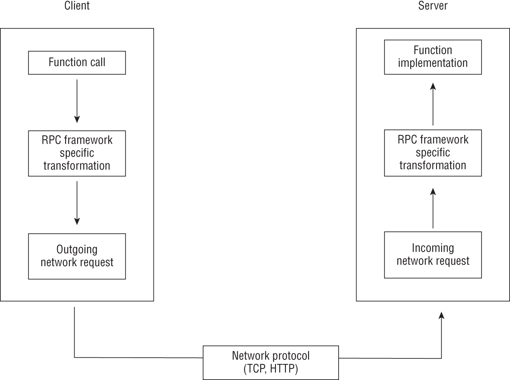
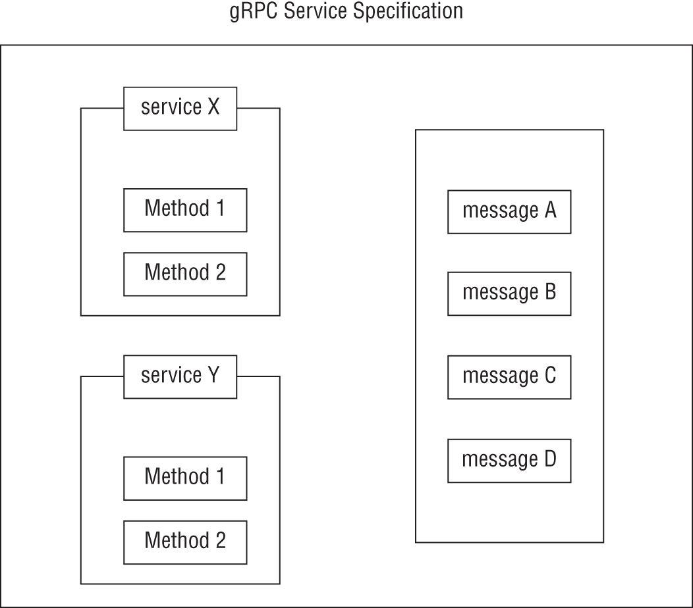
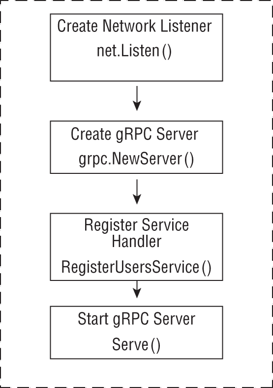
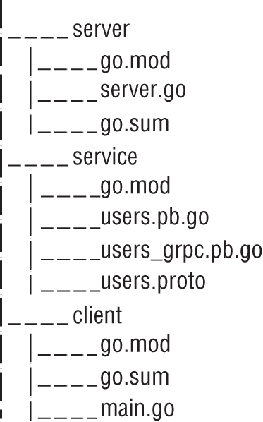
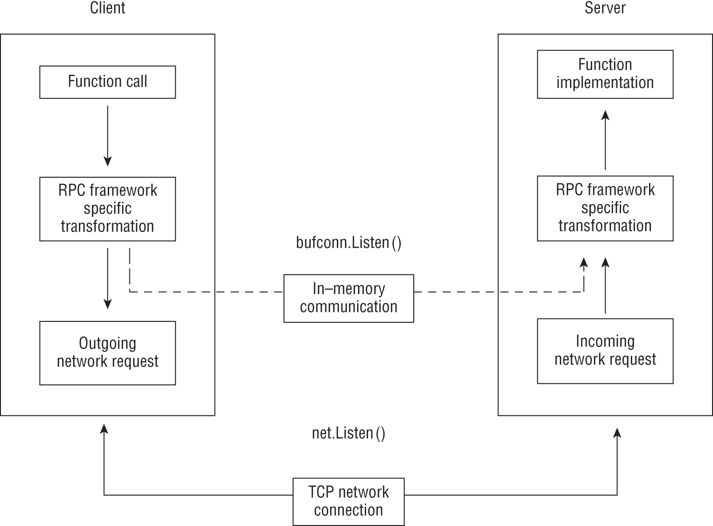

# 使用 gRPC 构建 RPC 应用程序
在本章中，你将学习构建使用远程过程调用 (RPC) 进行通信的网络应用程序。尽管标准库支持构建此类应用程序，但我们将使用开源通用 RPC 框架 gRPC 来实现。我们将从 RPC 框架的快速背景讨论开始，我们将在学习编写完全可测试的 gRPC 应用程序后结束本章。在此过程中，你还将学习使用协议缓冲区，这是一种接口描述语言和数据交换格式，可通过 gRPC 实现客户端-服务器通信。让我们直接跳进去。

## gRPC 和协议缓冲区

当你在程序中进行函数调用时，该函数通常是你自己编写的函数，或者由另一个包提供的函数——来自标准库或第三方包。构建应用程序时，二进制文件中包含该函数的实现。现在假设你能够进行函数调用，但不是在应用程序二进制文件中定义的函数，而是程序通过网络调用在另一个服务中定义的函数。简而言之，这就是远程过程调用 (RPC)。图 8.1 说明了 RPC 客户端和服务器如何通信的典型概览。它显示了从客户端到服务器的请求流。当然，响应流是反向发生的，并遍历与请求相同的层。



图 8.1：基于 RPC 的服务架构的功能

RPC 框架通过处理两个重要问题来增强你的能力：函数调用如何转换为网络请求以及请求本身如何传输。事实上，标准库中的 net/rpc 包为你提供了编写 RPC 服务器和客户端所需的一些基本功能。通过使用它，你可以通过 HTTP 或 TCP 实现 RPC 应用程序架构。当然，使用 net/rpc 包的一个直接限制是你的客户端和服务器必须都用 Go 编写。默认情况下，使用 Go 特定的 gob 格式进行数据交换。

作为对 net/rpc 的改进，net/rpc/jsonrpc 包允许你使用 JSON 作为 HTTP 上的数据交换格式。因此，服务器现在可以用 Go 编写，但你的客户端不需要。如果你想在你的应用程序中实现 RPC 架构，而不是 HTTP，这非常棒。然而，JSON 作为数据交换语言有一些固有的局限性；序列化和反序列化成本以及缺乏围绕数据类型的原生保证是最重要的。

因此，当你希望围绕 RPC 调用设计与语言无关的架构时，建议你选择围绕更高效的数据交换格式构建的 RPC 框架。此类框架的示例是 Apache Thrift 和 gRPC。与标准库的 RPC 支持相比，通用 RPC 框架的主要优势在于，它使你能够使用不同的编程语言编写服务器和客户端应用程序。

当然，我们本章的重点是 gRPC。与语言无关的框架（例如 gRPC）支持以任何受支持语言编写的客户端和服务器。它使用更高效的数据交换格式——Protocol Buffers，或简称为protobuf。 protobuf 数据格式只能机器可读（与 JSON 不同），而协议缓冲区语言是人类可读的。实际上，使用 gRPC 创建应用程序的第一步是使用协议缓冲区语言定义服务接口。

以下代码片段显示了协议缓冲区语言中服务的定义。我们将调用服务 Users，它声明了一个方法 GetUser()。此方法接受输入消息并返回输出消息，如下所示：

```protobuf
service Users {
  rpc GetUser (UserGetRequest) returns (UserGetReply) {}
}
```

GetUser 方法接受 UserGetRequest 类型的输入消息，并返回 UserGetReply 类型的消息。在 gRPC 中，函数必须始终具有输入消息并返回输出消息。因此，客户端和服务器应用程序通过传递消息进行通信。

什么是消息？它充当需要在客户端和服务器之间移动的数据的信封。消息的定义类似于结构类型。 GetUser 方法的目的是允许客户端根据用户的电子邮件或其他标识符查询用户。因此，我们将定义带有两个字段的 UserGetRequest 消息，如下所示：

```protobuf
message UserGetRequest {
  string email = 1;
  string id = 2;
}
```

在消息定义中，我们定义了两个字段：email（一个字符串）和 id（另一个字符串）。消息中的字段定义必须指定三件事：类型、名称和编号。字段的类型可以是当前支持的整数类型（int32、int64 等）、float、double、bool（对于布尔数据）、字符串和字节（对于任何任意数据）之一。

你还可以将字段定义为另一种消息类型。字段名称必须全部为小写，并使用下划线字符 _ 分隔多个单词，例如 first_name。字段编号是一种表示字段在消息中的位置的方式。字段编号可以从 1 开始到 2^29，其中某些范围仅供内部使用。一种推荐的策略是在字段编号中留出空隙。例如，你可以将第一个字段编号为 1，然后将 10 用于下一个字段。这意味着你可以稍后添加任何其他字段，而无需重新编号你的字段，并且还可以将相关字段彼此紧密分组。

值得指出的是，字段编号是你的应用程序无需担心的内部细节，因此应谨慎分配字段编号，切勿更改，并在设计时考虑到未来的修订。我们稍后会在有关向前和向后兼容性的章节中讨论这个主题。

接下来，我们将定义 UserGetReply 消息如下：

```protobuf
message UserGetReply {
  User user = 1;
}
```

上面的消息包含一个字段 user，类型为 User。我们将定义 User 消息如下：

```protobuf
message User {
  string id = 1;
  string first_name = 2;
  string last_name = 3;
  int32 age = 4;
}
```

图 8.2 总结了 gRPC 服务的 protobuf 规范的不同部分。在后面的部分中，你将学习如何在 gRPC 服务器中注册多个服务。



图 8.2：protobuf 语言规范的一部分

一旦你定义了服务接口，你就可以将定义转换为可以从你的应用程序中使用的格式。这个翻译过程将使用 protobuf 编译器、protoc 和编译器的特定语言插件 protoco-gen-go 来完成。值得一提的是，你只会直接与 protoc 命令交互。如果你没有按照介绍中的说明完成安装，那么在你进入下一部分之前，现在是这样做的好时机。

## 编写你的第一个服务

用户服务定义了一种方法 GetUser 来获取特定用户。清单 8.1 显示了服务的完整 protobuf 规范以及消息类型。

清单 8.1：用户服务的 Protobuf 规范

```go
// chap8/user-service/service/users.proto
 
syntax = "proto3";
option go_package = "github.com/username/user-service/service";
 
service Users {
  rpc GetUser (UserGetRequest) returns (UserGetReply) {}
}
 
message UserGetRequest {
  string email = 1;
  string id = 2;
}
 
message User {
  string id = 1;
  string first_name = 2;
  string last_name = 3;
  int32 age = 4;
}
 
message UserGetReply {
  User user = 1;
}
```

创建一个新目录，chap8/user-service。创建一个目录服务，并在其中初始化一个模块：

```sh
$ mkdir -p chap8/user-service/service
$ cd chap8/user-service/service
$ go mod init github.com/username/user-service/service
```

接下来，将代码清单 8.1 保存为一个新文件 users.proto 。

下一步是生成我所说的魔术胶。这本质上是将人类可读的 protobuf 定义（清单 8.1）、服务器和客户端应用程序实现（你将编写）以及机器可读的 protobuf 数据交换在网络上发生的两者联系在一起的东西。回到图 8.1，RPC 框架特定的请求转换是由这个生成的代码执行的。

在 chap8/user-service/service 目录中运行以下命令：

```sh
$ cd chap8/user-service/service
$ protoc --go_out=. --go_opt=paths=source:relative \
  --go-grpc_out=. --go-grpc_opt=paths=source:relative \
  users.proto
```

--go_out 和 go-grpc_out 选项指定生成这些文件的路径。这里我们指定当前目录。 --go_opt=paths=source:relative 和 --go-grpc_opt=paths=source:relative 指定应该根据 users.proto 文件的位置生成文件。结果是，当命令完成时，你将看到在服务目录中创建了两个新文件：users.pb.go 和 users_grpc.pb.go。我们绝不会手动编辑这些文件。它们定义了（在非常高的层次上）protobuf 消息类型的 Go 语言等价物以及你作为应用程序作者将要实现的服务接口。由于我们在服务目录中初始化了一个模块 github.com/username/user-service/service，你将在编写服务器和客户端应用程序时导入各种类型并调用从该模块定义的函数。

### 编写服务器

编写 gRPC 服务器应用程序的步骤类似于编写 HTTP 服务器应用程序：创建一个服务器，编写服务处理程序来处理来自客户端的请求，并将处理程序注册到服务器。创建服务器包括两个步骤：创建网络侦听器并在该侦听器上创建新的 gRPC 服务器：

```go
lis, err := net.Listen("tcp", ":50051")
s := grpc.NewServer()
log.Fatal(s.Serve(lis))
```


我们使用 net 包中定义的 net.Listen() 函数启动 TCP 侦听器。该函数的第一个参数是我们要创建的侦听器类型，在本例中为 TCP，第二个参数是要侦听的网络地址。

在这里，我们设置了侦听器，以便它侦听端口 50051 上的所有网络接口。与 HTTP 服务器的 8080 一样，50051 是 gRPC 服务器的常规选择数字。创建监听器后，我们使用 grpc.NewServer() 函数创建一个 grpc.Server 对象。 google.golang.org/grpc 定义了用于编写 gRPC 应用程序的类型和函数。

最后，我们调用定义在此对象上的 Serve() 方法传递侦听器。此方法仅在你终止服务器或出现错误时才会返回。这是一个功能齐全的 gRPC 服务器。但是，它还不知道如何接受和处理对用户服务的请求。

下一步是实现方法 GetUser()。为了定义这个方法，我们将导入我们之前生成的包：

```go
import users "github.com/username/user-service/service"
```

我们在这里使用导入别名，用户，以便能够在服务器代码的其他地方轻松识别它。然后我们定义一个类型 userService，它只有一个字段：users.UnimplementedUsersServer 结构。这对于 gRPC 中的任何服务实现都是强制性的，这是实现用户服务的第一步：

```go
type userService struct {
    users.UnimplementedUsersServer
}
```

userService 类型是用户服务的服务处理程序。接下来，我们将 GetUser() 方法定义为服务器结构的方法：

```go
func (s *userService) GetUser(
    ctx context.Context,
    in *users.UserGetRequest,
) (*users.UserGetReply, error) {
    log.Printf(
        "Received request for user with Email: %s Id: %s\n",
        in.Email,
        in.Id,
    )
    components := strings.Split(in.Email, "@")
    if len(components) != 2 {
        return nil, errors.New("invalid email address")
    }
    u := users.User{
        Id:        in.Id,
        FirstName: components[0],
        LastName:  components[1],
        Age:       36,
    }
    return &users.UserGetReply{User: &u}, nil
}
```

GetUser() 方法接受两个参数：context.Context 对象和 users.UserGetRequest 对象。它返回两个值：一个 *users.UserGetReply 类型的对象和一个错误。请注意 Go 等价于 RPC 方法 GetUser() 如何返回一个附加值——一个错误。对于其他语言，这可能会有所不同。

消息对应的结构体类型在 users.pb.go 文件中定义。每个结构体都有一些 protobuf 内部的字段，但你会看到它包含了 protobuf 规范的 Go 等价物。

首先，UserGetRequest 结构：

```go
type UserGetRequest struct {
    # other fields
    Email string
    Id    string
}
```

同样， UserGetReply 结构将包含一个 User 字段：

```go
type UserGetReply struct {
    # other fields
    User *User
}
```

User 类型将包含 Id、FirstName、LastName 和 Age 字段：

```go
type User struct {
    # Other fields
    Id        string
    FirstName string
    LastName  string
    Age       int32
}
```

该方法的实现记录传入的请求，从电子邮件地址中提取用户和域名，创建一个虚拟的 User 对象，并返回一个 UserGetReply 值和一个 nil 错误值。如果电子邮件地址格式不正确，我们将返回一个空的 UserGetReply 值和一个错误值。

实现 gRPC 服务器应用程序的最后一步是向 gRPC 服务器注册用户服务：

```go
lis, err := net.Listen("tcp", listenAddr)
s := grpc.NewServer()
users.RegisterUsersServer(s, &userService{})
log.Fatal(s.Serve(lis))
```

为了向 gRPC 服务器注册用户服务处理程序，我们调用通过运行 protoc 命令生成的 users.RegisterUsersServer() 函数。这个函数有两个参数。第一个参数是*grpc.Server对象，第二个参数是Users服务的实现，这里就是我们定义的userService类型。图 8.3 以图形方式说明了所涉及的不同步骤。



图 8.3：使用用户服务创建 gRPC 服务器

清单 8.2 显示了服务器的完整清单。
清单 8.2：用户服务的 gRPC 服务器

```go
// chap8/user-service/server/sever.go
package main
 
import (
    "context"
    "log"
    "net"
    "os"

    users "github.com/username/user-service/service"
    "google.golang.org/grpc"
)
 
type userService struct {
    users.UnimplementedUsersServer
}
 
// TODO: Insert GetUser() function from above
 
func registerServices(s *grpc.Server) {
    users.RegisterUsersServer(s, &userService{})
}
 
func startServer(s *grpc.Server, l net.Listener) error {
    return s.Serve(l)
}
 
func main() {
    listenAddr := os.Getenv("LISTEN_ADDR")
    if len(listenAddr) == 0 {
        listenAddr = ":50051"
    }

    lis, err := net.Listen("tcp", listenAddr)
    if err != nil {
        log.Fatal(err)
    }
    s := grpc.NewServer()
    registerServices(s)
    log.Fatal(startServer(s, lis))
}
```

在 chap8/user-service 目录中创建一个新目录 server。初始化其中的一个模块，如下所示：

```sh
$ mkdir -p chap8/user-service/server
$ cd chap8/user-service/server
$ go mod init github.com/username/user-service/server
```

接下来，将代码清单 8.2 作为一个新文件 server.go 保存在其中。从服务器子目录中运行以下命令：

```sh
$ go get google.golang.org/grpc@v1.37.0
```

上面的命令将获取 google.golang.org/grpc/ 包，更新 go.mod 文件，并创建一个 go.sum 文件。最后一步是手动将 github.com/username/user-service/service 包的信息添加到 go.mod 文件中。编辑 go.mod 文件以添加以下内容：

```sh
require.       v0.0.0
replace github.com/username/user-service/service => ../service
```

上述指令将指示 go 工具链在 ../service 目录中查找 github.com/username/user-service/service 包。最终的 go.mod 文件如代码清单 8.3 所示。

清单 8.3：用户 gRPC 服务器的 go.mod 文件

```go
// chap8/user-service/server/go.mod
module github.com/username/user-service/server
 
go 1.16
 
require (
        github.com/username/user-service/service v0.0.0
        google.golang.org/grpc v1.37.0 // indirect
)
 
replace github.com/username/user-service/service => ../service
```

非常好。现在你已准备好构建服务器并按如下方式运行它：

```sh
$ go build -o server
$ ./server
```

服务器现已启动并运行。就这样放着吧。它有效吗？让我们通过编写客户端与服务器进行交互来找出答案。

### 编写客户端

建立客户端连接涉及三个步骤。第一步是建立到服务器的连接，称为通道。我们通过 google.golang.org/grpc 包中定义的 grpc.DialContext() 函数来做到这一点。让我们写一个函数来做到这一点：

```go
func setupGrpcConnection(addr string) (*grpc.ClientConn, error) {
    return grpc.DialContext(
        context.Background(),
        addr,
        grpc.WithInsecure(),
        grpc.WithBlock(),
    )
}
```

使用单个字符串值调用 setupGrpcConnection() 函数 - 要连接到的服务器地址，例如 localhost:50051 或 127.0.0.1:50051。然后，使用三个参数调用 grpc.DialContext() 函数。

第一个参数是一个 context.Context 对象。在这里，我们通过调用 context.Background() 函数来创建一个新的。第二个参数是一个字符串值，包含要连接的服务器或目标的地址。 grpc.DialContext() 函数是可变参数，最后一个参数是 grpc.DialOption 类型。因此，你可以不指定或指定任意数量的 grpc.DialOption 类型的值。在这里，我们指定了两个这样的值：

- grpc.WithInsecure() 与服务器建立非 TLS（传输层安全）连接。在后面的章节中，你将学习如何配置客户端和服务器以通过 TLS 加密通道为 gRPC 应用程序进行通信。
-  grpc.WithBlock() 确保在从函数返回之前建立连接。这意味着如果你在服务器启动并运行之前运行客户端，它将无限期地等待。
- grpc.DialContext() 函数的返回值是 grpc.ClientConn 类型的对象，然后返回。

一旦我们创建了一个与服务器通信的通道——即一个有效的 grpc.ClientConn 对象——然后我们创建一个客户端来与用户服务进行通信。让我们编写一个函数 getUsersServiceClient() 来为我们实现这一点：

```go
import users "github.com/username/user-service/service"
func getUserServiceClient(conn *grpc.ClientConn) users.UsersClient {
    return users.NewUsersClient(conn)
}
```

我们使用从 setupGrpcConn() 函数获得的 *grpc.ClientConn 对象调用 getUserServiceClient() 函数。此函数然后调用作为代码生成步骤的一部分生成的 users.NewUsersClient() 函数。返回值是一个 users.UsersClient 类型的对象，它是从这个函数返回的。

剩下的最后一步是调用用户服务中的 GetUser() 方法。让我们编写另一个函数来为我们做到这一点：

```go
func getUser(
    client users.UsersClient,
    u *users.UserGetRequest,
) (*users.UserGetReply, error) {
    return client.GetUser(context.Background(), u)
}
```


getUser() 函数有两个传入参数：配置为与用户服务通信的客户端和发送到服务器的请求，即 users.UserGetRequest 对象。在函数内部，我们使用上下文对象和传入的 users.UserGetRequest 值 u 调用 GetUser() 函数。返回值是 users.UserGetReply 类型的对象和错误值。 getUser() 函数将按如下方式调用：

```go
result, err := getUser(
    c,
    &users.UserGetRequest{Email: "jane@doe.com"},
)
```

清单 8.4 显示了客户端的完整清单。

清单 8.4：用户服务的客户端

```go
// chap8/user-service/client/main.go
package main
 
import (
    "context"
    "fmt"
    "log"
    "os"

    users "github.com/username/user-service/service"
    "google.golang.org/grpc"
)
 
// TODO: Insert setupGrpcConn() function from above
// TODO: Insert getUsersServiceClient() function from above
// TODO: Insert getUser() function from above
 
func main() {
    if len(os.Args) != 2 {
        log.Fatal(
            "Must specify a gRPC server address",
        )
    }
    conn, err := setupGrpcConn(os.Args[1])
    if err != nil {
        log.Fatal(err)
    }
    defer conn.Close()

    c := getUserServiceClient(conn)

    result, err := getUser(
        c,
        &users.UserGetRequest{Email: "<?b Start?>jane@doe.com<?b End?>"},
    )
    if err != nil {
        log.Fatal(err)
    }
    fmt.Fprintf(
        os.Stdout, "User: %s %s\n",
        result.User.FirstName,
        result.User.LastName,
    )
}
```

在 main() 函数中，我们首先检查客户端是否指定了要连接的服务器地址作为命令行参数。如果未指定，我们将退出并显示错误消息。然后我们调用 setupGrpcConn() 函数，传入服务器地址。我们在 defer 语句中调用连接对象的 Close() 方法，以便在程序退出之前关闭客户端连接。然后我们调用 getUsersServiceClient() 函数来获取客户端与用户服务进行通信。接下来，我们使用 *users.UserGetRequest 类型的值调用 getUser() 函数。请注意，我们没有在值中指定 Id 字段，因为默认情况下 protobuf 消息中的字段是可选的。因此，我们也可以发送一个空值，换句话说，&users.UserGetRequest{}。当调用从 getUser() 函数返回时，结果中的值属于 users.UserGetReply 类型。该值包含一个 users.User 类型的字段，在这里我们调用 fmt.Fprintf() 函数来显示两个字符串值： FirstName 和 LastName 。

在 chap8/user-service 目录中创建一个新目录 client。初始化其中的一个模块，如下所示：

```sh
$ mkdir -p chap8/user-service/client
$ cd chap8/user-service/client
$ go mod init github.com/username/user-service/client
```

接下来，将代码清单 8.4 作为一个新文件 main.go 保存在其中。从客户端子目录中运行以下命令：

```sh
$ go get google.golang.org/grpc@v1.37.0
```

上面的命令将获取 google.golang.org/grpc/ 包，更新 go.mod 文件，并创建一个 go.sum 文件。最后一步是手动将 github.com/username/user-service/service 包的信息添加到 go.mod 文件中。最终的 go.mod 文件如代码清单 8.5 所示。

清单 8.5：用户服务客户端的 go.mod 文件

```go
// chap8/user-service/client/go.mod
module github.com/username/user-service/client
 
go 1.16
 
require (
    github.com/username/user-service/service v0.0.0
    google.golang.org/grpc v1.37.0
)
 
replace github.com/username/user-service/service => ../service
```


目录 chap8/user-service 现在应该如图 8.4 所示。



图 8.4：用户服务的目录结构

非常好。现在你已准备好构建客户端并按如下方式运行它：

```sh
$ cd chap8/user-service/client
$ go build -o client
$ ./client localhost:50051
User: Jane Doe
```

在服务器端，你将看到一条记录如下的消息：

```sh
2021/05/16 08:23:52 Received request for user with Email: jane@doe.com Id:
```

非常好。你已经编写了第一个通过 gRPC 进行通信的服务器和客户端应用程序。接下来，你将学习如何编写测试来验证你的客户端和服务器行为。

### 测试服务器

测试客户端和服务器的关键组件是 google.golang.org/grpc/test/bufconn（以下称为 bufconn ）包。它允许我们在 gRPC 客户端和服务器之间建立一个完整的内存通信通道。我们将在测试中使用 bufconn 包创建一个，而不是创建一个真正的网络侦听器。这样可以避免在测试过程中设置真实的网络服务器和客户端，同时确保我们最关心的服务器和客户端逻辑是可测试的。

让我们编写一个函数来为用户服务启动一个测试 gRPC 服务器：

```go
func startTestGrpcServer() (*grpc.Server, *bufconn.Listener) {
    l := bufconn.Listen(10)
    s := grpc.NewServer()
    registerServices(s)
    go func() {
        err := startServer(s, l)
        if err != nil {
            log.Fatal(err)
        }
    }()
    return s, l
}
```

首先，我们通过调用 bufconn.Listen() 函数创建一个 *bufconn.Listener 对象。传递给这个函数的参数是监听队列的大小。在这种情况下，它仅表示在任何给定时间点我们可以与服务器建立多少个连接。对于我们的测试，10 是一个足够的数字。

接下来，我们通过调用 grpc.NewServer() 函数创建一个 *grpc.Server 对象。然后我们调用服务器实现中定义的 registerServices() 函数向服务器注册服务处理程序，然后在 goroutine 中调用 startServer() 函数。最后，我们返回 *grpc.Server 和 *bufconn.Listener 值。为了与测试服务器通信，我们需要一个专门配置的客户端。

首先，我们创建一个拨号程序；即满足特定签名的函数，如下：

```go
bufconnDialer := func(
    ctx context.Context, addr string,
) (net.Conn, error) {
    return l.Dial()
 }
```

该函数接受一个 context.Context 对象和一个包含要连接的网络地址的字符串。它返回两个值：一个 net.Conn 类型的对象和一个来自该函数的错误值。这里我们简单地返回 l.Dial() 函数返回的值，其中 l 是通过调用 bufconn.Listen() 函数创建的 bufconn.Listener 对象。

接下来，我们创建特殊配置的客户端如下：

```go
client, err := grpc.DialContext(
    context.Background(),
    "", grpc.WithInsecure(),
    grpc.WithContextDialer(bufconnDialer),
 )
```

这里需要注意两个关键观察结果。首先，我们为 DialContext() 函数调用指定一个空地址字符串（第二个参数）。其次，最后一个参数是调用 grpc.WithContextDialer() 函数，传递我们在上面创建的 bufConnDialer 函数作为参数。通过这样做，我们要求 grpc.DialContext() 函数使用我们通过 grpc.WithContextDialer() 函数调用指定的拨号器。进一步简化它，我们本质上是要求它使用 bufConnDialer 函数将设置的内存网络连接。图 8.5 以图形方式演示了这一点，将真实网络侦听器上的客户端-服务器通信与通过 bufconn 创建的进行了比较。



图 8.5：真实网络侦听器与使用 bufconn 创建的侦听器的比较

一旦我们创建了一个配置为与测试服务器通信的 grpc.Client ，剩下的就是向客户端发出请求并验证响应。清单 8.6 显示了完整的测试函数。

清单 8.6：测试用户服务

```go
// chap8/user-service/server/server_test.go
package main
 
import (
    "context"
    "log"
    "net"
    "testing"

    users "github.com/username/user-service-test/service"
    "google.golang.org/grpc"
    "google.golang.org/grpc/test/bufconn"
)
 
// TODO Insert definition of startTestGrpcServer() from above
func TestUserService(t *testing.T) {

    s, l := startTestGrpcServer()
    defer s.GracefulStop()

    bufconnDialer := func(
        ctx context.Context, addr string,
    ) (net.Conn, error) {
        return l.Dial()
    }

    client, err := grpc.DialContext(
        context.Background(),
        "", grpc.WithInsecure(),
        grpc.WithContextDialer(bufconnDialer),
    )
    if err != nil {
        t.Fatal(err)
    }
    usersClient := users.NewUsersClient(client)
    resp, err := usersClient.GetUser(
        context.Background(),
        &users.UserGetRequest{
            Email: "jane@doe.com",
            Id:    "foo-bar",
        },
    )

    if err != nil {
        t.Fatal(err)
    }
    if resp.User.FirstName != "jane" {
        t.Errorf(
            "Expected FirstName to be: jane, Got: %s",
            resp.User.FirstName,
        )
    }

}
```

我们设置了一个延迟语句来调用为 *grpc.Server 对象定义的 GracefulStop() 方法。这样做是为了确保在测试函数退出之前停止服务器。在 chap8/user-service/server/ 目录中将代码清单 8.6 保存为一个新文件 server_test.go 并按如下方式运行测试：

```sh
$ go test
2021/05/28 16:57:42 Received request for user with Email: jane@doe.com
Id: foo-bar
PASS
ok.    github.com/practicalgo/code/chap8/user-service/server     0.133s
```

接下来让我们为客户端编写一个测试。

### 测试客户端
在为客户端编写测试时，我们将为用户服务实现一个虚拟服务器：

```go
type dummyUserService struct {
    users.UnimplementedUsersServer
}
```

然后我们为这种类型定义虚拟的 GetUser() 方法：

```go
func (s *dummyUserService) GetUser(
    ctx context.Context,
    in *users.UserGetRequest,
) (*users.UserGetReply, error) {
    u := users.User{
        Id: "user-123-a",
        FirstName: "jane",
        LastName: "doe",
        Age: 36,
    }
    return &users.UserGetReply{User: &u}, nil
}
```

接下来，我们将定义一个函数来创建 gRPC 服务器并注册虚拟服务实现：

```go
func startTestGrpcServer() (*grpc.Server, *bufconn.Listener) {
    l := bufconn.Listen(10)
    s := grpc.NewServer()
    users.RegisterUsersServer(s, &dummyUserService{})        
    go func() {
        err := startServer(s, l)
        if err != nil {
            log.Fatal(err)
        }
    }()
    return s, l
}
```

startTestGrpcServer() 函数与我们为服务器编写的完全相同，除了注册虚拟服务：users.RegisterUsersServer(s, &dummyUserService{})。我们在一个单独的 goroutine 中启动服务器并返回 *bufconn.Listener 值，以便我们可以为客户端创建一个拨号程序，类似于我们在测试服务器时所做的。这个想法是我们希望服务器在后台运行，而我们在其余的测试中向它发出请求。

最后的步骤是调用 GetUser() RPC 方法，然后验证结果。清单 8.7 显示了完整的测试函数。

清单 8.7：测试用户服务客户端

```go
// chap8/user-service/client/client_test.go
package main
 
import (
    "context"
    "log"
    "net"
    "testing"

    users "github.com/username/user-service/service"
    "google.golang.org/grpc"
    "google.golang.org/grpc/test/bufconn"
)
 
type dummyUserService struct {
    users.UnimplementedUsersServer
}
 
// TODO Insert definition of GetUser() from above
 
// TODO Insert definition of startTestGrpcServer() from above
func TestGetUser(t *testing.T) {

    s, l := startTestGrpcServer()
    defer s.GracefulStop()

    bufconnDialer := func(
        ctx context.Context, addr string,
    ) (net.Conn, error) {
        return l.Dial()
    }

    conn, err := grpc.DialContext(
        context.Background(),
        "", grpc.WithInsecure(),
        grpc.WithContextDialer(bufconnDialer),
    )
    if err != nil {
        t.Fatal(err)
    }

    c := getUserServiceClient(conn)
    result, err := getUser(
        c,
        &users.UserGetRequest{Email: "jane@doe.com"},
    )
    if err != nil {
        t.Fatal(err)
    }

    if result.User.FirstName != "jane" ||
    result.User.LastName != "doe" {
        t.Fatalf(
            "Expected: jane doe, Got: %s %s",
            result.User.FirstName,
            result.User.LastName,
        )
    }
}
```

在 chap8/user-service/client 目录中将代码清单 8.7 保存为一个新文件 client_test.go。运行测试如下：

```sh
$ go test
PASS
ok     github.com/practicalgo/code/chap8/user-service/client 0.128s
```

在我们继续之前，让我们总结一下你到目前为止学到的东西。要创建 gRPC 网络应用程序，你必须首先使用协议缓冲区语言创建服务规范。然后，你使用 protobuf 编译器 ( protoc ) 和 go 插件生成魔术胶。这生成的代码将负责数据的序列化和反序列化的低级工作，并通过客户端和服务器之间的网络进行通信。使用类型、实现接口和从生成的代码调用函数，然后编写服务器和客户端实现。最后，你测试你的服务器和客户端。

将此过程与编写 HTTP 服务器和客户端进行简要比较是值得的。首先，让我们考虑一个 gRPC 服务器和一个 HTTP 服务器。两种类型的服务器应用程序都设置了网络服务器和处理网络请求的功能。 HTTP 服务器可以定义任意处理函数并注册它们以处理任意路径，而 gRPC 服务器只能注册用于处理由相应 protobuf 规范定义的 RPC 调用的函数。

通过比较 HTTP 客户端和 gRPC 客户端，我们可以看到相似之处，例如创建客户端然后发送请求。然而，尽管 HTTP 客户端可以向 HTTP 服务器发出任意请求，并且在发送无效请求时可能会收到错误响应作为响应，但 gRPC 客户端仅限于进行协议缓冲区规范定义的 RPC 调用。此外，客户端必须知道 RPC 服务器定义的消息类型，以便能够向它理解的服务器发送消息。对于 HTTP 应用程序，客户端没有任何此类强制要求。

接下来，让我们探讨使用协议缓冲区时的两个关键主题：编组和解组，以及数据格式随时间的演变。

## 绕过 Protobuf 消息
消息构成了 gRPC 应用程序的基石。当你从另一个应用程序与你的 gRPC 应用程序交互时，你会发现必须能够将数据字节转换为协议缓冲区，反之亦然。我们接下来研究这个。之后，你将学习如何随着应用程序的发展设计向后和向前兼容的 protobuf 消息。

### 编组和解组
考虑对用户服务的 GetUser() 函数的请求。在客户端和测试中，你创建了一个 GetUserRequest 类型的值，如下所示：

```go
u := users.UserGetRequest{Email: "jane@doe.com"}
```

然后调用 GetUser() 函数传递此请求。现在，如果你从客户端应用程序调用 GetUser() 函数，在该应用程序中用户可以指定搜索查询，使其是映射到底层 UserGetRequest 消息类型的 JSON 格式的字符串，该怎么办？为了刷新你的记忆，UserGetRequest 消息定义如下：

```go
message UserGetRequest {
  string email = 1;
  string id = 2;
}
```

将直接映射到此消息类型的对象的示例 JSON 格式字符串是 ```{“email”: jane@doe.com , “id”: “user-123”}```。让我们看看如何将这个 JSON 字符串转换为 UserGetRequest 对象：

```go
u := users.UserGetRequest{}
jsonQuery = `'{"email": jane@doe.com, "id": "user-123"}`
input := []byte(jsonQuery)
err = protojson.Unmarshal(input, &u)
if err != nil {
        log.Fatal(err)
}
```

我们使用 google.golang.org/protobuf/encoding/protojson 包将 JSON 格式的字符串解组为协议缓冲区对象。作为运行 protojson.Unmarshal() 函数的结果，u 对象中的结果数据已根据 jsonQuery 中的 JSON 字符串填充。然后我们可以调用 GetUser() 函数传递 u 中的对象。我们可以使用它来更新用户服务的客户端，这样它允许用户通过命令行参数将搜索查询自己指定为 JSON 格式的字符串，如清单 8.8 所示。

清单 8.8：用户服务的客户端

```go
// chap8/user-service/client-json/client.go
package main
 
import (
    "context"
    "fmt"
    "log"
    "os"

    users "github.com/username/user-service/service"
    "google.golang.org/grpc"
    "google.golang.org/protobuf/encoding/protojson"
)
 
// TODO Insert definition of setupGrpcConn() from Listing 8.4
// TODO Insert definition of getUserServiceClient() from Listing 8.4
// TODO Insert definition of getUser() from Listing 8.4
 
func createUserRequest(
    jsonQuery string,
) (*users.UserGetRequest, error) {
    u := users.UserGetRequest{}
    input := []byte(jsonQuery)
    return &u, protojson.Unmarshal(input, &u)
}
 
func main() {
    if len(os.Args) != 3 {
        log.Fatal(
            "Must specify a gRPC server address and
            search query",
        )
    }
    serverAddr := os.Args[1]
    u, err := createUserRequest(os.Args[2])
    if err != nil {
        log.Fatalf("Bad user input: %v", err)
    }

    conn, err := setupGrpcConn(serverAddr)
    if err != nil {
        log.Fatal(err)
    }
    defer conn.Close()

    c := getUserServiceClient(conn)

    result, err := getUser(
        c,
        u,
    )
    if err != nil {
        log.Fatal(err)
    }
    fmt.Fprintf(
        os.Stdout, "User: %s %s\n",
        result.User.FirstName,
        result.User.LastName,
    )
}
```

在 chap8/user-service 目录中创建一个新目录 client-json。初始化其中的一个模块，如下所示：

```sh
$ mkdir -p chap8/user-service/client-json
$ cd chap8/user-service/client-json
$ go mod init github.com/username/user-service/client-json
```

接下来，将代码清单 8.8 作为一个新文件 main.go 保存在其中。从客户端子目录中运行以下命令：

```sh
$ go get google.golang.org/protobuf/encoding/protojson
```

上面的命令将获取 google.golang.org/protobuf/encoding/protojson 包并更新 go.mod 文件并创建一个 go.sum 文件。最后一步是手动将 github.com/username/user-service/service 包的信息添加到 go.mod 文件中。最终的 go.mod 文件如代码清单 8.9 所示。

清单 8.9：支持 JSON 格式查询的用户服务客户端的 go.mod 文件

```go
// chap8/user-service/client-json/go.mod
module github.com/username/user-service/client-json
 
go 1.16
 
require (
    github.com/username/user-service/service v0.0.0
    google.golang.org/grpc v1.37.0
    google.golang.org/protobuf v1.26.0
)
 
replace github.com/username/user-service/service => ../service
```

现在，构建并运行客户端，指定将作为搜索查询的第二个参数。让我们尝试几个无效的搜索查询，看看会发生什么：

```sh
$ go build
$ ./client-json localhost:50051 '{"Email": "jane@doe.com"}'
2021/05/21 06:53:53 Bad user input: proto: (line 1:2): 
unknown field "Email"
```

我们通过不正确的 Email 字段（而不是 email ）指定了电子邮件，我们得到了一个错误提示。如果你为字段指定无效数据，你也会收到错误消息：

```sh
$ ./client-json localhost:50051 '{"email": "jane@doe.com", "id": 1}'
2021/05/21 06:56:18 Bad user input: proto: (line 1:33): 
invalid value for string type: 1
```

现在让我们尝试一个有效的输入：

```sh
$ ./client-json localhost:50051 '{"email": "jon@doe.com", "id": "1"}'
User: jon doe.com
```

接下来，让我们看看如何将结果作为 JSON 格式的数据呈现给用户。我们将使用同一个包中的 protojson.Marshal() 函数：

```go
result, err := client.GetUser(context.Background(), u)
..
data, err := protojson.Marshal(result)
```

如果 Marshal() 函数调用返回 nil 错误，则数据中的字节切片将包含结果为 JSON 格式的字节。清单 8.10 显示了更新后的客户端代码。

清单 8.10：使用 JSON 和 protobuf 的用户服务客户端

```go
// chap8/user-service/client-json/client.go
package main
 
import (
    "context"
    "fmt"
    "log"
    "os"

    users "github.com/username/user-service/service"
    "google.golang.org/grpc"
    "google.golang.org/protobuf/encoding/protojson"
)
 
// TODO Insert definition of setupGrpcConn() from Listing 8.4
// TODO Insert definition of getUserServiceClient() from Listing 8.4
// TODO Insert definition of getUser() from Listing 8.4
// TODO Insert definition of createUserRequest () from Listing 8.9
 
func getUserResponseJson(result *users.UserGetReply) ([]byte, error) {
    return protojson.Marshal(result)
}
 
func main() {
    if len(os.Args) != 3 {
        log.Fatal(
            "Must specify a gRPC server address and
            search query",
        )
    }
    serverAddr := os.Args[1]
    u, err := createUserRequest(os.Args[2])
    if err != nil {
        log.Fatalf("Bad user input: %v", err)
    }

    conn, err := setupGrpcConn(serverAddr)
    if err != nil {
        log.Fatal(err)
    }
    defer conn.Close()

    c := getUserServiceClient(conn)

    result, err := getUser(
        c,
        u,
    )
    if err != nil {
        log.Fatal(err)
    }
    data, err := getUserResponseJson(result)
    if err != nil {
        log.Fatal(err)
    }
    fmt.Fprint(
        os.Stdout, string(data),
    )
}
```

突出显示了关键更改。我们添加了一个新函数 getUserResponseJson()，它接受 users.UserGetRequest 类型的对象，并以字节片形式返回等效的 JSON 格式数据。更新客户端代码后，如代码清单 8.10 所示，构建并运行客户端：

```sh
$ ./client-json localhost:50051 '{"email":"john@doe.com"}'
{"user":{"firstName":"john", "lastName":"doe.com", "age":36}}
```

这很好地将我们带到了练习 8.1，即本章的第一个练习。

> 练习 8.1 为用户服务实现命令行客户端 在第 2 章中，你在网络客户端 mync 中为 gRPC 客户端创建了框架。现在是实现该功能的时候了。实现一个新选项 service 来接受 gRPC 服务名称，以便我们能够执行客户端发出 gRPC 请求，如下所示：
>
> ```sh
> $ mync grpc -service Users -method UserGet -request
> '{"email":"bill@bryson.com"}' localhost:50051
> ```
>
> 结果应作为 JSON 格式的字符串显示给用户。缩进加分！

### 向前和向后兼容性
软件的向前兼容性意味着旧版本将继续与新版本一起使用。同样，向后兼容的想法是软件的较新版本应该继续与旧版本一起使用。我们希望改进我们的 protobuf 消息和 gRPC 方法，使通过这些消息与我们的服务交互的应用程序（包括服务本身）能够随着时间的推移使用其旧版本和新版本进行交互，而不会出现意外的重大变化。当你在消息中定义字段时，你为这些字段分配了一个标签，如下所示：

```go
message UserGetRequest {
  string email = 1;
  string id = 2;
}
```

对于protobuf消息，需要记住的关键点如下：

- 永远不要更改字段的标签。
- 只有当新旧数据类型相互兼容时，你才能更改字段的数据类型。例如，你可以在 int32、uint32、int64、uint64 和 bool 之间进行转换。有关其他类型的详细信息，请查看 Protocol Buffers 3 规范。
- 永远不要重命名字段。要重命名字段，请引入一个带有未使用标签的新字段，然后只有在所有客户端和服务器都已修改为使用新字段时，才删除该字段。

对于 gRPC 服务，除了对协议缓冲区消息不能做的事情之外，还要注意以下几点：

- 你不能在不破坏现有客户端的情况下重命名服务，除非你可以绝对保证客户端和服务器应用程序将同时更改。
- 你不能重命名函数。引入一项新功能，将所有使用该功能的应用程序切换到新的应用程序，然后删除旧的应用程序。

如果要更改函数接受作为输入并作为输出返回的消息类型，则必须考虑它是哪种更改。如果消息中的所有字段都保持不变，那么只需升级所有应用程序以使用新消息名称即可。但是，如果你要对字段进行任何更改（添加/删除/更新），则必须牢记上述关于 protobuf 消息的要点。

练习 8.2 提供了探索一个特定场景的机会，你需要在该场景中考虑 gRPC 应用程序的兼容性。

> 练习 8.2 向 USERREPLY 消息添加字段 在本练习中，你将创建两个版本的 protobuf 规范，例如 Service-v1 和 Service-v2。在 Service-v2 中，更新 UserReply 消息以添加带有新标签的新字符串字段位置。更新你的服务器应用程序以使用服务规范的 Service-v2 版本，并将位置字段添加到回复中。更新你的客户端应用程序以使用规范的 Service-v1 版本。

从客户端向服务器发出请求。你将看到一切正常，但你不会在回复中看到位置字段。更新你的客户端以使用 Service-v2 规范将解决此问题。

## 多种服务
gRPC 服务器可以处理来自一个或多个 gRPC 服务的请求。让我们看看如何添加第二个服务，即 Repo 服务，该服务将用于查询特定用户的源代码存储库。首先，你必须为服务创建 protobuf 规范。创建一个目录，chap8/multiple-services。从该目录中的 chap8/user-service 复制服务子目录，如下所示：

```sh
$ mkdir -p chap8/multiple-services
$ cp -r chap8/user-service/service chap8/multiple-services/
```

更新 go.mod 文件以包含以下内容：

```go
module github.com/username/multiple-services/service
go 1.16
```

现在创建一个新文件 repositories.proto，其内容如代码清单 8.11 所示。

清单 8.11：Repo 服务的 Protobuf 规范

```protobuf
// chap8/multiple-services/service/repositories.proto
 
syntax = "proto3";
import "users.proto";
 
option go_package = "github.com/username/multiple-services/service";
 
service Repo {
  rpc GetRepos (RepoGetRequest) returns (RepoGetReply) {}
}
 
message RepoGetRequest {
  string id = 2;
  string creator_id = 1;
}
 
message Repository {
  string id = 1;
  string name = 2;
  string url = 3;
  User owner = 4;
}
 
message RepoGetReply {
  repeated Repository repo = 1;
}
```

Repository 服务定义了一个 RPC 方法 GetRepos 和另外两种消息类型 RepoGetRequest 和 RepoGetReply，它们对应于函数的输入和输出。 RepoGetReply 消息类型包含一个字段，repo，类型为 Repository。我们使用了一个新的 protobuf 特性，一个重复字段。当我们声明一个字段已重复时，消息可能包含该字段的多个实例；也就是说，RepoGetReply 消息可以有零个、一个或多个 repo 字段。

Repository 有一个 owner 字段，它是 User 类型，在 users.proto 文件中定义。使用语句 import "users.proto"，我们可以引用该文件中定义的消息类型。接下来，我们将生成与这两个服务对应的 Go 代码，如下所示：

```sh
$ protoc --go_out=. --go_opt=paths=source:relative \
     --go-grpc_out=. --go-grpc_opt=paths=source:relative \
    users.proto repositories.proto
```

运行上述命令后，你应该会在服务目录中看到以下文件：users.pb.go、users_grpc.pb.go、repositories.pb.go 和 repositories_grpc.pb.go。

.proto 文件中的 go_package 选项告诉 protobuf 编译器的 go 插件如何将生成的包导入到你的 gRPC 服务器或其他服务中。如果你查看生成的 users.pb.go 和 repositories.pb.go 文件的包声明，你将看到它们都将包声明为服务。由于它们都在同一个 Go 包中，因此 User 类型可以直接被 Repository 类型使用。如果你好奇，请检查 repositories.pb.go 文件中 Repository 结构的定义。

现在我们将更新 gRPC 服务器代码以实现存储库服务。首先，创建一个类型来实现 Repo 服务，如下所示：

```go
import svc "github.com/username/multiple-services/service"
type repoService struct {
    svc.UnimplementedRepoServer
}
```

然后，实现 GetRepos() 函数：

```go
func (s *repoService) GetRepos(
    ctx context.Context,
    in *svc.RepoGetRequest,
) (*svc.RepoGetReply, error) {
    log.Printf(
        "Received request for repo with CreateId: %s Id: %s\n",
        in.CreatorId,
        in.Id,
    )
    repo := svc.Repository{
        Id:    in.Id,
        Name:  "test repo",
        Url:   "https://git.example.com/test/repo",
        Owner: &svc.User{Id: in.CreatorId, FirstName: "Jane"},
    }
    r := svc.RepoGetReply{
        Repo: []*svc.Repository{&repo},
    }
    return &r, nil
}
```

当一个字段在 protobuf 中被声明为重复时，它在 Go 中被生成为一个切片。因此，在构建 RepoGetReply 对象时，我们将一部分 *Repository 对象分配给 Repo 字段，如上面突出显示的代码所示。最后，向 gRPC 服务器注册服务， s ：

```go
svc.RegisterRepoServer(s, &repoService{})
```

清单 8.12 显示了更新后的服务器，它注册了用户和仓库服务。

清单 8.12：具有用户和 Repo 服务的 gRPC 服务器

```go
// chap8/multiple-services/server/server.go
package main
 
import (
    "context"
    "errors"
    "log"
    "net"
    "os"
    "strings"

    svc "github.com/username/multiple-services/service"
    "google.golang.org/grpc"
    "google.golang.org/grpc/reflection"
)
 
type userService struct {
    svc.UnimplementedUsersServer
}
 
type repoService struct {
    svc.UnimplementedRepoServer
}
 
// TODO Insert definition of getUser() from Listing 8.4
// TODO Insert definition of getRepos() from above
 
func registerServices(s *grpc.Server) {
    svc.RegisterUsersServer(s, &userService{})
    svc.RegisterRepoServer(s, &repoService{})
    reflection.Register(s)
}
 
func startServer(s *grpc.Server, l net.Listener) error {
    return s.Serve(l)
}
 
func main() {
    listenAddr := os.Getenv("LISTEN_ADDR")
    if len(listenAddr) == 0 {
        listenAddr = ":50051"
    }

    lis, err := net.Listen("tcp", listenAddr)
    if err != nil {
        log.Fatal(err)
    }
    s := grpc.NewServer()
    registerServices(s)
    log.Fatal(startServer(s, lis))
}
```

在 chap8/multiple-services 目录中创建一个新目录 server。初始化其中的一个模块，如下所示：

```sh
$ mkdir -p chap8/multiple-services/server
$ cd chap8/multiple-services/server
$ go mod init github.com/username/multiple-services/server
```

接下来，将代码清单 8.12 作为一个新文件 server.go 保存在其中。从服务器子目录中运行以下命令：

```sh
$ go get google.golang.org/grpc@v1.37.0
```

上面的命令将获取 google.golang.org/grpc/ 包，更新 go.mod 文件，并创建一个 go.sum 文件。最终的 go.mod 文件如代码清单 8.13 所示。

清单 8.13：带有 User 和 Repo 服务的 gRPC 服务的 go.mod 文件

```go
// chap8/multiple-services/server/go.mod
module github.com/username/user-service/server
 
go 1.16
 
require (
    github.com/username/multiple-services/service v0.0.0
    google.golang.org/grpc v1.37.0
)
 
replace github.com/username/multiple-services/service => ../service
```

接下来，你将通过为它编写测试来验证 Repository 服务是否按预期工作，如下所示：

```go
func TestRepoService(t *testing.T) {
    s, l := startTestGrpcServer()
    defer s.GracefulStop()

    bufconnDialer := func(
        ctx context.Context, addr string,
    ) (net.Conn, error) {
        return l.Dial()
    }

    client, err := grpc.DialContext(
        context.Background(),
        "", grpc.WithInsecure(),
        grpc.WithContextDialer(bufconnDialer),
    )
    if err != nil {
        t.Fatal(err)
    }
    repoClient := svc.NewRepoClient(client)
    resp, err := repoClient.GetRepos(
        context.Background(),
        &svc.RepoGetRequest{
            CreatorId: "user-123",
            Id: "repo-123",
        },
    )

    if err != nil {
        t.Fatal(err)
    }
    if len(resp.Repo) != 1 {
        t.Fatalf(
            "Expected to get back 1 repo, 
            got back: %d repos", len(resp.Repo),
        )
    }
    gotId := resp.Repo[0].Id
    gotOwnerId := resp.Repo[0].Owner.Id

    if gotId != "repo-123" {
        t.Errorf(
            "Expected Repo ID to be: repo-123, Got: %s",
            gotId,
        )
    }
    if gotOwnerId != "user-123" {
        t.Errorf(
            "Expected Creator ID to be: user-123, Got: %s",
            gotOwnerId,
        )
    }
}
```

突出显示了用于测试 Repo 服务的关键语句。一旦我们从对 GetRepos() 函数的调用获得响应，我们检查切片的长度，resp.Repo。我们期望它只包含一个 Repository 对象。如果不是这种情况，我们将无法通过测试。如果我们发现切片包含一个 Repo 对象，我们通过访问 Repo 字段来检索它的 Id 和 OwnerId，就像任何其他 Go 切片一样。最后，我们验证这些字段的值是否符合我们的预期。

你可以在本书的代码库中的文件 chap8/multiple-services/server/server_test.go 中找到完整的测试。

在下一个练习中，你还将扩展 mync grpc 客户端以支持向 Repo 服务发出请求。

练习 8.3 为 REPO 服务实现命令行客户端 在练习 8.1 中，你扩展了 mync grpc 子命令以具有如下界面：

    $ mync grpc -service Users -method UserGet -request '{"email":"bill@bryson.com"}' localhost:50051
现在，扩展命令以支持向 Repo 服务发出请求，以便用户可以将存储库搜索条件指定为 JSON 格式的字符串。

结果应作为 JSON 格式的字符串显示给用户。

在本章的最后一节，让我们了解 gRPC 应用程序中的错误处理。

## 错误处理
到目前为止，你已经看到，在 gRPC 方法实现中，你返回两个对象：一个是响应，另一个是错误值。如果我们从方法中返回一个非 nil 错误会发生什么？让我们看看如果我们在调用 GetUser() 方法时没有传递有效的电子邮件地址会发生什么。

从终端导航到 chap8/user-service/server 目录，必要时构建服务器，然后运行它：

```sh
$ cd chap8/user-service/server
$ go build -o server
$ ./server
```

从单独的终端会话中，导航到 chap8/user-service/client-json 目录，必要时构建客户端，并指定一个空的 JSON 对象运行它，如下所示：

```sh
$ cd chap8/user-service/client-json
$ go build -o client
$ ./client localhost:50051 '{}'
2021/05/25 21:12:11 rpc error: code = Unknown desc = invalid email
address
```

我们收到一条错误消息，客户端退出。文本“无效的电子邮件地址”来自我们从用户服务的处理程序返回的错误值：

```go
components := strings.Split(in.Email, "@")
if len(components) != 2 {
    return nil, errors.New("invalid email address")
}
```

字符串“rpc error: code = Unknown desc”来自 gRPC 库，它表示在来自服务器的错误响应中找不到代码。为了解决这个问题，我们需要更新我们的服务器以返回一个有效的错误代码，类似于 HTTP 状态代码。 gRPC 支持由 google.golang.org/grpc/codes 包定义的大量错误代码。其中之一是 InvalidArgument，考虑到客户端没有指定有效的电子邮件地址，这在这里听起来很合适。

现在让我们更新我们的服务器以使用此代码返回错误：

```go
import (
    "google.golang.org/grpc/codes"
    "google.golang.org/grpc/status"
)
….
components := strings.Split(in.Email, "@")
if len(components) != 2 {
    return nil, status.Error(
        codes.InvalidArgument,
        "Invalid email address specified",
    )
}
```

我们利用另一个包 google.golang.org/grpc/status，使用 status.Error() 函数创建错误值。该函数的第一个参数是错误代码，第二个参数是描述错误的消息。你可以在本书源代码库的 chap8/user-service-error-handling/server 目录中找到更新的服务器代码。

构建并运行这个新版本的服务器，如下所示：

```sh
$ ./server
```

现在，如果你再次发出请求，你将看到如下记录的代码：

```sh
$ ./client-json localhost:50051 '{}'
2021/05/25 21:45:16 rpc error: code = InvalidArgument desc = Invalid email address specified
```

我们可以通过使用 status.Convert() 函数分别访问错误代码和错误消息来稍微改进客户端错误处理，如下所示：

```go
result, err := getUser(..)
s := status.Convert(err)
if s.Code() != codes.OK {
    log.Fatalf("Request failed: %v - %v\n", s.Code(), s.Message())
}
```

status.Convert() 函数返回一个 *Status 类型的对象。通过调用它的Code()方法，我们检索到错误码，如果不是codes.OK（即服务返回错误），我们将错误码和消息分开记录。你可以在 chap8/user-service-error-handling/client-json 目录中找到更新的客户端代码。

当你向服务器发送相同的无效输入时，你现在将看到错误记录如下：

```sh
2021/05/25 21:59:13 Request failed: InvalidArgument - Invalid email address specified
```

gRPC 规范定义了其他几个错误代码，鼓励你参考 google.golang.org/grpc/codes 包的文档以了解这些。

## 概括

在本章中，你学习了编写 gRPC 应用程序。你已经熟悉编写 gRPC 应用程序的最基本形式；即请求-响应服务器客户端架构。你学会了为客户端和服务器编写测试，而无需设置昂贵的服务器进程。

然后，你了解了协议缓冲区以及如何利用它们作为 gRPC 应用程序的数据交换格式。你还学习了如何在 JSON 和 protobuf 数据格式之间进行转换。然后，你了解了在 protobuf 规范中保持向前和向后兼容性的一些知识。接下来，你学习了在 gRPC 服务器中注册多个服务。最后，你通过学习如何在 gRPC 应用程序中返回和处理错误来结束本章。

在下一章中，你将继续学习高级 gRPC 功能，例如流式通信模式、发送二进制数据以及为你的应用程序实现中间件。