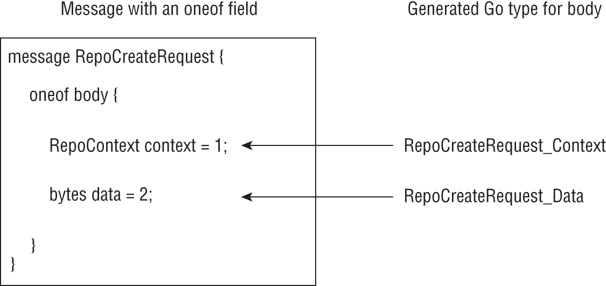

# 高级 gRPC 应用程序
在本章的前半部分，你将学习如何在 gRPC 应用程序中实现流通信模式。在后半部分，你将学习将公共服务器和客户端功能实现为中间件组件。在此过程中，你将学习如何发送和接收二进制数据并了解有关协议缓冲区的更多信息。让我们跳进去！

## 流媒体通讯

正如你在第 8 章中学到的，数据在客户端和服务器之间作为 protobuf 消息进行交换。你学习了按照一元 RPC 模式构建 gRPC 应用程序。在此模式中，客户端向服务器发送请求，然后等待服务器发回响应。更具体地说，客户端应用程序调用 RPC 方法，将请求作为 protobuf 消息发送，然后等待来自服务器的响应消息。客户端和服务器之间只发生一种消息交换。

接下来，我们将学习三种新的通信模式：服务器端流式传输、客户端流式传输以及两者的组合，双向流式传输。在这三种模式中，可以在单个方法调用期间交换多个请求和响应消息。让我们从服务器端流式传输开始了解这些。

### 服务器端流媒体

在服务器端流式传输中，当客户端发出请求时，服务器可能会发送多个响应消息。考虑我们在上一章中实现的 Repo 服务的 GetRepos() RPC 方法。我们可以用多条 Repo 消息作为响应，而不是在单个消息中发送存储库列表，每条消息都包含存储库的详细信息。让我们看看如何实现这样的应用程序。

首先，我们将更新 Repo 服务的 protobuf 规范如下：

```go
service Repo {
    rpc GetRepos (RepoGetRequest) returns (stream RepoGetReply) {}
}
```

这里的主要区别在于方法的返回类型中的流规范。这告诉协议缓冲区编译器和 Go gRPC 插件，响应将包含 RepoGetReply 消息流。清单 9.1 显示了 Repo 服务的完整 protobuf 规范。

清单 9.1：Repo 服务的 Protobuf 规范

```go
// chap9/server-streaming/service/repositories.proto
syntax = "proto3";
import "users.proto";
 
option go_package = "github.com/username/server-streaming/service";
 
service Repo {
    rpc GetRepos (RepoGetRequest) returns (stream RepoGetReply) {}
}
 
message RepoGetRequest {
    string id = 2;
    string creator_id = 1;
}
 
message Repository {
    string id = 1;
    string name = 2;
    string url = 3;
    User owner = 4;
}
 
message RepoGetReply {
    Repository repo = 1;
}
```

与服务的原始规范（第 8 章，代码清单 8.11）相比，有两个关键变化。 GetRepos() 方法现在返回一个 RepoGetReply 消息流。 RepoGetReply 消息现在将包含单个存储库的详细信息，因此我们已从该字段中删除了重复声明。

创建目录 chap9/server-streaming。在里面新建一个子目录service，里面初始化一个模块如下：

```sh
$ mkdir -p chap9/server-streaming/service
$ go mod init github.com/username/server-streaming/service
```

接下来，在服务目录中创建一个新文件 repositories.proto，其内容如清单 9.1 所示。将 users.proto 文件从 chap8/multiple-services/service/ 复制到此目录中。其中，将 go_package 替换为如下：

```sh
option go_package = "github.com/username/server-streaming/service";
```

接下来，我们将生成与这两个服务对应的 Go 代码：

```sh
$ protoc --go_out=. --go_opt=paths=source:relative \
     --go-grpc_out=. --go-grpc_opt=paths=source:relative \
    users.proto repositories.proto
```

运行上述命令后，你应该像之前一样在服务目录中看到以下文件：users.pb.go、users_grpc.pb.go、repositories.pb.go 和 repositories_grpc.pb.go。

接下来，我们将更新 GetRepos() 方法的实现如下：

```go
func (s *repoService) GetRepos(
    in *svc.RepoGetRequest,
    stream svc.Repo_GetReposServer,
) error {
    log.Printf(
        "Received request for repo with CreateId: %s Id: %s\n",
        in.CreatorId,
        in.Id,
    )
    repo := svc.Repository{
        Id:    in.Id,
        Owner: &svc.User{
            Id: in.CreatorId,
            FirstName: "Jane",
        },
    }
    cnt := 1
    for {
        repo.Name = fmt.Sprintf("repo-%d", cnt)
        repo.Url = fmt.Sprintf(
            "https://git.example.com/test/%s",
            repo.Name,
        )
        r := svc.RepoGetReply{
            Repo: &repo,
        }
        if err := stream.Send(&r); err != nil {
            return err
        }
        if cnt>= 5 {
            break
        }
        cnt++
    }
    return nil
}
```

上述实现中有几个关键的变化。首先，方法实现现在具有不同的签名。它接受两个参数：传入的请求（RepoGetRequest 类型）和对象（Repo_GetReposServer 类型的流），它返回一个错误值。 Repo_GetReposServer 类型是 protobuf 编译器生成的接口：

```go
type Repo_GetReposServer interface {
    Send(*RepoGetReply) error
    grpc.ServerStream
}
```

实现此接口的类型必须实现 Send() 方法，该方法接受 RepoGetReply 消息类型的参数——我们的回复类型——并返回一个错误值。当然，作为应用程序作者，你不必担心实现实现此接口的类型，因为它是由 protobuf 编译器和 Go grpc 插件自动完成的。我们使用此方法将 RepoGetReply 类型的消息作为响应发送回客户端。嵌入字段 grpc.ServerStream 是 google.golang.org/grpc 包中定义的另一个接口。我们将在本章后面的“使用拦截器实现中间件”一节中了解更多相关信息。

在方法主体中，我们首先记录一条消息以打印有关传入请求的详细信息。然后，我们创建一个 Repo 对象作为响应发送回来。在 for 循环中，我们进一步自定义此对象，创建 RepoGetReply 消息，然后使用 stream.Send() 方法将其作为响应发送给客户端。我们总共发送了五个这样的响应消息，每次都稍微改变 Repo 对象。当我们发送完所有响应后，我们就跳出循环并返回一个 nil 错误值。

清单 9.2 显示了 gRPC 服务器的完整清单以及 Users 和 Repo 服务的实现。

清单 9.2：用户和 Repo 服务的 gRPC 服务器

```go
// chap9/server-streaming/server/server.go
package main
 
import (
    "context"
    "errors"
    "fmt"
    "log"
    "net"
    "os"
    "strings"

    svc "github.com/username/server-streaming/service"
    "google.golang.org/grpc"
)
 
type userService struct {
    svc.UnimplementedUsersServer
}
 
type repoService struct {
    svc.UnimplementedRepoServer
}
 
// TODO Insert definition of GetUser() from Chapter 8, Listing 8.2
// TODO Insert definition of GetRepos() as    above
 
func registerServices(s *grpc.Server) {
    svc.RegisterUsersServer(s, &userService{})
    svc.RegisterRepoServer(s, &repoService{})
}
 
func startServer(s *grpc.Server, l net.Listener) error {
    return s.Serve(l)
}
 
func main() {
    listenAddr := os.Getenv("LISTEN_ADDR")
    if len(listenAddr) == 0 {
        listenAddr = ":50051"
    }

    lis, err := net.Listen("tcp", listenAddr)
    if err != nil {
        log.Fatal(err)
    }
    s := grpc.NewServer()
    registerServices(s)
    log.Fatal(startServer(s, lis))
}
```

在chap9/server-streaming里面新建一个子目录server，并在里面初始化一个模块，如下：

```sh
$ mkdir -p chap9/server-streaming/server
$ cd chap9/server-streaming/server
$ go mod init github.com/username/server-streaming/server
```

在服务器目录中将代码清单 9.2 保存为 server.go。接下来，我们将获取 google.golang.org/grpc 包（版本 1.37.0）：

```sh
$ go get google.golang.org/grpc@v1.37.0
```

然后，更新 go.mod 文件以添加对服务包的依赖项，包括替换指令，以便最终的 go.mod 如清单 9.3 所示。

清单 9.3：服务器的 go.mod 文件

```sh
// chap9/server-streaming/server/go.mod
 
module github.com/username/server-streaming/server
go 1.16
 
require google.golang.org/grpc v1.37.0
require github.com/username/server-streaming/service v0.0.0
 
replace github.com/username/server-streaming/service => ../service
```

确保你现在可以使用 go build 成功构建服务器。接下来，我们将编写一个测试函数来验证服务器的工作情况。和第 8 章一样，我们将使用 bufconn 包在测试客户端和服务器之间建立一个内存中的通信通道。假设我们有一个对象 repoClient，配置为与 gRPC 测试服务器中的 Repo 服务通信。我们将调用 GetRepos() 方法如下：

```go
stream, err := repoClient.GetRepos(
    context.Background(),
    &svc.RepoGetRequest{CreatorId: "user-123", Id: "repo-123"},
)
```

对该方法的调用返回两个值：stream，一个 Repo_GetReposClient 类型的对象，和 err，一个错误值。 Repo_GetReposClient 类型是 Repo_GetReposServer 类型的客户端等价物，它是一个接口定义如下：

```go
type Repo_GetReposClient interface {
    Recv() (*RepoGetReply, error)
    grpc.ClientStream
}
```

实现此接口的类型必须实现 Recv() 方法，该方法返回 RepoGetReply 消息（该方法的回复类型）并返回错误值。嵌入字段 grpc.ClientStream 是 google.golang.org/grpc 包中定义的另一个接口。我们将在本章后面的“使用拦截器实现中间件”一节中了解更多相关信息。

要从服务器读取响应流，我们将使用 Recv() 方法：

```go
var repos []*svc.Repository
for {
    repo, err := stream.Recv()
    if err == io.EOF {
        break
    }
    if err != nil {
        log.Fatal(err)
    }
    repos = append(repos, repo.Repo)
}
```

使用无限循环，我们调用 Recv() 方法。如果返回的错误值为 io.EOF，则没有更多消息要读取，因此我们跳出循环。如果我们遇到任何其他错误，我们会打印错误并终止执行。否则，我们将消息中的存储库详细信息附加到切片 repos。一旦我们阅读了服务器响应，我们就可以验证各种细节是否与预期的响应匹配。清单 9.4 显示了用于验证 GetRepos() 方法工作的测试函数的完整清单。 （这里没有展示用户服务的测试功能。你可以在本书的源代码库中的目录 chap9/server-streaming/server 中找到它。）

清单 9.4：Repo 服务的测试函数

```go
//    chap9/server-streaming/server/server_test.go
package main
 
// TODO: Imports have been omitted for brevity
// TODO: Insert definition of startTestGrpcServer()
// from previous chapter
 
func TestRepoService(t *testing.T) {
 
    l := startTestGrpcServer()

    bufconnDialer := func(
        ctx context.Context, addr string,
    ) (net.Conn, error) {
        return l.Dial()
    }

    client, err := grpc.DialContext(
        context.Background(),
        "", grpc.WithInsecure(),
        grpc.WithContextDialer(bufconnDialer),
    )
    if err != nil {
        t.Fatal(err)
    }
    repoClient := svc.NewRepoClient(client)
    stream, err := repoClient.GetRepos(
        context.Background(),
        &svc.RepoGetRequest{
            CreatorId: "user-123",
            Id: "repo-123",
        },
    )
    if err != nil {
        t.Fatal(err)
    }

    // TODO: Insert the for loop to read the streaming response from
    // server as earlier illustrated

    if len(repos) != 5 {
        t.Fatalf("Expected to get back 5 repos, got back:  %d repos", len(repos))
    }

    for idx, repo := range repos {
        gotRepoName := repo.Name
        expectedRepoName := fmt.Sprintf("repo-%d", idx+1)

        if gotRepoName != expectedRepoName {
            t.Errorf(
                "Expected Repo Name to be: %s, Got: %s",
                expectedRepoName,
                gotRepoName,
            )
        }
    }
}
```

在服务器目录中将代码清单 9.4 保存为 server_test.go。验证你是否可以运行测试并成功完成：

```sh
$ go test -v
=== RUN   TestUserService
2021/06/09 08:43:25 Received request for user with Email: 
jane@doe.com Id: foo-bar
--- PASS: TestUserService (0.00s)
=== RUN   TestRepoService
2021/06/09 08:43:25 Received request for repo with CreateId:
user-123 Id: repo-123
--- PASS: TestRepoService (0.00s)
PASS
Ok.     github.com/practicalgo/code/chap9/server-streaming/server 0.141s
```

服务器端流对于向客户端发送多个响应消息以进行单个 RPC 方法调用很有用。流式传输许多对象可能比发送此类对象的数组更有效。另一个可能有用的场景是发送最终值未知的响应时，例如流式传输另一个操作的结果。

在本章的第一个练习练习 9.1 中，你将在 Repo 服务中实现一个新方法，该方法将模拟为存储库运行构建作业，然后将构建日志流式传输到客户端。

> 练习 9.1：存储库的流构建日志 在 Repo 服务中，创建一个新方法 CreateBuild()，它接受 Repository 类型的消息并返回 RepoBuildLog 消息流。 RepoBuildLog 是一种包含两个字段的消息类型：一个表示生成日志行的时间戳，另一个包含日志行。更新服务测试（代码清单 9.4），为这个方法添加一个测试。

### 客户端流

与服务器端流类似，在客户端流中，客户端调用服务器上的 RPC 方法，然后将其请求作为消息流而不是单个消息发送。

让我们向 Repo 服务添加一个新方法 CreateRepo()，它现在将接受消息流作为参数。每条消息都将指定创建新存储库的详细信息。我们将为这个方法定义一个新的消息类型 RepoCreateRequest。该方法的 protobuf 规范将显示如下：

rpc CreateRepo (stream RepoCreateRequest) 返回 (RepoCreateReply) {}
这里的关键是消息类型之前的流规范。此方法在服务器中的服务处理程序将显示如下：

```go
func (s *repoService) CreateRepo(
    stream svc.Repo_CreateRepoServer,
) error {
    for {
        data, err := stream.Recv()
        if err == io.EOF {
            // We have received the complete request
            // so, we can now process the data
            r := svc.RepoCreateReply{..}
        }
    }
    return stream.SendAndClose(&r)
}
```

CreateRepo() 方法实现接受一个单一的参数流，类型为 svc.Repo_CreateRepoServer，它是一个由 protobuf 编译器生成的接口类型，它的定义如下：

```go
type Repo_CreateRepoServer interface {
    Recv() (*RepoCreateRequest, error)
    SendAndClose(*RepoCreateReply) error
    grpc.ServerStream
}
```

实现此接口的类型将实现两个方法，Recv() 和 SendAndClose()，并将嵌入 ServerStream 接口。 Recv() 方法用于接收来自客户端的传入消息，因此它返回一个 RepoCreateRequest 值和一个错误值。 SendAndClose() 方法用于向客户端发回回复。因此它接受一个 RepoCreateReply 类型的值作为参数，将响应发送回客户端，并关闭连接。当然，作为应用程序作者，你不必担心实现这种类型。

接下来，让我们看看如何从客户端应用程序调用 CreateRepo() 方法：

```go
repoClient := svc.NewRepoClient(client)
stream, err := repoClient.CreateRepo(
    context.Background(),
)
```

请注意，我们不使用任何请求参数调用 CreateRepo() 方法。它只接受一个 context.Context 对象。此方法返回两个值：Repo_CreateRepoClient 类型的流和一个错误值。 Repo_CreateRepoClient 类型是一个接口定义如下：

```go
type Repo_CreateRepoClient interface {
    Send(*RepoCreateRequest) error
    CloseAndRecv() (*RepoCreateReply, error)
    grpc.ClientStream
}
```

实现此接口的类型将实现两个方法，Send() 和 CloseAndRecv()，并将嵌入 ClientStream 接口。

要向服务器应用程序发送消息，我们将使用 Send() 方法。因此，必须使用 *RepoCreateRequest 类型的对象调用它。

CloseAndRecv() 方法用于接收来自服务器的响应。因此，它返回一个 RepoCreateReply 类型的值和一个错误值。

要将 RepoCreateRequest 消息流发送到服务器，我们将在 for 循环中多次调用 Send() 方法，例如：

```go
for i := 0; i < 5; i++ {
    r := svc.RepoCreateRequest{
        CreatorId: "user-123",
        Name:      "hello-world",
    }
    err := stream.Send(&r)
    if err != nil {
        t.Fatal(err)
    }
}
```

然后，一旦我们完成了请求消息的流式传输，我们将从服务器读取响应：

```go
resp, err := stream.CloseAndRecv()
```

你可以在本书源代码库的 chap9/client-streaming 目录中找到服务器的完整示例以及验证功能的测试。接下来，你将了解并实现结合客户端和服务器端流的流模式——双向流。

### 双向流媒体
在双向流中，一旦客户端发起与服务器的连接，每个客户端都可以按任意顺序独立读取和写入数据。不强加排序，因此除非你的应用程序已强制执行排序，否则不保证排序。例如，假设我们想要更新用户服务以允许用户从服务中获得帮助，类似于通过聊天向网站支持人员寻求帮助。在这种情况下，客户端和服务器之间的通信是双向的：用户（客户端）发起与支持人员（服务器）的对话，然后在两者之间进行交换，直到其中一个终止连接。我们现在将创建一个只有一个 RPC 方法 GetHelp() 的用户服务，如代码清单 9.5 所示。

清单 9.5：用户服务的 Protobuf 规范

```go
// chap9/bidi-streaming/service/users.proto
syntax = "proto3";
 
option go_package = "github.com/username/bidi-streaming/service";
 
service Users {
    rpc GetHelp (stream UserHelpRequest) returns (stream UserHelpReply) {}
}
 
message User {
    string id = 1;
}
 
message UserHelpRequest {
    User user =    1;
    string request = 2;
}
 
message UserHelpReply {
    string response = 1;
}
```

GetHelp() 方法接受 UserHelpRequest 消息流作为请求，并返回 UserHelpReply 消息流。

创建目录 chap9/bidi-streaming。在里面新建一个子目录service，并在里面初始化一个模块：

```sh
$ mkdir -p chap9/bidi-streaming/service
$ go mod init github.com/username/bidi-streaming/service
```

将代码清单 9.5 保存为服务目录中的 users.proto。生成两个服务对应的 Go 代码：

```sh
$ protoc --go_out=. --go_opt=paths=source:relative \
     --go-grpc_out=. --go-grpc_opt=paths=source:relative users.proto
```

运行上述命令后，你应该会在服务目录中看到以下文件：users.pb.go 和 users_grpc.pb.go。现在让我们在服务器上实现 GetHelp() 方法：

```go
func (s *userService) GetHelp(
    stream svc.Users_GetHelpServer,
) error {
    log.Println("Client connected")
    for {
        request, err := stream.Recv()
        if err == io.EOF {
            break
        }
        if err != nil {
            return err
        }
        fmt.Printf("Request received: %s\n", request.Request)
        response := svc.UserHelpReply{
            Response: request.Request,
        }
        err = stream.Send(&response)
        if err != nil {
            return err
        }
    }
    log.Println("Client disconnected")
    return nil
}
```

GetHelp() 方法接受一个类型为 Users_GetHelpServer 的参数，它是一个生成的接口，定义如下：

```go
type Users_GetHelpServer interface {
    Send(*UserHelpReply) error
    Recv() (*UserHelpRequest, error)
    grpc.ServerStream
}
```

由于服务器将接收和发送消息流，因此该接口同时具有 Send() 和 Recv() 方法，并且它嵌入了 ServerStream 接口。

Send() 方法用于向客户端发送 UserHelpReply 类型的回复消息。

Recv() 方法用于接收来自客户端的请求。它返回一个 UserHelpRequest 类型的值和一个错误值。

然后，我们创建了一个 for 循环，我们不断尝试从客户端的流中读取一个值，如果出现 io.EOF 错误，则退出循环，如果出现任何其他错误，则返回错误值。如果我们收到来自客户端的有效请求，我们会构造一个 UserHelpReply 消息，使用 Send() 方法将帮助请求消息回传给客户端。清单 9.6 显示了实现用户服务的 gRPC 服务器应用程序。

清单 9.6：用户服务的服务器

```go
// chap9/bidi-streaming/server/server.go
package main
 
import (
    "fmt"
    "io"
    "log"
    "net"
    "os"

    svc "github.com/username/bidi-streaming/service"
    "google.golang.org/grpc"
)
 
type userService struct {
    svc.UnimplementedUsersServer
}
 
// TODO: Insert definition of GetHelp() method from above
 
func registerServices(s *grpc.Server) {
    svc.RegisterUsersServer(s, &userService{})
}
 
func startServer(s *grpc.Server, l net.Listener) error {
    return s.Serve(l)
}
 
func main() {
    listenAddr := os.Getenv("LISTEN_ADDR")
    if len(listenAddr) == 0 {
        listenAddr = ":50051"
    }

    lis, err := net.Listen("tcp", listenAddr)
    if err != nil {
        log.Fatal(err)
    }
    s := grpc.NewServer()
    registerServices(s)
    log.Fatal(startServer(s, lis))
}
```

在 chap9/bidi-streaming 目录中，创建一个新的子目录 server。初始化其中的一个模块，如下所示：

```sh
$ mkdir -p chap9/bidi-streaming/server
$ cd chap9/bidi-streaming/server
$ go mod init github.com/username/bidi-streaming/server
```

在服务器目录中将代码清单 9.6 保存为 server.go。接下来，我们将按如下方式获取 google.golang.org/grpc 包（版本 1.37.0）：

```sh
$ go get google.golang.org/grpc@v1.37.0
```

然后，更新 go.mod 文件以添加对服务包的依赖项，包括替换指令，以便最终的 go.mod 如清单 9.7 所示。

代码清单 9.7：服务器的 go.mod 文件

```go
// chap9/bidi-streaming/server/go.mod
 
module github.com/username/bidi-streaming/server
go 1.16
 
require google.golang.org/grpc v1.37.0
require github.com/username/bidi-streaming/service v0.0.0
 
replace github.com/username/bidi-streaming/service => ../service
```

确保你现在可以使用 go build 成功构建服务器。接下来，让我们看看如何设置客户端。考虑一个函数 setupChat() ，它接受一个 io.Reader ，它将从中读取用户的帮助请求，一个配置好的 UsersClient 对象，与用户服务通信，以及一个 io.Writer 写入服务器响应。

```go
func setupChat(r io.Reader, w io.Writer, c svc.UsersClient) error {
    stream, err := c.GetHelp(context.Background())
    if err != nil {
        return err
    }
    for {
        scanner := bufio.NewScanner(r)
        prompt := "Request: "
        fmt.Fprint(w, prompt)

        scanner.Scan()
        if err := scanner.Err(); err != nil {
            return err
        }
        msg := scanner.Text()
        if msg == "quit" {
            break
        }
        request := svc.UserHelpRequest{
            Request: msg,
        }
        err := stream.Send(&request)
        if err != nil {
            return err
        }
        resp, err := stream.Recv()
        if err != nil {
            return err
        }
        fmt.Printf("Response: %s\n", resp.Response)
    }
    return stream.CloseSend()
}
```

首先，我们调用 GetHelp() RPC 方法，该方法返回类型为 Users_GetHelpClient 的值，生成的接口定义如下：

```go
type Users_GetHelpClient interface {
    Send(*UserHelpRequest) error
    Recv() (*UserHelpReply, error)
    grpc.ClientStream
}
```

与 Users_GetHelpServer 类型类似，Users_GetHelpClient 类型定义了发送和接收消息的方法，并且它嵌入了 ClientStream 接口。

一旦我们获得了流，我们就设置了一个 for 循环，该循环以交互方式读取用户输入，然后将其作为 UserHelpRequest 消息发送到服务器。如果用户键入退出，则连接将关闭。

清单 9.8 显示了客户端应用程序的清单。

清单 9.8：用户服务的客户端

```go
// chap9/bidi-streaming/client/main.go
package main
 
import (
    "bufio"
    "context"
    "fmt"
    "io"
    "log"
    "os"

    svc "github.com/username/bidi-streaming/service"
    "google.golang.org/grpc"
)
 
func setupGrpcConn(addr string) (*grpc.ClientConn, error) {
    return grpc.DialContext(
        context.Background(),
        addr,
        grpc.WithInsecure(),
        grpc.WithBlock(),
    )
}
 
func getUserServiceClient(conn *grpc.ClientConn) svc.UsersClient {
    return svc.NewUsersClient(conn)
}
 
// TODO Insert definition of setupChat() from earlier
 
func main() {
    if len(os.Args) != 2 {
        log.Fatal(
            "Must specify a gRPC server address",
        )
    }
    conn, err := setupGrpcConn(os.Args[1])
    if err != nil {
        log.Fatal(err)
    }
    defer conn.Close()

    c := getUserServiceClient(conn)
    err = setupChat(os.Stdin, os.Stdout, c)
    if err != nil {
        log.Fatal(err)
    }
}
```

在目录chap9/bidi-streaming内新建子目录client，并在里面初始化一个模块如下：

```sh
$ mkdir -p chap9/bidi-streaming/client
$ cd chap9/bidi-streaming/client
$ go mod init github.com/username/bidi-streaming/client
```

在客户端目录中将代码清单 9.8 保存为 client.go。接下来，我们将获取 google.golang.org/grpc 包（版本 1.37.0）：

```sh
$ go get google.golang.org/grpc@v1.37.0
```

然后，更新 go.mod 文件以添加对服务包的依赖项，包括替换指令，以便最终的 go.mod 如清单 9.9 所示。

代码清单 9.9：客户端的 go.mod 文件

```sh
// chap9/bidi-streaming/client/go.mod
 
module github.com/username/bidi-streaming/client
go 1.16
 
require google.golang.org/grpc v1.37.0
require github.com/username/bidi-streaming/service v0.0.0
 
replace github.com/username/bidi-streaming/service => ../service
```

构建客户端。

现在，在一个终端会话中，运行服务器：

```go
$ cd chap9/bidi-streaming/server
$ go build
$ ./server
```

在单独的终端会话中，运行客户端：

```sh
$ ./client localhost:50051
Request: Hello there
Response: Hello there
Request: I need some help
Response: I need some help
Request: quit
```

在服务器端，你将看到以下消息：

```sh
2021/06/24 20:46:56 Client connected
Request received: Hello there
Request received: I need some help
2021/06/24 20:47:29 Client disconnected
```

当你从客户端会话中键入退出时，客户端调用 CloseSend() 方法，该方法反过来关闭服务器上的客户端连接，返回 io.EOF 错误值。

你现在已经研究了 gRPC 中可能的三类流通信。与一元 RPC 方法调用仅交换请求和响应消息相比，在流通信中，交换了多个此类消息，总结在图 9.1 中。


图 9.1：流通信模式

接下来，你将学习如何在传输任意字节的数据时利用流。

## 接收和发送任意字节

到目前为止，我们只关注在 gRPC 服务器应用程序和客户端之间传输字符串和整数。你如何发送和处理任意数据，例如你将存储在存储库中的数据，例如 .tar.gz 文件？这就是字节类型的用武之地。让我们更新 RepoCreateRequest 数据类型以添加一个字段 data，它将包含任意字节，例如要存储在存储库中的文件的内容：

```go
message RepoCreateRequest {
  string creator_id = 1;
  string name = 2;
  bytes data = 3;
}
```

任何可以在 Go 中存储为字节切片的内容，都可以存储在数据字段中。要要求服务器创建存储库，客户端将发出如下请求：

```go
repoData := []byte("Arbitrary data")
resp, err := repoClient.CreateRepo(
    context.Background(),
    &svc.RepoCreateRequest{
        CreatorId: "user-123",
        Name:      "test-repo",
        Data:      repoData,
    },
 )
```

在服务器端，该方法将处理包含数据的请求，如下所示：

```go
func (s *repoService) CreateRepo(
    ctx context.Context,
    in *svc.RepoCreateRequest,
) (*svc.RepoCreateReply, error) {
    repoId := fmt.Sprintf("%s-%s", in.Name, in.CreatorId)
    repoURL := fmt.Sprintf("https://git.example.com/%s/%s", 
                           in.CreatorId, in.Name)
    data := in.Data
    repo := svc.Repository{
        Id:   repoId,
        Name: in.Name,
        Url:  repoURL,
    }
    r := svc.RepoCreateReply{
        Repo: &repo,
        Size: int32(len(data)),
    }
    return &r, nil
}
```

你可以在本书源代码库的 chap9/binary-data 目录中找到该示例的代码。这种发送任意字节的机制很简单，当传输的数据大小限制在几个字节时，它可以完美地工作。对于较大的数据传输，建议你使用流式通信模式。

在上面的示例场景中，客户端流将非常适合。从源（例如文件）以增量方式读取数据字节，然后将包含数据的消息发送到服务器。继续这样做，直到所有数据都被读取。

在流式传输中，客户端或服务器分别为请求或响应发送多条消息。我们只想流式传输数据，因此我们可以将 protobuf 消息设计为包含单个数据字段：

```protobuf
message RepoData {
  bytes data = 1;
}
```

但是，你很少会在没有任何上下文信息的情况下传输任意字节。例如，前面讨论的 RepoCreateRequest 消息包括一个 creator_id、名称和数据。如果我们使用此消息类型进行流传输，则必须在所有消息中发送相同的 creator_id 和名称。因此建议你改为在流的第一条消息中发送 creator_id 和 name 字段，然后流中的所有后续消息应仅包含数据字节。

幸运的是，我们可以在定义消息时使用称为 oneof 的协议缓冲区功能来相当优雅地执行此操作。这个关键字允许我们定义一个消息，其中在任何给定的时间点只能设置一组字段中的一个字段。让我们使用 oneof 关键字重新定义 RepoCreateRequest 消息，如下所示：

```protobuf
message RepoCreateRequest {
  oneof body {
    RepoContext context = 1;
    bytes data = 2;
  }
}
```

我们将 RepoCreateRequest 定义为具有名称为 body 的 oneof 字段。该字段只会在消息中设置上下文（类型 RepoContext ）或数据（类型 bytes ），但不能同时设置两者。新的消息类型 RepoContext 将包含正在创建的存储库的上下文信息，其定义如下：

```protobuf
message RepoContext {
  string creator_id = 1;
  string name = 2;
}
```

清单 9.10 显示了 Repo 服务的更新后的 protobuf 规范。

代码清单 9.10：Repo 服务的 Protobuf 规范

```protobuf
// chap9/bindata-client-streaming/service/repositories.proto
 
syntax = "proto3";
 
option go_package = "github.com/username/bindata-client-streaming
/service";
 
service Repo {
  rpc CreateRepo (stream RepoCreateRequest) returns (RepoCreateReply){}
}
 
message RepoCreateRequest {
  oneof body {
    RepoContext context = 1;
    bytes data = 2;
  }
}
 
message RepoContext {
  string creator_id = 1;
  string name = 2;
}
 
message Repository {
  string id = 1;
  string name = 2;
  string url = 3;
}
 
message RepoCreateReply {
  Repository repo = 1;
  int32 size = 2;
}
```

现在指定 CreateRepo() 方法接受 RepoCreateRequest 消息流并返回 RepoCreateReply 消息。创建目录 chap9/bindata-client-streaming。在里面新建一个子目录service，并在里面初始化一个模块：

```sh
$ mkdir -p chap9/bindata-client-streaming/service
$ go mod init github.com/username/bindata-client-streaming/service
```

接下来，在服务目录中创建一个新文件 repositories.proto，其内容如代码清单 9.10 所示。

接下来，我们将生成服务对应的 Go 代码：

```go
$ protoc --go_out=. --go_opt=paths=source:relative \
     --go-grpc_out=. --go-grpc_opt=paths=source:relative \
    repositories.proto
```

与之前的情况一样，你应该看到生成了两个文件： repositories.pb.go 和 repositories_grpc.pb.go 。

接下来，让我们在服务器中编写 CreateRepo() 方法的实现：

```go
func (s *repoService) CreateRepo(
    stream svc.Repo_CreateRepoServer,
) error {
    var repoContext *svc.RepoContext
    var data []byte
    for {
        r, err := stream.Recv()
        if err == io.EOF {
            break
        }
        switch t := r.Body.(type) {
            case *svc.RepoCreateRequest_Context:
            repoContext = r.GetContext()
            case *svc.RepoCreateRequest_Data:
            b := r.GetData()
            data = append(data, b…)
            case nil:
            return status.Error(
                codes.InvalidArgument,
                "Message doesn't contain context or data",
            )
            default:
            return status.Errorf(
                codes.FailedPrecondition,
                "Unexpected message type: %s",
                t,
            )
        }
    }
// TODO: Create the response message
}
```

该方法接受类型为 Repo_CreateRepoServer 的单个参数流，并返回一个错误值。 Repo_CreateRepoServer 是一个生成的接口，定义如下：

```go
type Repo_CreateRepoServer interface {
    SendAndClose(*RepoCreateReply) error
    Recv() (*RepoCreateRequest, error)
    grpc.ServerStream
}
```

因此，我们将使用流从客户端读取传入的流，然后将响应写回。

在方法体内部，我们声明了一个对象，repoContext，类型为 RepoContext，和一个字节片，data。我们将传入的与 repo 相关的上下文信息存储在 repoContext 对象中，并将存储库内容存储在 data 中。

接下来，我们定义一个 for 循环以使用 stream.Recv() 从流中连续读取，直到遇到 io.EOF 错误。现在，当我们使用 Recv() 方法读取一个对象时，它的类型是 RepoCreateRequest。但是，我们知道只会设置其中一个字段——上下文或数据。要找出设置的是哪一个，我们查看 r.Body 的类型，其中 Body 是 oneof 字段（protobuf 中的 body）：

1. 如果类型为 RepoCreateRequest_Context，则设置了上下文字段，我们通过调用 GetContext() 方法检索该字段。我们将检索到的值分配给 repoContext 对象。
2. 如果类型是 RepoCreateRequest_Data，我们通过调用 GetData() 方法检索字节并将其附加到数据切片。
3. 如果类型为 nil 或以上两者都不是，我们将错误返回给客户端。

我们使用 switch..case 语句来完成上述逻辑。图 9.2 总结了 protobuf 规范和为 Body 字段生成的 Go 类型之间的映射。



图 9.2：Protobuf oneof 字段和等效生成的 Go 类型

一旦我们读完完整的请求，我们就构造一个响应消息并使用为流对象定义的 SendAndClose() 方法将其发送到客户端：

```go
repo := svc.Repository{
    Name: repoContext.Name,
    Url: fmt.Sprintf(
        "https://git.example.com/%s/%s",
        repoContext.CreatorId,
        repoContext.Name,
    ),
}
r := svc.RepoCreateReply{
    Repo: &repo,
    Size: int32(len(data)),
}
return stream.SendAndClose(&r)
```

清单 9.11 展示了 Repo 服务的服务器实现。

清单 9.11：Repo 服务的服务器

```go
// chap9/bindata-client-streaming/server/server.go
package main
 
import (
    "fmt"
    "io"
    "log"
    "net"
    "os"

    svc "github.com/username/bindata-client-streaming/service"
    "google.golang.org/grpc"
    "google.golang.org/grpc/codes"
    "google.golang.org/grpc/status"
)
 
type repoService struct {
    svc.UnimplementedRepoServer
}
 
// TODO Insert the definition of CreateRepo() from earlier
 
func registerServices(s *grpc.Server) {
    svc.RegisterRepoServer(s, &repoService{})
}
 
func startServer(s *grpc.Server, l net.Listener) error {
    return s.Serve(l)
}
 
func main() {
    listenAddr := os.Getenv("LISTEN_ADDR")
    if len(listenAddr) == 0 {
        listenAddr = ":50051"
    }

    lis, err := net.Listen("tcp", listenAddr)
    if err != nil {
        log.Fatal(err)
    }
    s := grpc.NewServer()
    registerServices(s)
    log.Fatal(startServer(s, lis))
}
```

在chap9/bindata-client-streaming里面创建一个目录server，并在里面初始化一个模块如下：

```sh
$ mkdir -p chap9/bindata-client-streaming/server
$ cd chap9/bindata-client-streaming/server
$ go mod init github.com/username/bindata-client-streaming/server
```

将代码清单 9.11 保存为 server.go 在里面。获取 google.golang.org/grpc 包如下：

```sh
$ go get google.golang.org/grpc@v1.37.0
```

在 go.mod 文件中设置替换指令，以便它将对 github.com/username/bindata-client-streaming/service 包的引用添加到 ../service 目录。最终的 go.mod 文件如代码清单 9.12 所示。

代码清单 9.12：用于 Repo 服务服务器实现的 go.mod 文件

```go
// chap9/bindata-client-streaming/server/go.mod
module github.com/username/bindata-client-streaming/server
 
go 1.16
 
require google.golang.org/grpc v1.37.0
 
require github.com/username/bindata-client-streaming/service v0.0.0
 
replace github.com/username/bindata-client-streaming/
service v0.0.0 => ../service
```

在继续之前，请确保你可以构建服务器。

调用 CreateRepo() 方法从测试函数或客户端应用程序创建存储库涉及两个关键步骤：

1. 第一条消息将发送一个仅包含上下文字段集的 RepoCreateContext 对象。此消息将用于将存储库名称和所有者传达给服务器。
2. 第二个和后续消息（如果有）将发送仅包含数据字段集的 RepoCreateContext 对象。这些消息将用于传输要在存储库中创建的数据。

以下代码片段将实现第一步（省略错误处理）：

```go
stream, err := repoClient.CreateRepo(context.Background())
c := svc.RepoCreateRequest_Context{
    Context: &svc.RepoContext{
        CreatorId: "user-123",
        Name:      "test-repo",
    },
}
r := svc.RepoCreateRequest{
    Body: &c,
}
err = stream.Send(&r)
```

我们创建了一个 RepoCreateRequest_Context 对象 c，它包含 Context 字段，它是一个 RepoContext 类型的对象，其中包含我们要创建的存储库的 CreatorId 和 Name。然后，我们创建一个 RepoCreateRequest 类型的对象，并将 Body 的值指定为指向对象 c 的指针。最后，我们调用流对象的 Send() 方法发送 RepoCreateRequest 对象作为第一条消息。

为了实现第二步，我们将首先设置一个从中读取数据的源：

````go
data := "Arbitrary Data Bytes"
repoData := strings.NewReader(data)
````

strings.NewReader() 函数返回一个满足 io.Reader 接口的对象，因此我们可以使用任何兼容的函数来读取字节并将其发送到服务器：

```go
for {
    b, err := repoData.ReadByte()
    if err == io.EOF {
        break
    }
    bData := svc.RepoCreateRequest_Data{
        Data: []byte{b},
    }
    r := svc.RepoCreateRequest{
        Body: &bData,
    }
    err = stream.Send(&r)
    if err != nil {
        t.Fatal(err)
    }
}
```

我们一次从 repoData 读取一个字节。读取的字节存储在 b 中。然后我们创建一个 RepoCreateRequest_Data 类型的对象，其中 Data 字段包含一个字节切片，其中包含 b 中的读取字节。接下来，我们创建一个 RepoCreateRequest 对象，其中 Body 字段现在指向 RepoCreateRequest_Data 对象。最后，我们调用 Send() 方法来发送这条消息。我们继续这样做，直到我们从 repoData 中读取了所有字节。之后，我们将从服务器读取响应并验证响应是否包含预期数据：

```go
resp, err := stream.CloseAndRecv()
if err != nil {
    t.Fatal(err)
}
expectedSize := int32(len(data))
if resp.Size != expectedSize {
    t.Errorf(
        "Expected Repo Created to be: %d bytes 
        Got back: %d",
        expectedSize,
        resp.Size,
    )
}
expectedRepoUrl := "https://git.example.com/user-123/test-repo"
if resp.Repo.Url != expectedRepoUrl {
    t.Errorf(
        "Expected Repo URL to be: %s, Got: %s",
        expectedRepoUrl,
        resp.Repo.Url,
    )
}
```

你可以在本书源代码库的目录 chap9/bindata-client-streaming/server/ 中的文件 server_test.go 中找到完整的测试函数。

接下来，你将学习使用拦截器在 gRPC 客户端和服务器应用程序中实现通用功能。不过，在我们继续之前，你需要尝试一个练习（练习 9.2）。

> 练习 9.2：从文件中创建存储库内容 为 Repo 服务创建一个客户端应用程序，该应用程序使用客户端流来创建存储库，它允许用户将存储库的内容指定为 .tar.gz 文件。客户端应用程序将期望用户将文件路径指定为标志。

## 使用拦截器实现中间件
中间件在 gRPC 客户端和服务器中扮演的角色与它在 HTTP 客户端和服务器中扮演的角色相同。它允许你在应用程序中实现通用功能，例如发出日志、发布指标、附加元数据（例如请求标识符）以及添加身份验证信息。

在 gRPC 应用程序中实现中间件逻辑是通过编写称为拦截器的组件来实现的。根据你使用的通信模式——一元 RPC 或其中一种流模式——你的拦截器实现细节会有所不同。首先，让我们学习如何实现客户端拦截器。

我们将为第 8 章中创建的用户服务实现拦截器。 创建一个目录 chap9/interceptors，并将第 8 章的服务、客户端和服务器目录复制到其中：

```sh
$ mkdir -p chap9/interceptors/
$ cd chap9/interceptors
$ cp -r ../../chap8/user-service/{service,client,server} .
```

现在，更新服务目录中的 go.mod 文件以读取如代码清单 9.13 所示。

代码清单 9.13：用户服务的 go.mod 文件

```sh
// chap9/interceptors/service/go.mod
module github.com/username/interceptors/service
 
go 1.16
```

生成protobuf规范对应的Go代码：

```go
$ cd service
$ protoc --go_out=. --go_opt=paths=source:relative \
     --go-grpc_out=. --go-grpc_opt=paths=source:relative \
    users.proto
```

现在，更新服务器目录中的 go.mod 文件，如代码清单 9.14 所示。

代码清单 9.14：用户服务器的 go.mod 文件

```sh
// chap9/interceptors/server/go.mod
module github.com/username/interceptors/server
 
go 1.16
require google.golang.org/grpc v1.37.0
require github.com/username/interceptors/service v0.0.0
replace github.com/username/interceptors/service => ../service
```

确保 server.go 中服务包的导入路径已经更新如下：

```go
users "github.com/username/interceptors/service"
```

对 server_test.go 文件中的导入执行相同的操作。在继续之前确保你的测试通过。

现在，更新客户端目录中的 go.mod 文件，如代码清单 9.15 所示。

代码清单 9.15：用户客户端的 go.mod 文件

```go
// chap9/interceptors/client/go.mod
module github.com/username/interceptors/client
 
go 1.16
 
require (
    github.com/usernameinterceptors/service v0.0.0
    google.golang.org/grpc v1.37.0
)
 
replace github.com/interceptors/service => ../service
```

确保client.go中服务包的导入路径已经更新如下：

```go
users "github.com/username/interceptors/service"
```

对 client_test.go 文件中的导入执行相同的操作。在继续之前确保你的测试通过。

### 客户端拦截器

有两种客户端拦截器：

- 一元客户端拦截器：此类拦截器将仅拦截一元 RPC 方法调用。
- Stream Client Interceptor：此类拦截器将仅拦截流式 RPC 方法调用。

客户端一元拦截器是一个类型为 grpc.UnaryClientInterceptor 的函数，声明如下：

```go
type UnaryClientInterceptor func(
    ctx context.Context, method string, 
    req, reply interface{}, cc *ClientConn, 
    invoker UnaryInvoker, 
    opts …CallOption,
) error
```

该函数的各种参数如下：

- ctx 是与 RPC 方法调用关联的上下文。
- method 是 RPC 方法名称。
- req 和 reply 分别是请求和响应消息。
- cc 是底层的 grpc.ClientConn 对象。
- invoker 要么是最初拦截的 RPC 方法调用，要么是另一个拦截器。
- 拦截器可以链接起来，你很快就会学到。

opts 是调用原始 RPC 方法的任何类型为 grpc.CallOption 的值。
正如你将看到的，这些参数中的大部分都按原样传递给原始 RPC 方法调用。让我们编写我们的第一个拦截器，它将为对用户服务的任何传出一元 RPC 调用的请求添加一个唯一标识符：

```go
func metadataUnaryInterceptor(
    ctx context.Context,
    method string,
    req, reply interface{},
    cc *grpc.ClientConn,
    invoker grpc.UnaryInvoker,
    opts …grpc.CallOption,
) error {
    ctxWithMetadata := metadata.AppendToOutgoingContext(
        ctx,
        "Request-Id",
        "request-123",
    )
    return invoker(
        ctxWithMetadata,
        method,
        req,
        reply,
        cc,
        opts…,
    )
}
```

我们将请求标识符添加到传出方法调用的上下文中。在 gRPC 中，这是使用 google.golang.org/grpc/metadata 包完成的，该包提供了存储和检索 RPC 方法调用的元数据的功能。 AppendToOutgoingContext() 函数使用原始上下文、ctx 和要添加为元数据的键值对调用，它返回一个新上下文，然后将用于调用 RPC 方法而不是原始上下文。因此，在这里我们添加请求标识符的键 Request-Id 和一个虚拟值 request-123 作为元数据。新创建的上下文 ctxWithMetadata 然后用于调用原始 RPC 方法。返回从调用 invoker() 获得的错误值。

要将 metadataUnaryInterceptor 注册为客户端拦截器，我们指定一个新的 grpc.DialOption，通过调用 grpc.WithUnaryInterceptor() 函数获得，并将 metadataUnaryInterceptor 函数作为参数传递给它。最终的 setupGrpcConn() 函数将如下所示：

```go
func setupGrpcConn(addr string) (*grpc.ClientConn, error) {
    return grpc.DialContext(
        context.Background(),
        addr,
        grpc.WithInsecure(),
        grpc.WithBlock(),
        grpc.WithUnaryInterceptor(metadataUnaryInterceptor),
    )
}
```

更新 client.go 文件以添加 metadataUnaryInterceptor() 函数定义并更新 setupGrpcConn() 函数以添加上述 DialOption。在继续之前，请确保你可以构建客户端。

现在让我们继续编写一个拦截器来为流式 RPC 方法调用附加请求标识符。更新 chap9/interceptors/service/users.proto 中的 protobuf 规范，将 GetHelp() 添加到 Users 服务中，如代码清单 9.16 所示。

代码清单 9.16：更新了用户服务的 protobuf 规范

```protobuf
//chap9/interceptors/service/users.proto
syntax = "proto3";
 
option go_package = "github.com/username/interceptors/service/users";
 
service Users {
  rpc GetUser (UserGetRequest) returns (UserGetReply) {}
  rpc GetHelp (stream UserHelpRequest) returns (stream UserHelpReply) {}
}
 
message UserGetRequest {
  string email = 1;
  string id = 2;
}
 
message User {
  string id = 1;
  string first_name = 2;
  string last_name = 3;
  int32 age = 4;
}
 
message UserGetReply {
  User user = 1;
}
 
message UserHelpRequest {
  User user = 1;
  string request = 2;
}
 
message UserHelpReply {
  string response = 1;
}
```

重新生成protobuf规范对应的Go代码如下：

```go
$ cd chap9/intereceptors/service
$ protoc --go_out=. --go_opt=paths=source:relative \
     --go-grpc_out=. --go-grpc_opt=paths=source:relative \
    users.proto
```

接下来，通过在清单 9.8 中的 chap9/intereceptors/client/main.go 中插入 setupChat() 方法的定义来更新客户端。

现在，我们将编写拦截器来拦截流式 RPC 方法调用。客户端流拦截器是一个类型为 grpc.StreamClientInterceptor 的函数，声明如下：

```go
type StreamClientInterceptor func(
    ctx context.Context,
    desc *StreamDesc,
    cc *ClientConn,
    method string,
    streamer Streamer,
    opts …CallOption,
) (ClientStream, error)
```

该函数的各种参数如下：

- ctx 是与 RPC 方法调用关联的上下文。
- desc 是一个 *grpc.StreamDesc 类型的对象，它包含与流本身相关的各种属性，例如 RPC 方法名称、方法的服务处理程序以及流是否支持发送和接收操作。
- cc 是底层的 grpc.ClientConn 对象。
- method 是 RPC 方法名称。
- 当你有一系列流拦截器时，streamer 要么是最初拦截的 RPC 流方法调用，要么是另一个流拦截器。
- opts 是调用原始 RPC 方法的任何类型为 grpc.CallOption 的值。

然后，流式 RPC 方法调用的元数据拦截器将编写如下：

```go
func metadataStreamInterceptor(
    ctx context.Context,
    desc *grpc.StreamDesc,
    cc *grpc.ClientConn,
    method string,
    streamer grpc.Streamer,
    opts …grpc.CallOption,
) (grpc.ClientStream, error) {
    ctxWithMetadata := metadata.AppendToOutgoingContext(
        ctx,
        "Request-Id",
        "request-123",
    )
    clientStream, err := streamer(
        ctxWithMetadata,
        desc,
        cc,
        method,
        opts…,
    )
    return clientStream, err
}
```

与一元拦截器一样，我们通过使用 AppendToOutgoingContext() 函数和创建的上下文将请求标识符添加到传入的请求上下文中，以设置流通信。要注册拦截器，我们将使用 grpc.WithStreamInterceptor(metadataStreamInterceptor) 创建一个新的 DialOption，然后将其指定给 grpc.DialContext() 函数。更新后的 setupGrpcConn() 函数将如下所示：

```go
func setupGrpcConn(addr string) (*grpc.ClientConn, error) {
    return grpc.DialContext(
        context.Background(),
        addr,
        grpc.WithInsecure(),
        grpc.WithBlock(),
        grpc.WithUnaryInterceptor(metadataUnaryInterceptor),
        grpc.WithStreamInterceptor(metadataStreamInterceptor),
    )
}
```

清单 9.17 显示了完整的客户端应用程序。

清单 9.17：带有拦截器的用户服务的客户端应用程序

```go
// chap9/interceptors/client/main.go
package main
 
import (
    "bufio"
    "context"
    "fmt"
    "io"
    "log"
    "os"

    svc "github.com/username/interceptors/service"
    "google.golang.org/grpc"
    "google.golang.org/grpc/metadata"
)

// TODO Insert definition of metadataUnaryInterceptor() from earlier
// TODO Insert definition of metadataStreamInterceptor() from earlier
// TODO Insert definition of setupGrpcConn() function from earlier

func getUserServiceClient(conn *grpc.ClientConn) svc.UsersClient {
    return svc.NewUsersClient(conn)
}

// TODO Insert definition of GetUser() from Chapter 8, Listing 8.2
// TODO Insert definition of setupChat() from Listing 9.8

func main() {
    if len(os.Args) != 3 {
        log.Fatal(
            "Specify a gRPC server and method to call",
        )
    }
    serverAddr := os.Args[1]
    methodName := os.Args[2]

    conn, err := setupGrpcConn(serverAddr)
    if err != nil {
        log.Fatal(err)
    }
    defer conn.Close()

    c := getUserServiceClient(conn)

    switch methodName {
        case "GetUser":
        result, err := getUser(
            c,
            &svc.UserGetRequest{Email: "jane@doe.com"},
        )
        if err != nil {
            log.Fatal(err)
        }
        fmt.Fprintf(
            os.Stdout, "User: %s %s\n",
            result.User.FirstName,
            result.User.LastName,
        )
        case "GetHelp":
        err = setupChat(os.Stdin, os.Stdout, c)
        if err != nil {
            log.Fatal(err)
        }
        default:
        log.Fatal("Unrecognized method name")
    }
}
```

我们已经编写了 main() 函数，以便用户服务的客户端应用程序可以被要求调用 GetUser() 或 GetHelp() 方法。要指定的第一个命令行参数是 gRPC 服务器地址，第二个参数是要调用的 RPC 方法。在继续实现服务器端拦截器之前，请确保你可以构建客户端。

### 服务器端拦截器

与客户端拦截器类似，服务器端拦截器有两种：

- 一元服务器拦截器：此类拦截器将仅拦截传入的一元 RPC 方法调用。
- 流服务器拦截器：此类拦截器将仅拦截传入的流式 RPC 方法调用。

让我们首先实现一个服务器拦截器来记录一元 RPC 方法调用的请求详细信息，包括我们在上一节中在客户端中设置的请求标识符、方法名称等。服务器端一元拦截器是一个类型为 grpc.UnaryServerInterceptor 的函数，声明如下：

```go
type UnaryServerInterceptor func(
    ctx context.Context,
    req interface{},
    info *UnaryServerInfo,
    handler UnaryHandler,
) (resp interface{}, err error)
```

该函数的各种参数如下：

- ctx 是与 RPC 方法调用关联的上下文。
- req 是传入的请求。
- info 是一个 *UnaryServerInfo 类型的对象，其中包含与服务实现相关的数据以及它拦截的 RPC 方法。
- handler 是实现 RPC 方法的函数：例如 GetHelp() 或 GetUser()。

因此，一元 RPC 方法调用的日志服务器拦截器将定义如下：

```go
func loggingUnaryInterceptor(
    ctx context.Context,
    req interface{},
    info *grpc.UnaryServerInfo,
    handler grpc.UnaryHandler,
) (interface{}, error) {
    start := time.Now()
    resp, err := handler(ctx, req)
    logMessage(ctx, info.FullMethod, time.Since(start), err)
    return resp, err
}
```


我们将当前时间存储在 start 中并调用 handler() 函数，将上下文和请求本身传递给它。一旦 RPC 方法完成执行，我们将调用 logMessage() 函数（稍后将讨论其实现）以记录各种调用数据以及调用的延迟。 *UnaryServerInfo 对象的 FullMethod 属性 info 包含与服务名称一起调用的 RPC 方法的名称。最后，我们从这个拦截器返回响应和错误值。

流服务器拦截器定义为 grpc.StreamServerInterceptor 类型的函数，声明如下：

```go
type StreamServerInterceptor func(srv interface{}, ss ServerStream, info *StreamServerInfo, handler StreamHandler) error
```

该函数的各种参数如下：

- srv是调用拦截器时传递的gRPC服务器的实现。它将按原样传递给下一个拦截器或实际方法调用。
- ss 是 grpc.ServerStream 类型的对象，其中包含描述流连接的服务器端行为的字段。
- info 是 *grpc.StreamServerInfo 类型的对象，其中包含 RPC 方法的名称以及流是客户端流还是服务器端流。
- handler 是实现流式 RPC 方法的函数，在本例中为 GetHelp()。

因此，流式 RPC 调用的日志拦截器将按如下方式实现：

```go
func loggingStreamInterceptor(
    srv interface{},
    stream grpc.ServerStream,
    info *grpc.StreamServerInfo,
    handler grpc.StreamHandler,
) error {

    start := time.Now()
    err := handler(srv, stream)
    ctx := stream.Context()
    logMessage(ctx, info.FullMethod, time.Since(start), err)
    return err
}
```

我们将当前时间存储在 start 中并调用 handler() 函数，将上下文和请求本身传递给它。一旦 RPC 方法完成执行，我们将调用 logMessage() 函数（稍后将讨论其实现）以记录各种调用数据以及调用的延迟。 *UnaryServerInfo 对象的 FullMethod 属性 info 包含与服务名称一起调用的 RPC 方法的名称。最后，我们从这个拦截器返回响应和错误值。

```go
func logMessage(
    ctx context.Context,
    method string,
    latency time.Duration,
    err error,
) {
    var requestId string
    md, ok := metadata.FromIncomingContext(ctx)
    if !ok {
        log.Print("No metadata")
    } else {
        if len(md.Get("Request-Id")) != 0 {
            requestId = md.Get("Request-Id")[0]
        }
    }
    log.Printf("Method:%s, Duration:%s, Error:%v, Request-Id:%s",
               method,
               latency,
               err,
               requestId,
              )
}
```

流服务器拦截器定义为 grpc.StreamServerInterceptor 类型的函数，声明如下：

```go
type StreamServerInterceptor func(srv interface{}, ss ServerStream, info *StreamServerInfo, handler StreamHandler) error
```

该函数的各种参数如下：

- srv是调用拦截器时传递的gRPC服务器的实现。它将按原样传递给下一个拦截器或实际方法调用。
- ss 是 grpc.ServerStream 类型的对象，其中包含描述流连接的服务器端行为的字段。
- info 是 *grpc.StreamServerInfo 类型的对象，其中包含 RPC 方法的名称以及流是客户端流还是服务器端流。
- handler 是实现流式 RPC 方法的函数，在本例中为 GetHelp()。

因此，流式 RPC 调用的日志拦截器将按如下方式实现：

```go
func loggingStreamInterceptor(
    srv interface{},
    stream grpc.ServerStream,
    info *grpc.StreamServerInfo,
    handler grpc.StreamHandler,
) error {

    start := time.Now()
    err := handler(srv, stream)
    ctx := stream.Context()
    logMessage(ctx, info.FullMethod, time.Since(start), err)
    return err
}
```

函数中的关键语句在上面突出显示。我们首先尝试使用元数据包中的 FromIncomingContext() 函数从调用上下文中检索元数据。此函数返回两个值：一个类型 metadata.MD（定义为类型 MD map[string][]string 的映射）和一个布尔值，ok。如果在上下文中找到元数据，则 ok 设置为 true，否则设置为 false。因此，在函数中，我们检查该值是否为真，然后尝试获取与 Request-Id 键对应的值（一段字符串）。如果找到，我们将 requestId 的值设置为切片的第一个元素，然后使用对 log.Printf() 函数的调用将其记录下来。清单 9.18 显示了完整的客户端应用程序。

清单 9.18：带有拦截器的用户服务的服务器应用程序

```go
// chap9/interceptors/server/server.go
 
package main
 
import (
    "context"
    "errors"
    "fmt"
    "io"
    "log"
    "net"
    "os"
    "strings"
    "time"

    svc "github.com/username/interceptors/service"
    "google.golang.org/grpc"
    "google.golang.org/grpc/metadata"
)

type userService struct {
    svc.UnimplementedUsersServer
}

// TODO Insert definition of logMessage() from earlier
// TODO Insert definition of loggingUnaryInterceptor() from earlier
// TODO Insert definition of loggingStreamInterceptor() from earlier
// TODO Insert definition of GetUser() from Chapter 8, Listing 8.2
// TODO Insert definition of GetHelp() from Listing 9.6

func registerServices(s *grpc.Server) {
    svc.RegisterUsersServer(s, &userService{})
}

func startServer(s *grpc.Server, l net.Listener) error {
    return s.Serve(l)
}

func main() {
    listenAddr := os.Getenv("LISTEN_ADDR")
    if len(listenAddr) == 0 {
        listenAddr = ":50051"
    }

    lis, err := net.Listen("tcp", listenAddr)
    if err != nil {
        log.Fatal(err)
    }
    s := grpc.NewServer(
        grpc.UnaryInterceptor(loggingUnaryInterceptor),
        grpc.StreamInterceptor(loggingStreamInterceptor),
    )
    registerServices(s)
    log.Fatal(startServer(s, lis))
}
```

为了向 gRPC 服务器注册拦截器，我们使用两个值调用 grpc.NewServer() 函数，这两个值都是 grpc.ServerOption 类型（类似于客户端应用程序的 grpc.DialOption ）。这两个值是通过分别使用值 loggingUnaryInterceptor 和 logginStreamInterceptor 调用 grpc.UnaryInterceptor() 和 grpc.StreamInterceptor() 函数获得的。构建服务器并运行它：

```sh
$ cd chap9/interceptors/server
$ go build
$ ./server
```

现在，从新的终端会话中，运行客户端应用程序以首先调用 GetUser 方法：

```sh
$ cd chap9/interceptors/client
$ go build
$ ./client localhost:50051 GetUser
User: jane doe.com
```

在运行服务器的终端会话中，你将看到如下日志：

```sh
2021/06/26 22:14:04 Received request for user with Email: jane@doe.com Id:
2021/06/26 22:14:04 Method:/Users/GetUser, Duration:214.333μs, Error:<nil>, Request-Id:request-123
```

RPC 方法名称与服务名称、完成方法调用所用的持续时间以及客户端中指定的 Request-Id 值一起记录。

接下来，让我们从客户端调用 GetHelp 方法：

```sh
Request: Hello there
Response: Hello there
Request: how are you
Response: how are you
Request: quit
```

在服务器端，你将看到以下日志：

```sh
2021/06/26 22:24:40 Client connected
Request received: Hello there
Request received: how are you
2021/06/26 22:24:46 Client disconnected
2021/06/26 22:24:46 Method:/Users/GetHelp, Duration:6.186660625s,
Error:<nil>, Request-Id:request-123
```

正如你将看到的，报告的持续时间是 RPC 流连接处于活动状态的整个时间，换句话说，只要你继续与客户端进行通信。

到目前为止，我们编写的客户端和服务器拦截器允许我们拦截 RPC 方法调用的开始和结束。对于一元 RPC 方法调用，这正是我们想要的。但是，对于流方法调用，客户端拦截器不会等待整个流通信完成，而是在设置流通信通道后立即返回（见图 9.3）。因此，如果你想记录整个流通信的持续时间，你将需要以不同的方式实现客户端拦截器。同样，对于服务器端拦截器，如果你想实现一个拦截器在每次消息交换期间运行自定义代码怎么办？这两个用例的解决方案是创建你自己的自定义流来包装原始客户端或服务器流。


图 9.3：拦截器和流通信

### 包装流

首先，让我们看一个包装客户端流的示例：

```go
type wrappedClientStream struct {
    grpc.ClientStream
}
```

然后，我们为三个方法添加自定义实现：SendMsg()、RecvMsg() 和 CloseSend()。首先，让我们看一下 SendMsg() 方法的实现：

```go
func (s wrappedClientStream) SendMsg(m interface{}) error {
    log.Printf("Send msg called: %T", m)
    return s.Stream.SendMsg(m)
}
```

每次客户端向服务器发送消息时，都会调用上述方法。将记录一条消息，然后调用底层流的 SendMsg()。同样，自定义的 RecvMsg() 实现如下：

```go
func (s wrappedClientStream) RecvMsg(m interface{}) error {
    log.Printf("Recv msg called: %T", m)
    return s.Stream.RecvMsg(m)
}
```

最后，我们将实现自定义 CloseSend() 方法如下：

```go
func (s wrappedClientStream) CloseSend() error {
        log.Println("CloseSend() called")
        return s.ClientStream.CloseSend()
}
```

接下来，我们将编写一个拦截器来使用包装好的客户端流，如下所示：

```go
func exampleStreamingInterceptor(
    ctx context.Context,
    desc *grpc.StreamDesc,
    cc *grpc.ClientConn,
    method string,
    streamer grpc.Streamer,
    opts …grpc.CallOption,
) (grpc.ClientStream, error) {
    stream, err := streamer(
        ctx,
        desc,
        cc, method,
        opts…,
    )
    clientStream := wrappedClientStream{
        ClientStream: stream,
    }
    return clientStream, err
}
```

要创建一个包装的服务器流，我们将创建一个包装 grpc.ServerStream 的结构体：

```go
type wrappedServerStream struct {
    grpc.ServerStream
}
```

然后，我们将实现我们想要运行自定义代码的方法。关键操作是消息发送和接收；因此，我们将覆盖 SendMsg() 和 RecvMsg() 方法：

```go
func (s wrappedServerStream) SendMsg(m interface{}) error {
    log.Printf("Send msg called: %T", m)
    return s.ServerStream.SendMsg(m)
}
func (s wrappedServerStream) RecvMsg(m interface{}) error {
    log.Printf("Waiting to receive a message: %T", m)
    return s.ServerStream.RecvMsg(m)
}
```

一旦我们创建了一个包装的服务器流并实现了自定义方法，我们将更新我们之前编写的日志拦截器，如下所示：

```go
func loggingStreamInterceptor(
    srv interface{},
    stream grpc.ServerStream,
    info *grpc.StreamServerInfo,
    handler grpc.StreamHandler,
) error {
    serverStream := wrappedServerStream{
        ServerStream: stream,
    }
    err := handler(srv, serverStream)
    // Everything else remains the same
    // …
    return err
}
```

包装客户端和服务器流允许你的拦截器在通过流连接的每次消息交换期间运行自定义代码。这使得编写需要了解正在交换的消息的拦截器成为可能，例如从缓存存储中存储或检索数据或实现速率限制机制。接下来，我们将学习如何创建拦截器链。

### 链接拦截器

由于拦截器用于在你的应用程序中实现通用功能，将拦截器链接在一起允许你为应用程序集成多个拦截器。让我们首先尝试一个客户端应用程序的示例。我们将在创建 DialContext 时设置链。这是更新的 setupGrpcConn() 函数：

```go
func setupGrpcConn(addr string) (*grpc.ClientConn, error) {
    return grpc.DialContext(
        context.Background(),
        addr,
        grpc.WithInsecure(),
        grpc.WithBlock(),
        grpc.WithChainUnaryInterceptor(
            loggingUnaryInterceptor,
            metadataUnaryInterceptor,
        ),
        grpc.WithChainStreamInterceptor(
            loggingStreamingInterceptor,
            metadataStreamingInterceptor,
        ),
    )
}
```

google.golang.org/grpc 包中定义的WithChainUnaryInterceptor() 函数用于注册多个拦截器。这里， loggingUnaryIntereceptor 和 metadataUnaryInterceptor 就是两个这样的拦截器。同一个包中的 WithChainStreamInterceptor() 函数用于注册多个流拦截器：本例中的 loggingStreamingInterceptor 和 metadataStreamingInterceptor。在这两种情况下，最里面的拦截器首先被执行。

你可以在本书源代码库的 chap9/interceptor-chain/client 中找到一个完整的客户端应用程序，它展示了如何设置客户端拦截器链。 logStreamingInterceptor 的实现还演示了包装客户端流。

要在服务器端设置拦截器链，你将在创建 grpc.Server 对象时注册拦截器：

```go
s := grpc.NewServer(
    grpc.ChainUnaryInterceptor(
        metricUnaryInterceptor,
        loggingUnaryInterceptor,
    ),
    grpc.ChainStreamInterceptor(
        metricStreamInterceptor,
        loggingStreamInterceptor,
    ),
)
```

ChainUnaryInterceptor() 和 ChainStreamInterceptor() 函数用于注册多个拦截器，最里面的拦截器首先执行。你可以在本书源代码库的 chap9/interceptor-chain/server 中找到完整的服务器应用程序，它展示了如何设置服务器拦截器链。 logStreamingInterceptor 的实现还演示了包装服务器流。

在这些部分中，你学习了如何在 gRPC 应用程序中编写拦截器。你学习了如何为客户端和服务器应用程序之间的一元和流式 RPC 通信编写拦截器。接下来，你有一个最后的练习来尝试应用你的理解（练习 9.3）。

>练习 9.3：记录流中交换的消息数 实现客户端拦截器和服务器端拦截器，以记录通过存储库服务中的 GetHelp() 方法调用交换的消息数。使用本书源代码库中 chap9/intereceptor-chain 中的代码作为起点。

##  概括

在本章中，你学习了如何构建超越一元 RPC 方法的 gRPC 应用程序。你学会了实现各种流通信模式，从客户端流开始，到服务器端流，最后是双向流。这些技术允许你在客户端和服务器应用程序之间有效地传输数据。

然后，你学习了如何在客户端和服务器应用程序之间交换超出数字和字符串的任意数据。你还学习了如何利用流式传输更有效地传输数据。

接下来，你学习了使用拦截器为 gRPC 应用程序实现中间件。你学习了如何为一元和流通信模式实现客户端和服务器端拦截器。你还学习了如何将元数据附加到你的请求中。

在下一章中，你将学习如何在你的 gRPC 应用程序中实现各种技术，以使其具有可扩展性和安全性。